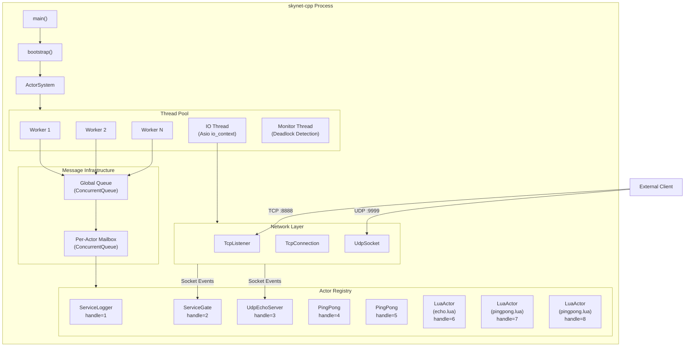
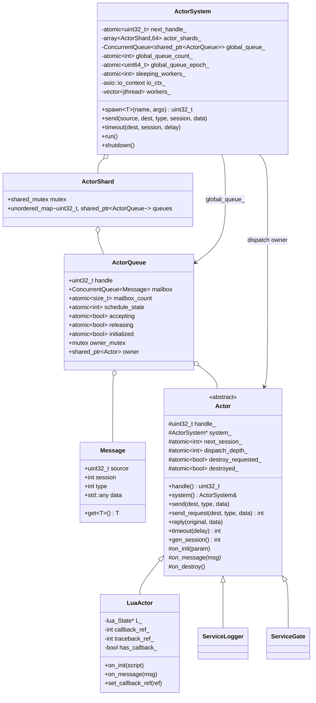
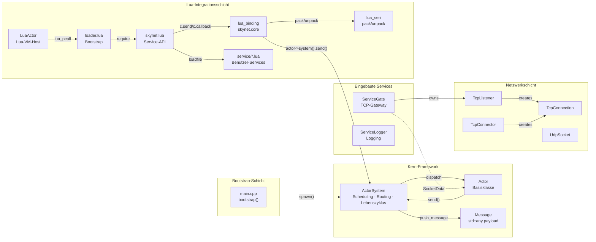
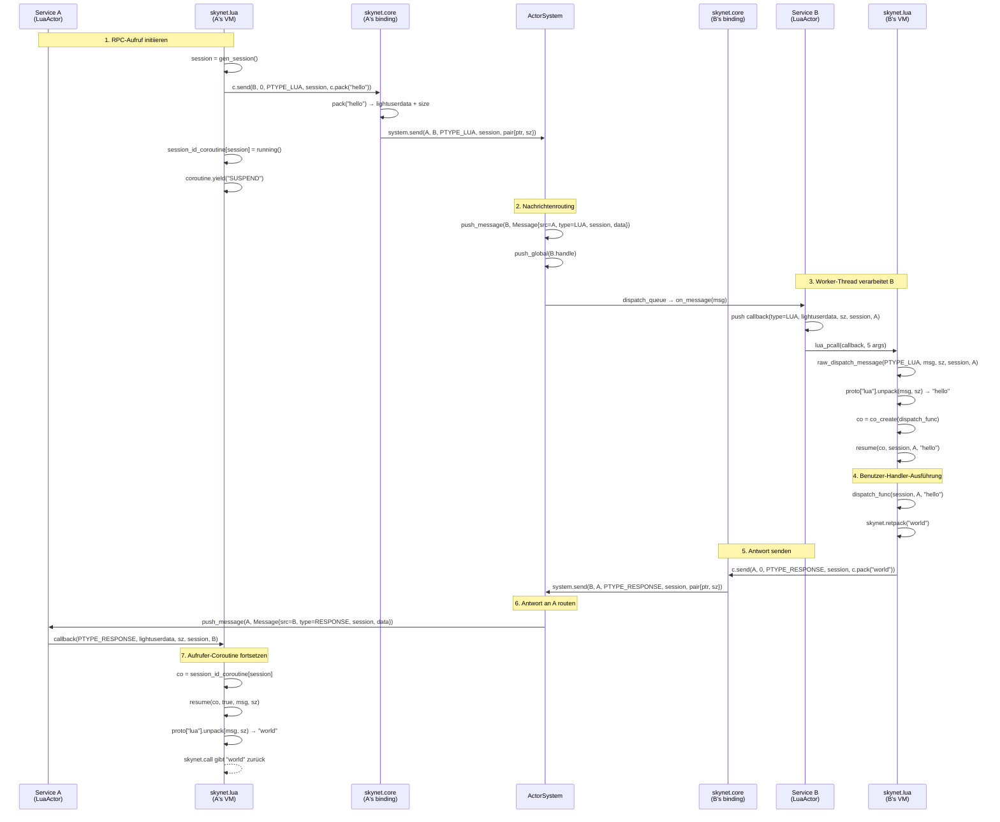

# skynet-cpp — Projektdesign-Dokument
## Aktuelle Runtime-Aktualisierungen

Die Runtime verwendet jetzt einen preload-gesteuerten Bootstrap: der C++ Einstieg liest nur `SKYNET_THREAD` und `SKYNET_PRELOAD`, nutzt standardmäßig `examples/preload.lua` und überlässt Launcher-Start, Lua path/cpath/service path und Anwendungseinstieg dem Preload-Skript. `skynet.appendpath`, `skynet.prependpath`, `skynet.appendcpath`, `skynet.appendservicepath` und `skynet.getpath` verwalten den globalen Lua-Pfad-Snapshot für neu erstellte LuaActors.

Das Release-Modell ist jetzt install/package-freundlich: die ausführbare Datei enthält keinen Source-Root mehr, und der Installationsbaum nutzt `bin/`, `lualib/`, `service/`, `examples/` und `doc/`. Ein Preload-Skript kann das Prozess-cwd mit `skynet.getcwd()` ausgeben, die relative Pfadbasis mit `skynet.setpathbase(path)` / `skynet.getpathbase()` verwalten und `skynet.readfile` / `skynet.writefile` für pathbase-relative Geschäftsdateien verwenden, ohne Lua `io` zu öffnen.

Die Planung nutzt jetzt das `ActorQueue` Modell: die Actor-Registry ist nach Handle geshardet, die globale Queue speichert `ActorQueue` Objekte, und die Queue-Lebensdauer ist vom Actor-Owner getrennt. Nach `kill` drain/droppt die Queue ausstehende Nachrichten sicher. LuaActor Callback und Traceback werden als Registry-Refs gecacht; `skynet.core` C-APIs cachen den aktuellen Actor-Zeiger als Closure-Upvalue.

Der Hot Path verwendet `ConcurrentQueue`, atomic epoch wait/notify, Sleeping-Worker-Tracking und eine ungefähre globale Queue-Zählung. 8/16-Thread-Worker spinnen kurz im Userspace vor dem Schlafen, um futex wakeups in Actor-RPC-Workloads zu reduzieren. Tests sind in `tests/logic`, `tests/stress`, `tests/perf` und Coverage-Runner getrennt; Linux-Vergleiche laufen per Docker.

> **skynet-cpp** — Moderne C++20-Neuimplementierung des [Skynet](https://github.com/cloudwu/skynet) Actor-Frameworks

---

## Inhaltsverzeichnis

1. [Projektübersicht](#1-projektübersicht)
2. [Designziele und gelöste Probleme](#2-designziele-und-gelöste-probleme)
3. [Technologieauswahl](#3-technologieauswahl)
4. [Systemarchitektur](#4-systemarchitektur)
5. [Kernmodule](#5-kernmodule)
6. [Klassendiagramm](#6-klassendiagramm)
7. [Modulbeziehungen](#7-modulbeziehungen)
8. [Implementierungsdetails](#8-implementierungsdetails)
9. [Nachrichtenfluss-Beispiel](#9-nachrichtenfluss-beispiel)

---

## 1. Projektübersicht

skynet-cpp ist ein leichtgewichtiges Actor-Modell-Server-Framework, das in **C++20** neu implementiert wurde. Seine Designphilosophie und API-Semantik stammen von [cloudwu/skynet](https://github.com/cloudwu/skynet). Das Framework bewahrt die Kernabstraktion von skynet — **jeder Service ist ein unabhängiger Actor, der über asynchrone Nachrichten kommuniziert** — und nutzt gleichzeitig moderne C++-Sprachfeatures und das plattformübergreifende Ökosystem für Typsicherheit, RAII-Ressourcenverwaltung und Plattformunabhängigkeit.

### Projektstruktur

```
skynet-cpp/
├── CMakeLists.txt                         # Build configuration
├── doc/
│   ├── design/                            # Multilingual architecture design docs
│   ├── wiki/                              # Multilingual user wiki docs
│   └── performance-optimization/          # Performance optimization notes
├── src/
│   ├── skynet.h / skynet.cpp              # ActorSystem, ActorQueue, scheduler, registry
│   ├── network.h / network.cpp            # TCP/UDP network layer (Asio)
│   ├── platform.h / platform.cpp          # Small cross-platform runtime helpers
│   ├── service_gate.h                     # TCP gateway service (C++)
│   ├── service_logger.h                   # Logger service (C++)
│   ├── lua_actor.h / lua_actor.cpp        # Lua VM host Actor
│   ├── lua_binding.cpp                    # skynet.core C bindings
│   ├── lua_seri.h / lua_seri.cpp          # Lua binary serialization
│   ├── lua_socket_binding.cpp             # socketdriver C bindings
│   ├── lua_netpack.cpp                    # netpack C bindings
│   ├── lua_cluster.cpp                    # cluster.core C bindings
│   ├── lua_profile.cpp                    # profile C bindings
│   ├── skynet_json.h                      # JSON helper
│   └── main.cpp                           # Minimal preload bootstrap entrypoint
├── lualib/
│   ├── loader.lua                         # Lua service loader; uses global path snapshot
│   ├── skynet.lua                         # Lua service API layer and path config API
│   ├── socket.lua                         # Socket API (coroutine wrapper)
│   ├── gateserver.lua                     # TCP gateway template
│   ├── sharedata.lua                      # Shared data client
│   ├── bson.lua                           # BSON codec (pure Lua)
│   └── skynet/
│       ├── socketchannel.lua              # Socket connection multiplexing
│       ├── cluster.lua                    # Cluster RPC client
│       ├── coverage.lua                   # Lua line coverage hook
│       ├── debug.lua                      # Debug protocol
│       ├── queue.lua                      # Coroutine critical section queue
│       ├── multicast.lua                  # Pub/sub client
│       ├── crypt.lua                      # SHA1/Base64/Hex helpers
│       └── db/
│           ├── redis.lua                  # Redis driver (RESP protocol)
│           ├── mysql.lua                  # MySQL driver (wire protocol)
│           └── mongo.lua                  # MongoDB driver (OP_MSG)
├── service/
│   ├── launcher.lua                       # Service launcher
│   ├── debug_console.lua                  # Debug console service
│   ├── clusterd.lua                       # Cluster manager
│   ├── clusteragent.lua                   # Cluster inbound agent
│   ├── clustersender.lua                  # Cluster outbound sender
│   ├── sharedatad.lua                     # Shared data server
│   └── multicastd.lua                     # Multicast manager service
├── examples/
│   ├── preload.lua                        # Default preload bootstrap
│   ├── main.lua                           # Example application entry service
│   ├── echo.lua                           # Example echo service
│   └── pingpong.lua                       # Example ping-pong service
├── tests/
│   ├── cpp_unit.cpp                       # C++ unit tests
│   ├── logic/                             # Logic regression preload and services
│   ├── stress/                            # Stress preload, workers, and suite
│   └── perf/                              # Performance benchmark preload and workers
├── tools/
│   ├── run_coverage.bat                   # Windows coverage gate
│   ├── run_linux_coverage_in_docker.bat   # Linux coverage gate via Docker
│   ├── run_perf_benchmark.bat             # Windows perf benchmark
│   └── run_linux_perf_in_docker.bat       # Linux/native comparison perf benchmark
└── 3rdparty/
    ├── asio/                              # Asio standalone headers
    ├── concurrentqueue/                   # moodycamel lock-free queue
    └── lua-5.5.0/                         # Skynet-modified Lua 5.5.0
```

---

## 2. Designziele und gelöste Probleme

| Dimension | Original Skynet (C + Lua) | skynet-cpp (C++20) |
|---|---|---|
| **Sprache** | Reine C-Implementierung, manuelle Speicherverwaltung | C++20, RAII + `std::shared_ptr` automatische Lebenszyklus-Verwaltung |
| **Plattform** | Nur Linux (epoll + pthreads) | Plattformübergreifend (Asio-Abstraktion, Windows/Linux/macOS) |
| **Typsicherheit** | `void*`-Zeiger für Nachrichtenübergabe, Runtime-Cast | `std::any` + `msg.get<T>()` Template-basierter typsicherer Zugriff |
| **Nebenläufigkeit** | Eigener Spinlock + globale Queue | `moodycamel::ConcurrentQueue` (Lock-Free MPMC) + `std::shared_mutex` |
| **Asynchrone IO** | Eigener Socket-Server (epoll-Wrapper) | Asio + `steady_timer`, natürliche Integration mit Actor-Nachrichten |
| **Thread-Modell** | Feste Worker-Threads + einzelner Timer-Thread | Worker-Threads + IO-Thread (Asio) + Monitor-Thread |
| **Lua-Integration** | Enge Kopplung, direkte Lua-Stack-Manipulation in C | Klare Schichtung: `LuaActor` → C-Binding → Lua-API |
| **Build-System** | Makefile (nur GCC/Clang) | CMake 3.20+ (MSVC/GCC/Clang) |

### Kern-Designziele

1. **Skynet-Actor-Semantik beibehalten**: Handle-Identifikation, asynchrone Nachrichten, Session-Mechanismus, benannte Services
2. **Moderne C++-Typsicherheit**: Template-Spawn, typisierte Nachrichten, Kompilierzeit-Fehlererkennung
3. **Plattformübergreifend**: Hauptziel Windows (MSVC), kompatibel mit Linux/macOS
4. **Lua-Integration**: Direkte Übernahme von Skynets modifiziertem Lua 5.5.0 (mit Codecache), API-kompatibles `skynet.send/call/ret`

---

## 3. Technologieauswahl

| Technologie | Version | Begründung |
|---|---|---|
| **C++20** | MSVC 19.41+ / GCC 12+ | `std::jthread` (Auto-Join), `std::any` (typsichere Nachrichten), `std::shared_mutex` (Leser-Schreiber-Lock), Concepts |
| **Asio** | 1.28.2 (standalone) | Ausgereiftes plattformübergreifendes asynchrones IO; keine Boost-Abhängigkeit; native TCP/UDP/Timer-Unterstützung; `io_context` integrierbar mit Actor-Nachrichtenschleife |
| **moodycamel::ConcurrentQueue** | latest | Hochleistungs-Lock-Free-MPMC-Queue; Header-Only; ActorQueue-Mailbox und globale Dispatch-Queue nutzen `ConcurrentQueue` |
| **Lua 5.5.0 (Skynet-modifiziert)** | 5.5.0-skynet | Skynets Lua-Fork mit **Codecache** (gemeinsamer kompilierter Bytecode über VMs), `lua_clonefunction`, `lua_sharefunction`, `lua_pushexternalstring` Erweiterungs-APIs |
| **CMake** | 3.20+ | Plattformübergreifender Build; MSVC/GCC/Clang-Unterstützung; Target-basiertes modernes CMake |

---

## 4. Systemarchitektur



---

## 5. Kernmodule

| Module | Source Files | Current Responsibility |
|---|---|---|
| **Actor Runtime** | `src/skynet.h`, `src/skynet.cpp` | `Actor`, `ActorSystem`, sharded actor registry, `ActorQueue`, weighted dispatch, timer/session, lifecycle, monitor thread |
| **Platform Helpers** | `src/platform.h`, `src/platform.cpp` | Small portability boundary for environment variables, file append/write helpers, local time formatting, process/node identity, Lua C module suffix |
| **Network Layer** | `src/network.h`, `src/network.cpp` | Cross-platform TCP listener/client/connection and UDP socket built on standalone Asio |
| **C++ Gateway** | `src/service_gate.h` | C++ TCP gateway service and connection event routing |
| **Logger** | `src/service_logger.h` | stdout/file logger service; runtime error logs route through cached logger handle |
| **Lua Actor Host** | `src/lua_actor.h`, `src/lua_actor.cpp` | Per-service Lua VM, loader execution, global path snapshot inheritance, callback/traceback registry refs, memory tracking |
| **Lua Core Binding** | `src/lua_binding.cpp` | `skynet.core` C API: send/callback/session/command/path configuration/serialization helpers |
| **Serialization Binding** | `src/lua_seri.h`, `src/lua_seri.cpp` | Skynet-compatible Lua value pack/unpack binary serialization |
| **Socket Binding** | `src/lua_socket_binding.cpp` | `socketdriver` C API for TCP/UDP listen/connect/send/close/pause/resume with shortened store lock scope |
| **Netpack Binding** | `src/lua_netpack.cpp` | 2-byte big-endian TCP frame pack/unpack/filter helpers |
| **Cluster Binding** | `src/lua_cluster.cpp` | `cluster.core` pack/unpack/multicast string helpers |
| **Profile Binding** | `src/lua_profile.cpp` | `skynet.profile` coroutine timing hooks and resume/wrap replacement |
| **JSON Helper** | `src/skynet_json.h` | Header-only JSON utility retained for runtime/support code |
| **Lua Loader** | `lualib/loader.lua` | Resolves plain service names through configured service paths and executes Lua service scripts |
| **Lua Service API** | `lualib/skynet.lua` | `start`, `dispatch`, `send`, `call`, `ret`, `timeout`, `fork`, named service APIs, path/cpath/service-path configuration APIs |
| **Socket API** | `lualib/socket.lua` | Coroutine-friendly TCP/UDP API over `socketdriver` |
| **GateServer API** | `lualib/gateserver.lua` | Lua gateway template with connect/disconnect/message handler callbacks |
| **SocketChannel** | `lualib/skynet/socketchannel.lua` | Reconnectable ordered/session socket multiplexing used by Redis/Mongo style clients |
| **Cluster** | `lualib/skynet/cluster.lua` + `service/cluster*.lua` | Cluster RPC client and cluster manager/agent/sender services |
| **Debug Console** | `lualib/skynet/debug.lua`, `service/debug_console.lua` | Debug command protocol and TCP debug console service |
| **ShareData** | `lualib/sharedata.lua`, `service/sharedatad.lua` | Shared immutable table publication, query, cache, and update notification |
| **Multicast** | `lualib/skynet/multicast.lua`, `service/multicastd.lua` | Publish/subscribe channel manager and client API |
| **Coverage** | `lualib/skynet/coverage.lua` | Lua line coverage hook used only by coverage runners |
| **DB Drivers** | `lualib/skynet/db/{redis,mysql,mongo}.lua`, `lualib/bson.lua` | Redis RESP, MySQL wire protocol, MongoDB OP_MSG/BSON clients |
| **Examples** | `examples/preload.lua`, `examples/main.lua`, `examples/echo.lua`, `examples/pingpong.lua` | Default preload and example services |
| **Tests** | `tests/cpp_unit.cpp`, `tests/logic`, `tests/stress`, `tests/perf` | C++ units, logic regression suite, stress suite, and performance benchmark suite |
| **Tools** | `tools/*.bat / tools/*.sh`, `tools/py`, `tools/python/archives` | Python stdlib runners for coverage, package, Docker/Linux validation, DB stress, and performance; offline Python is stored as Git LFS archives and extracted into ignored runtime dirs |

---

## 6. Klassendiagramm



---

## 7. Modulbeziehungen



---

## 8. Implementierungsdetails

*Die technischen Details der Abschnitte 8.1–8.8 sind identisch mit der englischen Version (`design/en.md`). Mermaid-Diagramme, Code-Auszüge und API-Referenztabellen bleiben unverändert. Für die vollständigen Details jedes Moduls siehe die englische Version.*

---

## 9. Nachrichtenfluss-Beispiel

Das folgende Sequenzdiagramm zeigt eine vollständige Lua-RPC-Aufrufkette: **Service A ruft `skynet.call(B, "lua", "hello")` auf**.



### Wichtige Timing-Punkte

1. **Pack/Unpack paarweise**: `c.pack("hello")` serialisiert auf der Senderseite, der Empfänger deserialisiert über `proto.unpack(msg, sz)` — Format vollständig kompatibel mit Original-Skynet
2. **Session-Kontinuität**: Sender weist Session zu → speichert in `session_id_coroutine` → Empfänger gibt sie unverändert zurück → Sender gleicht ab und setzt Coroutine fort
3. **Zero-Copy-Übertragung**: Serialisierter Puffer wird per `lightuserdata`-Zeiger übergeben, Empfänger gibt nach `c.unpack` über `skynet.trash` frei
4. **Coroutine-Suspension/Fortsetzung**: `skynet.call` nutzt `coroutine.yield("SUSPEND")` zum Suspendieren, `PTYPE_RESPONSE` löst `resume` zum Fortfahren aus
