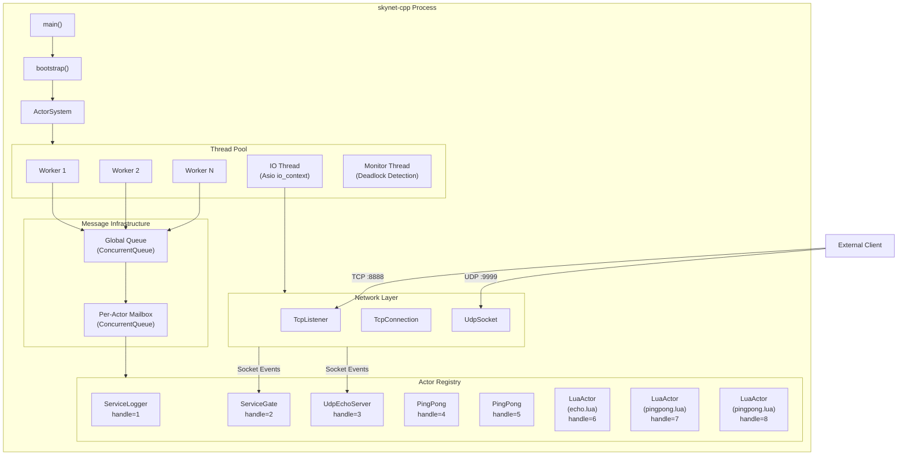
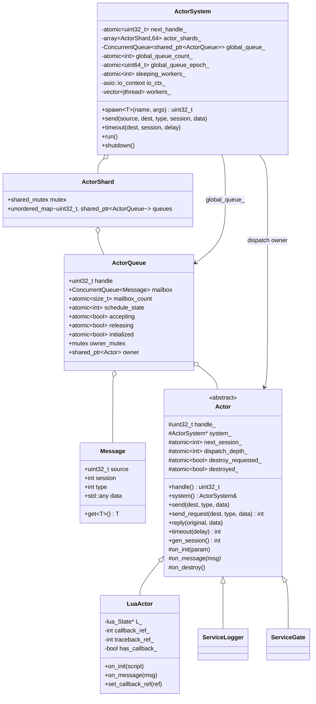
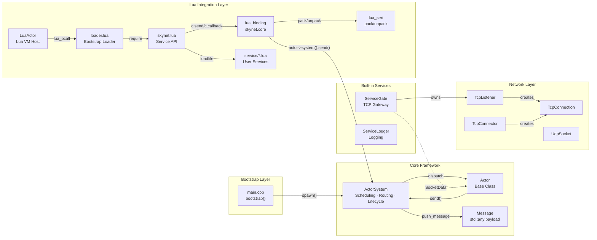
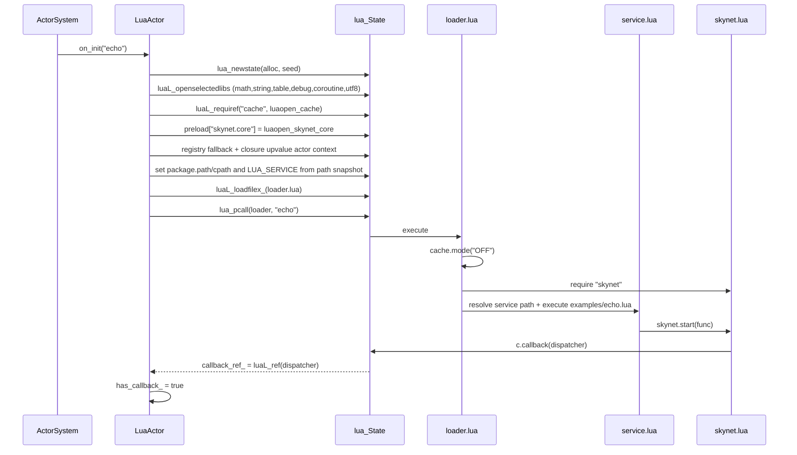
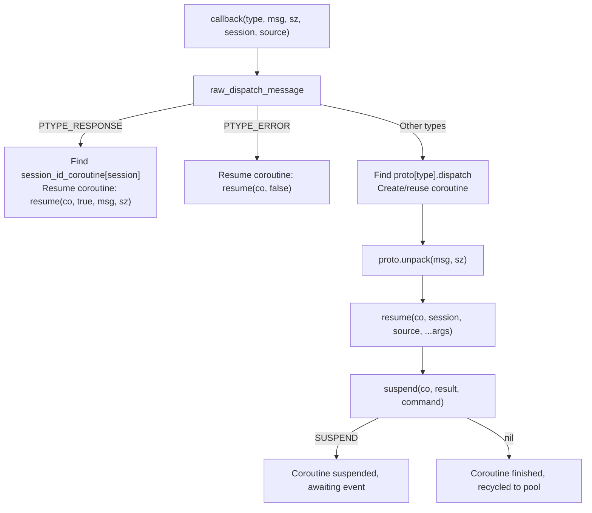
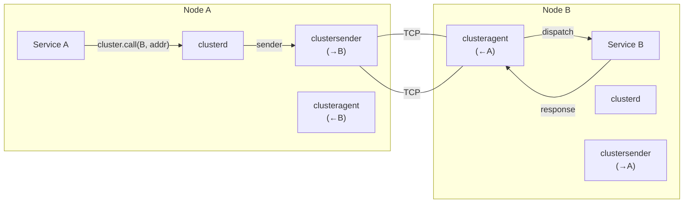
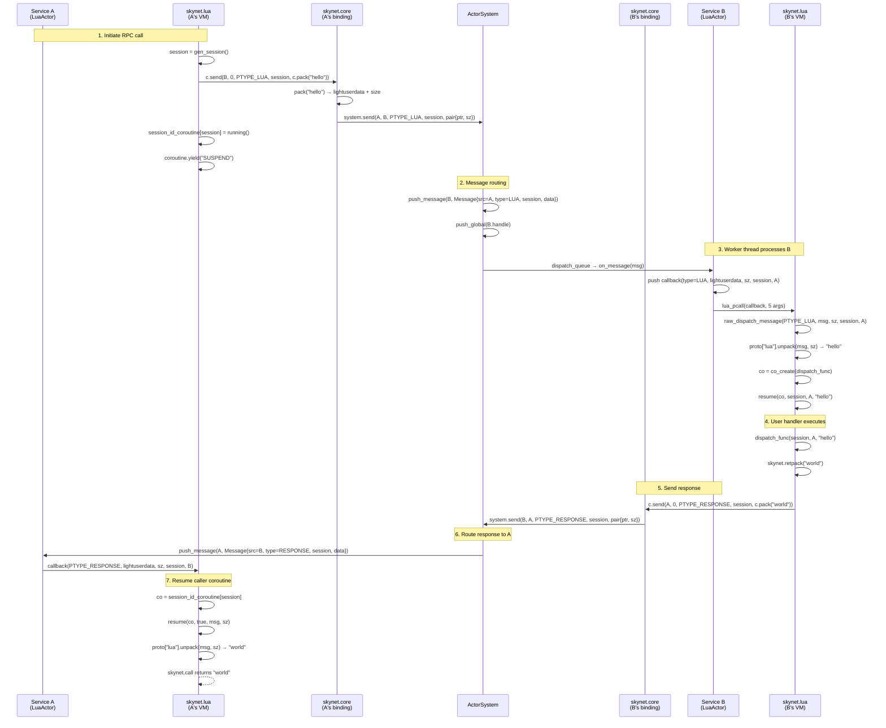

# skynet-cpp Design Document
## Recent Runtime Updates

The runtime now uses a preload-driven bootstrap path: the C++ entrypoint reads only `SKYNET_THREAD` and `SKYNET_PRELOAD`, defaults to `examples/preload.lua`, and leaves launcher startup, Lua path/cpath/service path setup, and application entry selection to the preload script. `skynet.appendpath`, `skynet.prependpath`, `skynet.appendcpath`, `skynet.appendservicepath`, and `skynet.getpath` manage the global Lua path snapshot inherited by newly created LuaActors.

The release model is now install/package friendly: the executable no longer embeds the source root, and the installed tree uses `bin/`, `lualib/`, `service/`, `examples/`, and `doc/`. A preload script can print the process cwd with `skynet.getcwd()`, manage relative search-path base with `skynet.setpathbase(path)` / `skynet.getpathbase()`, and use `skynet.readfile` / `skynet.writefile` for pathbase-relative business files without opening Lua's `io` library.

Scheduling now uses the `ActorQueue` model: the actor registry is sharded by handle, the global queue stores `ActorQueue` objects, and queue lifetime is independent from the Actor owner. After kill, the queue drains or drops pending messages safely. LuaActor callback and traceback functions are cached as registry refs, and `skynet.core` C APIs cache the current actor pointer as closure upvalues to avoid repeated registry string lookups.

The hot path uses `ConcurrentQueue`, atomic epoch wait/notify, sleeping-worker tracking, and an approximate global queue count. 8/16-thread workers briefly spin in user space before sleeping to reduce futex wakeups in actor RPC workloads. Tests are split into `tests/logic`, `tests/stress`, `tests/perf`, and coverage runners; Linux native comparison runs through Docker.

> **skynet-cpp** — A modern C++20 reimplementation of the [Skynet](https://github.com/cloudwu/skynet) Actor Framework

---

## Table of Contents

1. [Project Overview](#1-project-overview)
2. [Design Goals & Problems Solved](#2-design-goals--problems-solved)
3. [Technology Choices](#3-technology-choices)
4. [System Architecture Overview](#4-system-architecture-overview)
5. [Core Modules](#5-core-modules)
6. [Class Relationship Diagram](#6-class-relationship-diagram)
7. [Module Interaction Flow](#7-module-interaction-flow)
8. [Module Implementation Details](#8-module-implementation-details)
   - [8.1 Actor Framework](#81-actor-framework-skynethcpp)
   - [8.2 Network Layer](#82-network-layer-networkhcpp)
   - [8.3 TCP Gateway Service](#83-tcp-gateway-service-service_gateh)
   - [8.4 Logger Service](#84-logger-service-service_loggerh)
   - [8.5 Lua Actor](#85-lua-actor-lua_actorhcpp)
   - [8.6 Lua C Binding Layer](#86-lua-c-binding-layer-lua_bindingcpp)
   - [8.7 Lua Serialization Protocol](#87-lua-serialization-protocol-lua_serihcpp)
   - [8.8 Lua Service API Layer](#88-lua-service-api-layer-skynetlua)
   - [8.9 Socket Lua API](#89-socket-lua-api)
   - [8.10 GateServer Gateway Template](#810-gateserver-gateway-template)
   - [8.11 SocketChannel Connection Multiplexing](#811-socketchannel-connection-multiplexing)
   - [8.12 Cluster](#812-cluster)
   - [8.13 Debug & Profile](#813-debug--profile)
   - [8.14 ShareData](#814-sharedata)
   - [8.15 Queue Serialization Queue](#815-queue-serialization-queue)
   - [8.16 Multicast Pub/Sub](#816-multicast-pubsub)
   - [8.17 Database Drivers & Utility Libraries](#817-database-drivers--utility-libraries)
9. [Message Flow Example](#9-message-flow-example)

---

## 1. Project Overview

skynet-cpp is a lightweight Actor-model server framework reimplemented in **C++20**, with design philosophy and API semantics derived from [cloudwu/skynet](https://github.com/cloudwu/skynet). The framework preserves Skynet's core abstraction — **each service is an independent Actor communicating via asynchronous messages** — while leveraging modern C++ features for type safety, RAII resource management, and platform independence.

### Project Structure

```
skynet-cpp/
├── CMakeLists.txt                         # Build configuration
├── doc/
│   ├── design/                            # Multilingual architecture design docs
│   ├── wiki/                              # Multilingual user wiki docs
│   └── performance-optimization/          # Performance optimization notes
├── src/
│   ├── skynet.h / skynet.cpp              # ActorSystem, ActorQueue, scheduler, registry
│   ├── network.h / network.cpp            # TCP/UDP network layer (Asio)
│   ├── platform.h / platform.cpp          # Small cross-platform runtime helpers
│   ├── service_gate.h                     # TCP gateway service (C++)
│   ├── service_logger.h                   # Logger service (C++)
│   ├── lua_actor.h / lua_actor.cpp        # Lua VM host Actor
│   ├── lua_binding.cpp                    # skynet.core C bindings
│   ├── lua_seri.h / lua_seri.cpp          # Lua binary serialization
│   ├── lua_socket_binding.cpp             # socketdriver C bindings
│   ├── lua_netpack.cpp                    # netpack C bindings
│   ├── lua_cluster.cpp                    # cluster.core C bindings
│   ├── lua_profile.cpp                    # profile C bindings
│   ├── skynet_json.h                      # JSON helper
│   └── main.cpp                           # Minimal preload bootstrap entrypoint
├── lualib/
│   ├── loader.lua                         # Lua service loader; uses global path snapshot
│   ├── skynet.lua                         # Lua service API layer and path config API
│   ├── socket.lua                         # Socket API (coroutine wrapper)
│   ├── gateserver.lua                     # TCP gateway template
│   ├── sharedata.lua                      # Shared data client
│   ├── bson.lua                           # BSON codec (pure Lua)
│   └── skynet/
│       ├── socketchannel.lua              # Socket connection multiplexing
│       ├── cluster.lua                    # Cluster RPC client
│       ├── coverage.lua                   # Lua line coverage hook
│       ├── debug.lua                      # Debug protocol
│       ├── queue.lua                      # Coroutine critical section queue
│       ├── multicast.lua                  # Pub/sub client
│       ├── crypt.lua                      # SHA1/Base64/Hex helpers
│       └── db/
│           ├── redis.lua                  # Redis driver (RESP protocol)
│           ├── mysql.lua                  # MySQL driver (wire protocol)
│           └── mongo.lua                  # MongoDB driver (OP_MSG)
├── service/
│   ├── launcher.lua                       # Service launcher
│   ├── debug_console.lua                  # Debug console service
│   ├── clusterd.lua                       # Cluster manager
│   ├── clusteragent.lua                   # Cluster inbound agent
│   ├── clustersender.lua                  # Cluster outbound sender
│   ├── sharedatad.lua                     # Shared data server
│   └── multicastd.lua                     # Multicast manager service
├── examples/
│   ├── preload.lua                        # Default preload bootstrap
│   ├── main.lua                           # Example application entry service
│   ├── echo.lua                           # Example echo service
│   └── pingpong.lua                       # Example ping-pong service
├── tests/
│   ├── cpp_unit.cpp                       # C++ unit tests
│   ├── logic/                             # Logic regression preload and services
│   ├── stress/                            # Stress preload, workers, and suite
│   └── perf/                              # Performance benchmark preload and workers
├── tools/
│   ├── run_coverage.ps1                   # Windows coverage gate
│   ├── run_linux_coverage_in_docker.ps1   # Linux coverage gate via Docker
│   ├── run_perf_benchmark.ps1             # Windows perf benchmark
│   └── run_linux_perf_in_docker.ps1       # Linux/native comparison perf benchmark
└── 3rdparty/
    ├── asio/                              # Asio standalone headers
    ├── concurrentqueue/                   # moodycamel lock-free queue
    └── lua-5.5.0/                         # Skynet-modified Lua 5.5.0
```

---

## 2. Design Goals & Problems Solved

| Dimension | Original Skynet (C + Lua) | skynet-cpp (C++20) |
|---|---|---|
| **Language** | Pure C, manual memory management | C++20, RAII + `std::shared_ptr` automatic lifecycle |
| **Platform** | Linux only (epoll + pthreads) | Cross-platform (Asio abstraction, Windows/Linux/macOS) |
| **Type Safety** | `void*` pointer message passing, runtime cast | `std::any` + `msg.get<T>()` template type-safe access |
| **Concurrency** | Custom spinlock + global queue | `moodycamel::ConcurrentQueue` (lock-free MPMC) + `std::shared_mutex` |
| **Async IO** | Custom socket server (epoll wrapper) | Asio + `steady_timer`, naturally integrated with Actor messages |
| **Thread Model** | Fixed worker threads + single timer thread | Worker threads + IO thread (Asio) + monitor thread |
| **Lua Integration** | Deeply coupled, C code directly manipulates Lua stack | Clean layering: `LuaActor` → C binding → Lua API |
| **Build System** | Makefile (GCC/Clang only) | CMake 3.20+ (MSVC/GCC/Clang) |

### Core Design Goals

1. **Preserve Skynet's Actor semantics**: handle identification, async messages, session mechanism, named services
2. **Modern C++ type safety**: templated spawn, typed messages, compile-time error catching
3. **Cross-platform**: primary target Windows (MSVC), also compatible with Linux/macOS
4. **Lua integration**: directly adopt Skynet's modified Lua 5.5.0 (with codecache), providing API-compatible `skynet.send/call/ret`

---

## 3. Technology Choices

| Technology | Version | Rationale |
|---|---|---|
| **C++20** | MSVC 19.41+ / GCC 12+ | `std::jthread` (auto-join), `std::any` (type-safe messages), `std::shared_mutex` (reader-writer lock), Concepts |
| **Asio** | 1.28.2 (standalone) | Mature cross-platform async IO; no Boost dependency; native TCP/UDP/Timer support; `io_context` integrates with Actor message loop |
| **moodycamel::ConcurrentQueue** | latest | High-performance lock-free MPMC queue; header-only; ActorQueue mailbox and global dispatch queue use `ConcurrentQueue` |
| **Lua 5.5.0 (Skynet-modified)** | 5.5.0-skynet | Skynet's Lua fork with **codecache** (shared compiled bytecode across VMs), `lua_clonefunction`, `lua_sharefunction`, `lua_pushexternalstring` extensions |
| **CMake** | 3.20+ | Cross-platform build; MSVC/GCC/Clang support; target-based modern CMake |

---

## 4. System Architecture Overview



---

## 5. Core Modules

| Module | Source Files | Current Responsibility |
|---|---|---|
| **Actor Runtime** | `src/skynet.h`, `src/skynet.cpp` | `Actor`, `ActorSystem`, sharded actor registry, `ActorQueue`, weighted dispatch, timer/session, lifecycle, monitor thread |
| **Platform Helpers** | `src/platform.h`, `src/platform.cpp` | Small portability boundary for environment variables, file append/write helpers, local time formatting, process/node identity, Lua C module suffix |
| **Network Layer** | `src/network.h`, `src/network.cpp` | Cross-platform TCP listener/client/connection and UDP socket built on standalone Asio |
| **C++ Gateway** | `src/service_gate.h` | C++ TCP gateway service and connection event routing |
| **Logger** | `src/service_logger.h` | stdout/file logger service; runtime error logs route through cached logger handle |
| **Lua Actor Host** | `src/lua_actor.h`, `src/lua_actor.cpp` | Per-service Lua VM, loader execution, global path snapshot inheritance, callback/traceback registry refs, memory tracking |
| **Lua Core Binding** | `src/lua_binding.cpp` | `skynet.core` C API: send/callback/session/command/path configuration/serialization helpers |
| **Serialization Binding** | `src/lua_seri.h`, `src/lua_seri.cpp` | Skynet-compatible Lua value pack/unpack binary serialization |
| **Socket Binding** | `src/lua_socket_binding.cpp` | `socketdriver` C API for TCP/UDP listen/connect/send/close/pause/resume with shortened store lock scope |
| **Netpack Binding** | `src/lua_netpack.cpp` | 2-byte big-endian TCP frame pack/unpack/filter helpers |
| **Cluster Binding** | `src/lua_cluster.cpp` | `cluster.core` pack/unpack/multicast string helpers |
| **Profile Binding** | `src/lua_profile.cpp` | `skynet.profile` coroutine timing hooks and resume/wrap replacement |
| **JSON Helper** | `src/skynet_json.h` | Header-only JSON utility retained for runtime/support code |
| **Lua Loader** | `lualib/loader.lua` | Resolves plain service names through configured service paths and executes Lua service scripts |
| **Lua Service API** | `lualib/skynet.lua` | `start`, `dispatch`, `send`, `call`, `ret`, `timeout`, `fork`, named service APIs, path/cpath/service-path configuration APIs |
| **Socket API** | `lualib/socket.lua` | Coroutine-friendly TCP/UDP API over `socketdriver` |
| **GateServer API** | `lualib/gateserver.lua` | Lua gateway template with connect/disconnect/message handler callbacks |
| **SocketChannel** | `lualib/skynet/socketchannel.lua` | Reconnectable ordered/session socket multiplexing used by Redis/Mongo style clients |
| **Cluster** | `lualib/skynet/cluster.lua` + `service/cluster*.lua` | Cluster RPC client and cluster manager/agent/sender services |
| **Debug Console** | `lualib/skynet/debug.lua`, `service/debug_console.lua` | Debug command protocol and TCP debug console service |
| **ShareData** | `lualib/sharedata.lua`, `service/sharedatad.lua` | Shared immutable table publication, query, cache, and update notification |
| **Multicast** | `lualib/skynet/multicast.lua`, `service/multicastd.lua` | Publish/subscribe channel manager and client API |
| **Coverage** | `lualib/skynet/coverage.lua` | Lua line coverage hook used only by coverage runners |
| **DB Drivers** | `lualib/skynet/db/{redis,mysql,mongo}.lua`, `lualib/bson.lua` | Redis RESP, MySQL wire protocol, MongoDB OP_MSG/BSON clients |
| **Examples** | `examples/preload.lua`, `examples/main.lua`, `examples/echo.lua`, `examples/pingpong.lua` | Default preload and example services |
| **Tests** | `tests/cpp_unit.cpp`, `tests/logic`, `tests/stress`, `tests/perf` | C++ units, logic regression suite, stress suite, and performance benchmark suite |
| **Tools** | `tools/run_*.ps1`, `tools/run_linux_coverage.sh` | Coverage, Docker/Linux validation, Docker DB stress, and performance runners |

---

## 6. Class Relationship Diagram



---

## 7. Module Interaction Flow



### Key Call Paths

| Path | Description |
|---|---|
| `main → ActorSystem::spawn<T>()` | Create Actor instance, assign handle, call `on_init` |
| `Actor::send() → ActorSystem::send() → push_message()` | Send message to the target ActorQueue mailbox |
| `worker_loop → global_queue → dispatch_queue → on_message` | Worker thread takes ActorQueue from global queue and dispatches weighted batches |
| `TcpListener → SocketAccept/SocketData → ServiceGate::on_message` | Network events delivered to Gate via `PTYPE_SOCKET` |
| `LuaActor::on_init → loader.lua → skynet.lua → service.lua` | Lua service loading chain |
| `skynet.send() → c.send() → lsend() → ActorSystem::send()` | Full path of Lua message sending |
| `skynet.call() → yield → PTYPE_RESPONSE → resume` | Lua synchronous RPC coroutine switching |

---

## 8. Module Implementation Details

### 8.1 Actor Framework (`skynet.h/cpp`)

#### Message Type Enum

```cpp
enum MessageType {
    PTYPE_TEXT     = 0,   // Plain text message
    PTYPE_RESPONSE = 1,   // RPC response / Timer callback
    PTYPE_SYSTEM   = 4,   // System message
    PTYPE_SOCKET   = 6,   // Network event
    PTYPE_ERROR    = 7,   // Error notification
    PTYPE_TIMER    = 8,   // (Reserved)
    PTYPE_LUA      = 10,  // Lua serialized message
};
```

#### Message Structure

```cpp
struct Message {
    uint32_t source = 0;     // Sender handle
    int      session = 0;    // Session ID (0 = fire-and-forget)
    int      type = PTYPE_TEXT;
    std::any data;           // Typed payload

    template<typename T> const T& get() const;  // Type-safe access
    bool has_data() const;
};
```

`std::any` replaces Skynet's original `void* msg + size_t sz`, enabling compile-time type checking and eliminating invalid pointer casts.

#### Actor Base Class

Each Actor owns:
- **Unique handle** (`uint32_t`): globally unique identifier
- **Independent mailbox** (`ConcurrentQueue<Message>`): lock-free MPMC queue
- **Session allocator** (`atomic<int>`): generates incrementing session IDs for RPC calls

Actor lifecycle: `spawn()` → `on_init()` → loop `on_message()` → `kill()` → `on_destroy()`

#### ActorSystem Scheduler

**Thread model**:

| Thread | Count | Responsibility |
|---|---|---|
| Worker | N (default=CPU cores) | Take `ActorQueue` from `global_queue_` and dispatch weighted batches |
| IO | 1 | Run `asio::io_context`, handle all async network IO and Timers |
| Monitor | 1 | Check Worker deadlocks every 5 seconds (version comparison) |

**Scheduling weight strategy** (`calc_weight`):

```
Workers 1..N/4    → weight=-1 → process 1 message per turn (low-latency priority)
Workers N/4..N/2  → weight= 0 → process all queued messages (throughput priority)
Workers N/2..3N/4 → weight= 1 → process n/2 messages
Workers 3N/4..N   → weight= 2 → process n/4 messages
```

Mixing different weight Workers ensures **balance between low latency and high throughput**.

**Deadlock detection** (`WorkerMonitor`):

Each Worker has a `WorkerMonitor`. `begin(src, dst)` / `end()` are called around `dispatch_queue`, incrementing a version number. The Monitor thread compares `version` with `check_version` every 5 seconds — if a Worker is `busy` with unchanged version, it's flagged as deadlocked.

**Timer implementation**:

```cpp
void ActorSystem::timeout(uint32_t dest, int session, milliseconds delay) {
    auto timer = make_shared<asio::steady_timer>(io_ctx_, delay);
    timer->async_wait([this, dest, session, timer](auto& ec) {
        if (!ec) send(0, dest, PTYPE_RESPONSE, session, {});
    });
}
```

Timers don't start new threads — they post to the Asio `io_context` and deliver `PTYPE_RESPONSE` messages to the target Actor upon expiry.

---

### 8.2 Network Layer (`network.h/cpp`)

#### Socket Event Structures

Network events are sent to Actors via `PTYPE_SOCKET` + `std::any`:

| Event | Structure | Fields |
|---|---|---|
| New connection | `SocketAccept` | `connection_id`, `remote_address`, `remote_port` |
| Data received | `SocketData` | `connection_id`, `data` |
| Connection closed | `SocketClose` | `connection_id` |
| Connection established | `SocketOpen` | `connection_id`, `remote_address`, `remote_port` |
| Send buffer warning | `SocketWarning` | `connection_id`, `pending_bytes` |
| UDP data | `SocketUDP` | `data`, `remote_address`, `remote_port` |

#### TcpConnection

Manages a single TCP connection:

- **Read**: 8KB buffer with cyclic `async_read_some`, data wrapped as `SocketData` delivered to owner Actor
- **Write**: `deque<string>` write queue, serialized writes prevent concurrency; tracks `pending_bytes_`, generates `SocketWarning` above 1MB
- **Flow control**: `pause()` / `resume()` control read rate
- **Half-close**: `shutdown_write()` sends FIN while keeping reads active

#### TcpListener

TCP server:

- Cyclic `async_accept`, creates `TcpConnection` for each new connection
- Manages connection pool via `connection_id` (`unordered_map<int, shared_ptr<TcpConnection>>`)
- `send(conn_id, data)` / `close_connection(conn_id)` operate by ID

#### TcpConnector

TCP client connector:

- `async_resolve` → `async_connect` → create `TcpConnection`
- Sends `SocketOpen` on success, `SocketError` on failure

#### UdpSocket

UDP send/receive:

- 64KB receive buffer, cyclic `async_receive_from`
- Received data wrapped as `SocketUDP` delivered to owner Actor
- `send_to(data, host, port)` for async sends

---

### 8.3 TCP Gateway Service (`service_gate.h`)

`ServiceGate` bridges the Actor framework and network layer:

```
Client ──TCP──→ TcpListener ──SocketAccept──→ ServiceGate
                TcpConnection ──SocketData──→ ServiceGate ──forward──→ Agent Actor
```

**Agent factory pattern**:

```cpp
using AgentFactory = std::function<uint32_t(
    ServiceGate& gate, int conn_id,
    const std::string& addr, uint16_t port)>;
```

When a new connection arrives, if an `AgentFactory` is set, the Gate automatically creates a dedicated Agent Actor for the connection. Subsequent data is forwarded to the Agent via `PTYPE_TEXT`. Without a factory, data is handled directly within the Gate (suitable for simple echo services).

**Event dispatch**:

`on_message` receives `PTYPE_SOCKET` messages and dispatches to virtual methods based on the concrete type in `std::any`:

| Event Type | Callback | Default Behavior |
|---|---|---|
| `SocketAccept` | `on_accept()` | Create agent if factory set |
| `SocketData` | `on_data()` | Forward to agent if exists |
| `SocketClose` | `on_close()` | Clean up agent mapping |
| `SocketWarning` | — | Log warning |

---

### 8.4 Logger Service (`service_logger.h`)

System-level logging center. All `ActorSystem::error()` calls are ultimately routed to the Actor named `"logger"`:

**Log format**:
```
[HH:MM:SS.mmm][HANDLE][TAG] message
```

- `HANDLE`: 8-digit hexadecimal Actor handle
- `TAG`: `ERROR` (`PTYPE_ERROR`) or `INFO` (`PTYPE_TEXT`)
- Outputs to both stdout and an optional log file

---

### 8.5 Lua Actor (`lua_actor.h/cpp`)

`LuaActor` inherits from `Actor`, hosting an independent `lua_State` for each Lua service.

#### Initialization Flow (`on_init`)



**Key design decisions**:

1. **Security sandbox**: `io` and `os` libraries not opened (prevents Lua services from direct file/process operations)
2. **Codecache disabled**: `cache.mode("OFF")` disables code caching to avoid `_ENV` sharing between VMs causing `require` to be nil
3. **Memory tracking**: custom `lua_alloc` tracks per-VM memory usage with limits and automatic warnings
4. **Non-cached loading**: `loader.lua` loaded via `luaL_loadfilex_` (non-cached variant) ensuring independent execution per VM

#### Message Dispatch (`on_message`)

Callback signature: `callback(type, msg, sz, session, source)`

| Message Type | msg Parameter | sz Parameter |
|---|---|---|
| `PTYPE_LUA` / `PTYPE_RESPONSE` | `lightuserdata` (serialized buffer pointer) | byte length |
| `PTYPE_TEXT` / `PTYPE_ERROR` | Lua string | string length |
| Others (Timer, etc.) | nil | 0 |

`PTYPE_LUA` first attempts to extract `std::pair<void*, size_t>` (generated by `skynet.pack`), falling back to `std::string` on failure.

#### Memory Allocator

```
Allocation strategy:
  if nsize == 0           → free(ptr), return nullptr
  if mem_ > mem_limit_    → reject allocation (OOM protection)
  if mem_ > mem_report_   → print memory warning, mem_report_ *= 2
  else                    → realloc(ptr, nsize)
```

---

### 8.6 Lua C Binding Layer (`lua_binding.cpp`)

The 15 C functions registered by `luaopen_skynet_core` form the `skynet.core` module:

| Function | Signature | Description |
|---|---|---|
| `send` | `(dest, source, type, session, msg [,sz])` → `session` | Send message; source ignored (always uses self) |
| `callback` | `(func)` → nil | Register message callback, stored at `cached callback registry ref` |
| `genid` | `()` → `session_id` | Allocate incrementing session ID |
| `self` | `()` → `handle` | Return current Actor handle |
| `now` | `()` → `centiseconds` | Time since start (centiseconds) |
| `error` | `(text)` → nil | Route to logger via ActorSystem |
| `command` | `(cmd, param)` → `string\|nil` | Service commands (REG/NAME/QUERY/EXIT/KILL/TIMEOUT/NOW) |
| `intcommand` | `(cmd, param)` → `int\|nil` | Command variant returning integer |
| `addresscommand` | `(cmd, param)` → `int\|nil` | Command variant returning handle integer |
| `pack` | `(...)` → `lightuserdata, size` | Serialize Lua values |
| `unpack` | `(msg, sz)` → `...values` | Deserialize |
| `tostring` | `(msg, sz)` → `string` | Convert lightuserdata to Lua string |
| `trash` | `(msg, sz)` → nil | Free lightuserdata buffer |
| `redirect` | `(dest, src, type, session, msg, sz)` → nil | Send with explicit source address |
| `harbor` | `(addr)` → `0, 0` | Stub (single-process, no harbor needed) |

**Command sub-commands**:

| Command | Parameter | Return | Behavior |
|---|---|---|---|
| `REG` | `"name"` | `":handle"` | Register current Actor's name |
| `NAME` | `"name :handle"` | `":handle"` | Register name for specified handle |
| `QUERY` | `"name"` | `":handle"` or nil | Look up named service |
| `EXIT` | — | nil | Kill current Actor |
| `KILL` | `":handle"` or `"name"` | nil | Kill specified Actor |
| `TIMEOUT` | `"centisecs"` | `"session"` | Register timer |
| `NOW` | — | `"centisecs"` | Current time |

---

### 8.7 Lua Serialization Protocol (`lua_seri.h/cpp`)

Binary serialization format fully compatible with original Skynet.

#### Encoding Format

Each value encoded as **1-byte header + variable-length payload**:

```
Header = [TYPE: 3 bits | COOKIE: 5 bits]
```

| TYPE | Value | COOKIE Meaning | Payload |
|---|---|---|---|
| NIL | 0 | — | None |
| BOOLEAN | 1 | 0=false, 1=true | None |
| NUMBER | 2 | Sub-type encoding | See below |
| USERDATA | 3 | — | 8 bytes (pointer) |
| SHORT_STRING | 4 | Length (0-31) | 0-31 bytes |
| LONG_STRING | 5 | 2 or 4 | 2/4 byte length + data |
| TABLE | 6 | Array size | Array elements + hash pairs + NIL terminator |

**Number sub-types** (NUMBER COOKIE field):

| COOKIE | Type | Payload Size |
|---|---|---|
| 0 | ZERO | 0 (value is 0) |
| 1 | BYTE | 1 (uint8) |
| 2 | WORD | 2 (uint16) |
| 4 | DWORD | 4 (int32) |
| 6 | QWORD | 8 (int64) |
| 8 | DOUBLE | 8 (IEEE754) |

**Table encoding**:
```
[Header: TYPE_TABLE | min(array_size, 31)]
  [If array_size >= 31: varint-encoded actual size]
  [Array elements 1..n recursively encoded]
  [Hash pairs: key,value alternating recursively encoded]
  [NIL terminator]
```

**Memory model**:

- **Pack**: writes to linked list of 128-byte blocks, coalesced into single `malloc`'d buffer, returns `(lightuserdata, size)`
- **Unpack**: sequential read from buffer, recursively rebuilds Lua values
- **Max nesting depth**: 32 levels

---

### 8.8 Lua Service API Layer (`skynet.lua`)

`skynet.lua` is the developer-facing API layer for Lua services, wrapping `skynet.core` C bindings with high-level interfaces.

#### Coroutine Pool & Message Dispatch



#### Registered Protocols

| Name | ID | pack | unpack |
|---|---|---|---|
| `lua` | 10 (`PTYPE_LUA`) | `c.pack` (binary serialization) | `c.unpack` |
| `text` | 0 (`PTYPE_TEXT`) | identity | `c.tostring` |
| `response` | 1 | — | — |
| `error` | 7 | — | — |

#### Public API

**Message sending**:

| Function | Description |
|---|---|
| `skynet.send(addr, typename, ...)` | Async send, auto-pack, returns session |
| `skynet.rawsend(addr, type, session, msg, sz)` | Raw send without packing |
| `skynet.call(addr, typename, ...)` | Synchronous RPC: send → yield → await PTYPE_RESPONSE → unpack → return |
| `skynet.ret(msg, sz)` | Send PTYPE_RESPONSE reply |
| `skynet.retpack(...)` | Shorthand for `skynet.ret(skynet.pack(...))` |

**Coroutine control**:

| Function | Description |
|---|---|
| `skynet.dispatch(typename, func)` | Register type handler: `func(session, source, ...)` |
| `skynet.fork(func, ...)` | Spawn coroutine, added to fork_queue for deferred execution |
| `skynet.timeout(ti, func)` | Execute func after `ti` centiseconds |
| `skynet.sleep(ti)` | Block current coroutine for `ti` centiseconds |
| `skynet.yield()` | Yield current coroutine (equivalent to `sleep(0)`) |

**Service management**:

| Function | Description |
|---|---|
| `skynet.start(func)` | Service entry point: register callback + `timeout(0, func)` |
| `skynet.exit()` | Terminate current service |
| `skynet.self()` | Current Actor handle |
| `skynet.register(name)` | Register service name |
| `skynet.name(name, handle)` | Register name for specified handle |

**Utility functions**:

| Function | Description |
|---|---|
| `skynet.address(handle)` | Format as `":xxxxxxxx"` |
| `skynet.error(...)` | Concatenate args and send to logger |
| `skynet.now()` | Current time (centiseconds) |
| `skynet.pack(...)` | Serialize → `(lightuserdata, size)` |
| `skynet.unpack(msg, sz)` | Deserialize → `...values` |
| `skynet.tostring(msg, sz)` | lightuserdata to string |
| `skynet.trash(msg, sz)` | Free lightuserdata buffer |

---

### 8.9 Socket Lua API

`socket.lua` wraps the `socketdriver` C module with coroutine semantics, providing blocking-style APIs. When the underlying IO is not ready, the current coroutine is suspended via `skynet.wait`; upon IO completion, the socket event dispatch wakes it up.

**Architecture layers**:
```
socket.lua (User API)
  └─→ socketdriver (C module)
        └─→ TcpListener / TcpConnector / UdpSocket (C++ Asio)
              └─→ PTYPE_SOCKET events → ActorQueue mailbox
```

**TCP API**:

| Function | Description |
|---|---|
| `socket.listen(host, port, handler)` | Listen on TCP port, handler receives accept/close/warning events |
| `socket.ondata(listener_id, handler)` | Set data callback `handler(conn_id, data)` |
| `socket.connect(host, port)` | Connect to remote host, blocks until connected or failed |
| `socket.send(conn_id, data)` | Send data via connector |
| `socket.write(listener_id, conn_id, data)` | Send data via listener's connection |
| `socket.read(conn_id, sz)` | Read sz bytes, blocks until data ready |
| `socket.readline(conn_id, sep)` | Read until delimiter (default `\n`), excludes delimiter |
| `socket.readall(conn_id)` | Read all available data |
| `socket.close(conn_id)` | Close connection |
| `socket.pause(listener_id, conn_id)` | Pause connection reading (flow control) |
| `socket.resume(listener_id, conn_id)` | Resume connection reading |

**UDP API**:

| Function | Description |
|---|---|
| `socket.udp(host, port, callback)` | Create UDP socket, callback receives datagrams |
| `socket.udp_send(id, data, host, port)` | Send UDP datagram |

---

### 8.10 GateServer Gateway Template

`gateserver.lua` is a high-level template for building client-facing gateways. It encapsulates `socket.listen` + `netpack` framing logic; developers only need to implement handler callbacks.

**Framing protocol**: each packet = 2-byte big-endian length header + data content, max 65535 bytes per packet.

**Usage**:
```lua
local gateserver = require "gateserver"
local handler = {}

function handler.connect(conn_id, addr, port) ... end
function handler.disconnect(conn_id) ... end
function handler.message(conn_id, data) ... end
function handler.open(source, conf) ... end

gateserver.start(handler)
```

**Handler callbacks**:

| Callback | Description |
|---|---|
| `connect(conn_id, addr, port)` | New client connected |
| `disconnect(conn_id)` | Client disconnected |
| `message(conn_id, data)` | Received complete business packet (length header stripped) |
| `error(conn_id, msg)` | Connection error |
| `warning(conn_id, bytes)` | Send buffer exceeded threshold |
| `open(source, conf)` | Called when gate opens listening port |

**Lua protocol commands** (other services can send to gate): `OPEN`, `SEND`, `SENDRAW`, `CLOSE`, `KICK`.

---

### 8.11 SocketChannel Connection Multiplexing

`socketchannel.lua` provides high-level encapsulation for external service access, supporting two protocol modes:

**Mode 1: Order Mode**
- Each request has exactly one response, TCP guarantees ordering
- Suitable for Redis RESP protocol
- `channel:request(req, response_func)` — response_func parses the response

**Mode 2: Session Mode**
- Each request carries a unique session; responses include session for matching
- Suitable for MongoDB protocol
- Provide a global `response` function when creating the channel; `request` takes a session parameter

**Core features**:
- **Auto-reconnect**: automatically re-establishes connection on next request after disconnect
- **Auth flow**: provide an `auth` function at creation time, executed immediately after connection
- **readline support**: `channel:readline(sep)` reads by delimiter
- **response method**: `channel:response(func)` receive-only without sending (for pub/sub)

```lua
-- Redis (Order Mode)
local channel = socketchannel.channel { host = "127.0.0.1", port = 6379 }
local resp = channel:request(req_str, function(sock) return true, sock:readline() end)

-- MongoDB (Session Mode)
local channel = socketchannel.channel {
    host = "127.0.0.1", port = 27017,
    response = function(sock) ... return session, ok, data end
}
local resp = channel:request(req_str, session_id)
```

---

### 8.12 Cluster

skynet-cpp implements skynet's cluster mode (not master/slave). Each node is an independent process, communicating via TCP for cross-node RPC.

**Architecture**:



**Three-service architecture**:

| Service | Responsibility |
|---|---|
| `clusterd` | Central manager: node config, sender/agent lifecycle, name registration, listen port |
| `clustersender` | Outbound connection (one per remote node): sends requests/pushes via socketchannel, receives responses |
| `clusteragent` | Inbound connection (one per incoming connection): parses requests, dispatches to local services, relays responses |

**Client API** (`skynet.cluster`):

| Function | Description |
|---|---|
| `cluster.call(node, addr, ...)` | Synchronous RPC call to remote service |
| `cluster.send(node, addr, ...)` | Async push (no response) |
| `cluster.open(addr, port)` | Listen on port to accept inbound connections |
| `cluster.reload(cfg)` | Reload cluster configuration |
| `cluster.register(name, addr)` | Register name for remote access |
| `cluster.query(node, name)` | Query registered name on remote node |

**Cluster protocol** (`cluster.core` C module): 2-byte length header + type tag + address + session + payload. Supports automatic large message segmentation (>32KB split into multiple segments).

---

### 8.13 Debug & Profile

#### Debug Protocol

`debug.lua` registers the `PTYPE_DEBUG` protocol for each Lua service, with built-in debug commands:

| Command | Description |
|---|---|
| `MEM` | Returns current Lua VM memory usage (KB) |
| `GC` | Triggers garbage collection, reports memory change |
| `STAT` | Returns task count, message queue length, CPU stats |
| `TASK` | Returns current task coroutine stack info |
| `INFO` | Calls service-registered `info_func` callback |
| `EXIT` | Gracefully exit service |
| `PING` | Liveness check (immediate response) |
| `RUN` | Inject and execute Lua code |

Custom debug commands can be registered via `debug.reg_debugcmd(name, fn)`.

#### Debug Console

`debug_console.lua` provides a TCP telnet interface, supporting commands: `list`, `mem`, `gc`, `stat`, `ping`, `info`, `exit`, `kill`, `start`, `inject`.

#### Profile

Coroutine-level CPU timing via `lua_profile.cpp`:

```lua
local profile = require "skynet.profile"
profile.start()                 -- Start timing
local cpu_time = profile.stop() -- Stop timing, returns seconds
```

---

### 8.14 ShareData

ShareData enables sharing read-only structured data among multiple services within the same process, typically used for configuration table distribution.

**Architecture**:

```
sharedatad (server)               sharedata (client library)
  ├─ data_store[name]               ├─ local cache
  │   ├─ data                       ├─ version tracking
  │   └─ version                    └─ monitor coroutine (long-poll updates)
  └─ commands: new/delete/
     query/update/monitor
```

**Client API** (`sharedata`):

| Function | Description |
|---|---|
| `sharedata.new(name, value)` | Create shared data |
| `sharedata.query(name)` | Query data (first query starts monitor coroutine) |
| `sharedata.update(name, value)` | Update data (notifies all monitors) |
| `sharedata.delete(name)` | Delete shared data |
| `sharedata.flush()` | Clear local cache |
| `sharedata.deepcopy(name, ...)` | Get deep copy |

**Difference from original**: skynet-cpp's sharedata uses message passing with deep copies, not C shared memory (since each VM has independent `_ENV`). Functionally equivalent but memory is not shared.

---

### 8.15 Queue Serialization Queue

`queue.lua` implements coroutine-level mutex locks, solving the "pseudo-concurrency" problem within a single service. When a blocking API (like `skynet.call`) is called during message processing, causing service reentry, queue ensures serial execution of critical code sections.

**Usage**:
```lua
local queue = require "skynet.queue"
local cs = queue()  -- Create an execution queue

function CMD.foobar()
    cs(function()
        -- This code block will not be interrupted by other code using the same cs
        skynet.call(other_service, "lua", "slow_request")
        -- Even if the above line suspends, new foobar messages will queue up
    end)
end
```

**Implementation**: Uses `current_thread` + `ref` reference counting + `thread_queue` wait queue, with `skynet.wait/wakeup` for FIFO scheduling. Supports reentrancy (nested calls within the same coroutine do not deadlock).

---

### 8.16 Multicast Pub/Sub

The Multicast module provides channel-based publish/subscribe messaging within the same process.

**Architecture**:

| Component | Responsibility |
|---|---|
| `multicastd` service | Manages channels (assigns IDs), maintains subscriber lists, broadcasts messages |
| `multicast.lua` client | Registers `PTYPE_MULTICAST` protocol, provides object-oriented API |

**API**:

```lua
local multicast = require "skynet.multicast"
local mc = multicast.new()        -- Create channel
mc:subscribe()                     -- Subscribe
mc:publish("hello", "world")       -- Publish
mc:unsubscribe()                   -- Unsubscribe
mc:delete()                        -- Delete channel

-- Receiver sets callback
mc.dispatch = function(channel, source, ...)
    print("received:", ...)
end
```

---

### 8.17 Database Drivers & Utility Libraries

All database drivers are built on `socketchannel`, never blocking skynet worker threads.

#### Redis Driver (`skynet.db.redis`)

- **Protocol**: RESP (Redis Serialization Protocol)
- **socketchannel mode**: Order (request/response one-to-one)
- **Features**: auto-generated commands (metatable `__index`), pipeline batching, pub/sub watch mode
- **Connection**: `redis.connect({host, port, auth, db})`
- **Commands**: `db:get(key)`, `db:set(key, val)`, `db:hgetall(key)` — all Redis commands

#### MySQL Driver (`skynet.db.mysql`)

- **Protocol**: MySQL Wire Protocol v10
- **Auth**: SHA1 challenge-response (MySQL 4.1+ native_password)
- **Features**: text query + prepared statement + multi-result sets
- **Connection**: `mysql.connect({host, port, user, password, database})`
- **API**: `db:query(sql)`, `db:prepare(sql)`, `stmt:execute()`, `stmt:close()`

#### MongoDB Driver (`skynet.db.mongo`)

- **Protocol**: OP_MSG (MongoDB 3.6+)
- **socketchannel mode**: Session (request/response matched by requestID)
- **BSON**: uses `bson.lua` pure Lua codec (supports double/string/document/array/binary/objectid/int64/null/minkey/maxkey)
- **Connection**: `mongo.client({host, port})`
- **API**: `client:getDB(name)` → `db:getCollection(name)` → `coll:insert/find/update/delete/aggregate`
- **Cursor**: `coll:find(query):sort(s):skip(n):limit(m):toArray()`

#### Crypt Tools (`skynet.crypt`)

Pure Lua cryptography functions, used for MySQL auth and similar:

| Function | Description |
|---|---|
| `crypt.sha1(msg)` | SHA-1 hash (160-bit) |
| `crypt.hmac_sha1(key, msg)` | HMAC-SHA1 |
| `crypt.base64encode(data)` | Base64 encode |
| `crypt.base64decode(data)` | Base64 decode |
| `crypt.hexencode(data)` | Hex encode |
| `crypt.hexdecode(data)` | Hex decode |

#### BSON Codec (`bson`)

Pure Lua BSON serialization library for the MongoDB driver:

| Function | Description |
|---|---|
| `bson.encode(doc)` | Encode Lua table → BSON binary |
| `bson.encode_order(k1, v1, ...)` | Order-preserving encode |
| `bson.decode(data)` | Decode BSON binary → Lua table |
| `bson.objectid(hex)` | Create/generate ObjectId |
| `bson.int64(value)` | Create 64-bit integer |
| `bson.null` | BSON null constant |

---

## 9. Message Flow Example

The following shows a complete Lua RPC call chain: **Service A calls `skynet.call(B, "lua", "hello")`**.



### Key Timing Points

1. **Pack/Unpack in pairs**: `c.pack("hello")` serializes on the sender side, the receiver deserializes via `proto.unpack(msg, sz)` — format fully compatible with original Skynet
2. **Session continuity**: sender allocates session → stores in `session_id_coroutine` → receiver returns it unchanged → sender matches and resumes coroutine
3. **Zero-copy transfer**: serialized buffer passed via `lightuserdata` pointer, receiver frees via `skynet.trash` after `c.unpack`
4. **Coroutine suspend/resume**: `skynet.call` uses `coroutine.yield("SUSPEND")` to suspend, `PTYPE_RESPONSE` triggers `resume` to continue


