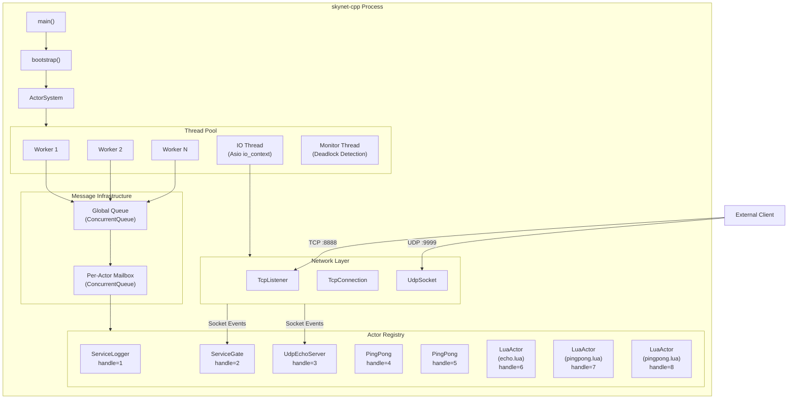
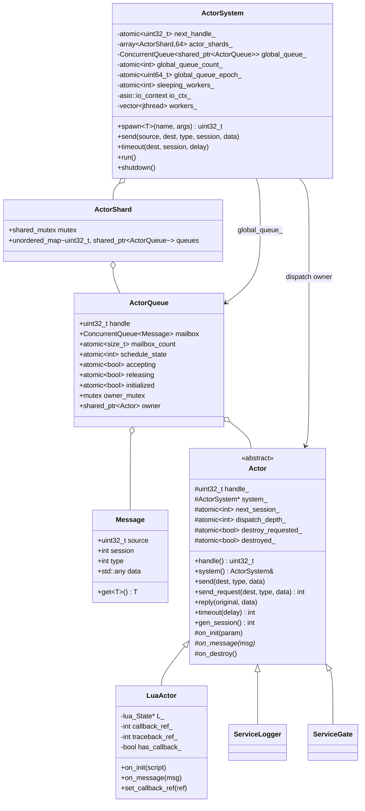
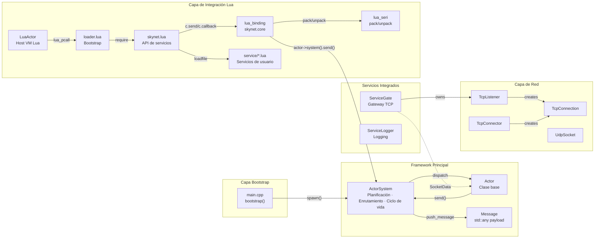
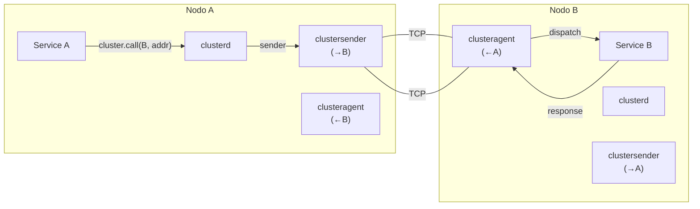
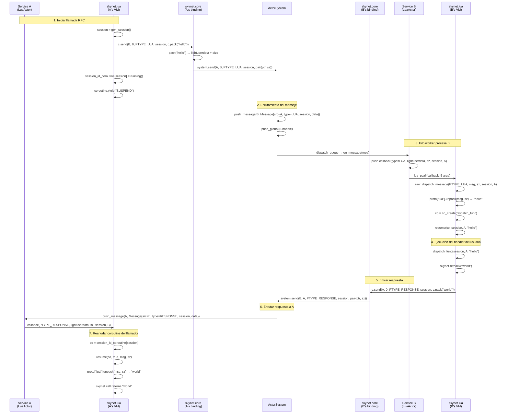

# skynet-cpp — Documento de Diseño del Proyecto
## Actualizaciones Recientes del Runtime

El runtime ahora usa un arranque basado en preload: la entrada C++ solo lee `SKYNET_THREAD` y `SKYNET_PRELOAD`, usa `examples/preload.lua` por defecto y deja al script preload el arranque del launcher, la configuración de Lua path/cpath/service path y la selección de la entrada de la aplicación. `skynet.appendpath`, `skynet.prependpath`, `skynet.appendcpath`, `skynet.appendservicepath` y `skynet.getpath` gestionan el snapshot global de rutas heredado por nuevos LuaActors.

El modelo de release ahora es apto para install/package: el ejecutable ya no contiene la raíz de código fuente y el árbol instalado usa `bin/`, `lualib/`, `service/`, `examples/` y `doc/`. Un preload puede imprimir el cwd con `skynet.getcwd()`, administrar la base de rutas relativas con `skynet.setpathbase(path)` / `skynet.getpathbase()` y usar `skynet.readfile` / `skynet.writefile` para archivos de negocio relativos al pathbase sin abrir la biblioteca Lua `io`.

El scheduler usa ahora el modelo `ActorQueue`: el registro de actores está particionado por handle, la cola global almacena objetos `ActorQueue` y la vida de la cola es independiente del owner Actor. Después de `kill`, la cola drena o descarta mensajes pendientes de forma segura. LuaActor cachea callback y traceback como registry refs, y las APIs C de `skynet.core` cachean el puntero del actor como closure upvalue.

La ruta caliente usa `ConcurrentQueue`, atomic epoch wait/notify, conteo de workers dormidos y un contador aproximado de cola global. Los workers de 8/16 hilos hacen un breve spin en user space antes de dormir para reducir futex wakeups en cargas actor RPC. Las pruebas se separaron en `tests/logic`, `tests/stress`, `tests/perf` y runners de coverage; la comparación Linux se ejecuta con Docker.

> **skynet-cpp** — Reimplementación moderna en C++20 del framework de actores [Skynet](https://github.com/cloudwu/skynet)

---

## Índice

1. [Descripción del Proyecto](#1-descripción-del-proyecto)
2. [Objetivos de Diseño y Problemas Resueltos](#2-objetivos-de-diseño-y-problemas-resueltos)
3. [Selección de Tecnología](#3-selección-de-tecnología)
4. [Arquitectura del Sistema](#4-arquitectura-del-sistema)
5. [Módulos Principales](#5-módulos-principales)
6. [Diagrama de Clases](#6-diagrama-de-clases)
7. [Relaciones entre Módulos](#7-relaciones-entre-módulos)
8. [Detalles de Implementación](#8-detalles-de-implementación)
   - [8.1 Framework de Actores](#81-framework-de-actores-skynethcpp)
   - [8.2 Capa de Red](#82-capa-de-red-networkhcpp)
   - [8.3 Servicio Gateway TCP](#83-servicio-gateway-tcp-service_gateh)
   - [8.4 Servicio de Logging](#84-servicio-de-logging-service_loggerh)
   - [8.5 Lua Actor](#85-lua-actor-lua_actorhcpp)
   - [8.6 Capa de Binding C Lua](#86-capa-de-binding-c-lua-lua_bindingcpp)
   - [8.7 Protocolo de Serialización Lua](#87-protocolo-de-serialización-lua-lua_serihcpp)
   - [8.8 Capa API de Servicio Lua](#88-capa-api-de-servicio-lua-skynetlua)
   - [8.9 Socket Lua API](#89-socket-lua-api)
   - [8.10 GateServer Plantilla de Gateway](#810-gateserver-plantilla-de-gateway)
   - [8.11 SocketChannel Multiplexación de Conexión](#811-socketchannel-multiplexación-de-conexión)
   - [8.12 Cluster](#812-cluster)
   - [8.13 Debug y Profile](#813-debug-y-profile)
   - [8.14 ShareData](#814-sharedata)
   - [8.15 Queue Cola de Serialización](#815-queue-cola-de-serialización)
   - [8.16 Multicast Pub/Sub](#816-multicast-pubsub)
   - [8.17 Drivers de Base de Datos y Bibliotecas Utilitarias](#817-drivers-de-base-de-datos-y-bibliotecas-utilitarias)
9. [Ejemplo de Flujo de Mensajes](#9-ejemplo-de-flujo-de-mensajes)

---

## 1. Descripción del Proyecto

skynet-cpp es un framework de servidor ligero basado en el modelo de actores, reimplementado en **C++20**. Su filosofía de diseño y semántica de API provienen de [cloudwu/skynet](https://github.com/cloudwu/skynet). El framework preserva la abstracción central de skynet — **cada servicio es un actor independiente que se comunica mediante mensajes asíncronos** — mientras aprovecha las características modernas de C++ y el ecosistema multiplataforma para lograr seguridad de tipos, gestión automática de recursos mediante RAII e independencia de plataforma.

### Estructura del Proyecto

```
skynet-cpp/
├── CMakeLists.txt                         # Build configuration
├── doc/
│   ├── design/                            # Multilingual architecture design docs
│   ├── wiki/                              # Multilingual user wiki docs
│   └── performance-optimization/          # Performance optimization notes
├── src/
│   ├── skynet.h / skynet.cpp              # ActorSystem, ActorQueue, scheduler, registry
│   ├── network.h / network.cpp            # TCP/UDP network layer (Asio)
│   ├── platform.h / platform.cpp          # Small cross-platform runtime helpers
│   ├── service_gate.h                     # TCP gateway service (C++)
│   ├── service_logger.h                   # Logger service (C++)
│   ├── lua_actor.h / lua_actor.cpp        # Lua VM host Actor
│   ├── lua_binding.cpp                    # skynet.core C bindings
│   ├── lua_seri.h / lua_seri.cpp          # Lua binary serialization
│   ├── lua_socket_binding.cpp             # socketdriver C bindings
│   ├── lua_netpack.cpp                    # netpack C bindings
│   ├── lua_cluster.cpp                    # cluster.core C bindings
│   ├── lua_profile.cpp                    # profile C bindings
│   ├── skynet_json.h                      # JSON helper
│   └── main.cpp                           # Minimal preload bootstrap entrypoint
├── lualib/
│   ├── loader.lua                         # Lua service loader; uses global path snapshot
│   ├── skynet.lua                         # Lua service API layer and path config API
│   ├── socket.lua                         # Socket API (coroutine wrapper)
│   ├── gateserver.lua                     # TCP gateway template
│   ├── sharedata.lua                      # Shared data client
│   ├── bson.lua                           # BSON codec (pure Lua)
│   └── skynet/
│       ├── socketchannel.lua              # Socket connection multiplexing
│       ├── cluster.lua                    # Cluster RPC client
│       ├── coverage.lua                   # Lua line coverage hook
│       ├── debug.lua                      # Debug protocol
│       ├── queue.lua                      # Coroutine critical section queue
│       ├── multicast.lua                  # Pub/sub client
│       ├── crypt.lua                      # SHA1/Base64/Hex helpers
│       └── db/
│           ├── redis.lua                  # Redis driver (RESP protocol)
│           ├── mysql.lua                  # MySQL driver (wire protocol)
│           └── mongo.lua                  # MongoDB driver (OP_MSG)
├── service/
│   ├── launcher.lua                       # Service launcher
│   ├── debug_console.lua                  # Debug console service
│   ├── clusterd.lua                       # Cluster manager
│   ├── clusteragent.lua                   # Cluster inbound agent
│   ├── clustersender.lua                  # Cluster outbound sender
│   ├── sharedatad.lua                     # Shared data server
│   └── multicastd.lua                     # Multicast manager service
├── examples/
│   ├── preload.lua                        # Default preload bootstrap
│   ├── main.lua                           # Example application entry service
│   ├── echo.lua                           # Example echo service
│   └── pingpong.lua                       # Example ping-pong service
├── tests/
│   ├── cpp_unit.cpp                       # C++ unit tests
│   ├── logic/                             # Logic regression preload and services
│   ├── stress/                            # Stress preload, workers, and suite
│   └── perf/                              # Performance benchmark preload and workers
├── tools/
│   ├── run_coverage.ps1                   # Windows coverage gate
│   ├── run_linux_coverage_in_docker.ps1   # Linux coverage gate via Docker
│   ├── run_perf_benchmark.ps1             # Windows perf benchmark
│   └── run_linux_perf_in_docker.ps1       # Linux/native comparison perf benchmark
└── 3rdparty/
    ├── asio/                              # Asio standalone headers
    ├── concurrentqueue/                   # moodycamel lock-free queue
    └── lua-5.5.0/                         # Skynet-modified Lua 5.5.0
```

---

## 2. Objetivos de Diseño y Problemas Resueltos

| Dimensión | Skynet Original (C + Lua) | skynet-cpp (C++20) |
|---|---|---|
| **Lenguaje** | Implementación C pura, gestión manual de memoria | C++20, RAII + `std::shared_ptr` gestión automática del ciclo de vida |
| **Plataforma** | Solo Linux (epoll + pthreads) | Multiplataforma (abstracción Asio, Windows/Linux/macOS) |
| **Seguridad de tipos** | Punteros `void*` para paso de mensajes, cast en tiempo de ejecución | `std::any` + `msg.get<T>()` acceso seguro basado en templates |
| **Concurrencia** | Spinlock propio + cola global | `moodycamel::ConcurrentQueue` (lock-free MPMC) + `std::shared_mutex` |
| **IO Asíncrono** | Servidor de sockets propio (wrapper epoll) | Asio + `steady_timer`, integración natural con mensajes de actores |
| **Modelo de hilos** | Hilos worker fijos + hilo timer único | Hilos worker + hilo IO (Asio) + hilo monitor |
| **Integración Lua** | Acoplamiento estrecho, manipulación directa del stack Lua en C | Capas claras: `LuaActor` → C-Binding → Lua-API |
| **Sistema de compilación** | Makefile (solo GCC/Clang) | CMake 3.20+ (MSVC/GCC/Clang) |

### Objetivos de Diseño Principales

1. **Preservar la semántica de actores de Skynet**: identificación por handle, mensajes asíncronos, mecanismo de sesiones, servicios con nombre
2. **Seguridad de tipos moderna con C++**: spawn con templates, mensajes tipados, detección de errores en tiempo de compilación
3. **Multiplataforma**: objetivo principal Windows (MSVC), compatible con Linux/macOS
4. **Integración Lua**: adopción directa del Lua 5.5.0 modificado de Skynet (con codecache), API compatible `skynet.send/call/ret`

---

## 3. Selección de Tecnología

| Tecnología | Versión | Justificación |
|---|---|---|
| **C++20** | MSVC 19.41+ / GCC 12+ | `std::jthread` (auto-join), `std::any` (mensajes con tipo seguro), `std::shared_mutex` (bloqueo lectores-escritor), Concepts |
| **Asio** | 1.28.2 (standalone) | IO asíncrono multiplataforma maduro; sin dependencia de Boost; soporte nativo TCP/UDP/Timer; `io_context` integrable con bucle de mensajes de actores |
| **moodycamel::ConcurrentQueue** | latest | Cola MPMC lock-free de alto rendimiento; header-only; buzón ActorQueue usa `ConcurrentQueue`, buzón ActorQueue y cola global usan `ConcurrentQueue` |
| **Lua 5.5.0 (modificado por Skynet)** | 5.5.0-skynet | Fork Lua de Skynet con **codecache** (bytecode compilado compartido entre VMs), APIs extendidas `lua_clonefunction`, `lua_sharefunction`, `lua_pushexternalstring` |
| **CMake** | 3.20+ | Compilación multiplataforma; soporte MSVC/GCC/Clang; CMake moderno basado en targets |

---

## 4. Arquitectura del Sistema



---

## 5. Módulos Principales

| Module | Source Files | Current Responsibility |
|---|---|---|
| **Actor Runtime** | `src/skynet.h`, `src/skynet.cpp` | `Actor`, `ActorSystem`, sharded actor registry, `ActorQueue`, weighted dispatch, timer/session, lifecycle, monitor thread |
| **Platform Helpers** | `src/platform.h`, `src/platform.cpp` | Small portability boundary for environment variables, file append/write helpers, local time formatting, process/node identity, Lua C module suffix |
| **Network Layer** | `src/network.h`, `src/network.cpp` | Cross-platform TCP listener/client/connection and UDP socket built on standalone Asio |
| **C++ Gateway** | `src/service_gate.h` | C++ TCP gateway service and connection event routing |
| **Logger** | `src/service_logger.h` | stdout/file logger service; runtime error logs route through cached logger handle |
| **Lua Actor Host** | `src/lua_actor.h`, `src/lua_actor.cpp` | Per-service Lua VM, loader execution, global path snapshot inheritance, callback/traceback registry refs, memory tracking |
| **Lua Core Binding** | `src/lua_binding.cpp` | `skynet.core` C API: send/callback/session/command/path configuration/serialization helpers |
| **Serialization Binding** | `src/lua_seri.h`, `src/lua_seri.cpp` | Skynet-compatible Lua value pack/unpack binary serialization |
| **Socket Binding** | `src/lua_socket_binding.cpp` | `socketdriver` C API for TCP/UDP listen/connect/send/close/pause/resume with shortened store lock scope |
| **Netpack Binding** | `src/lua_netpack.cpp` | 2-byte big-endian TCP frame pack/unpack/filter helpers |
| **Cluster Binding** | `src/lua_cluster.cpp` | `cluster.core` pack/unpack/multicast string helpers |
| **Profile Binding** | `src/lua_profile.cpp` | `skynet.profile` coroutine timing hooks and resume/wrap replacement |
| **JSON Helper** | `src/skynet_json.h` | Header-only JSON utility retained for runtime/support code |
| **Lua Loader** | `lualib/loader.lua` | Resolves plain service names through configured service paths and executes Lua service scripts |
| **Lua Service API** | `lualib/skynet.lua` | `start`, `dispatch`, `send`, `call`, `ret`, `timeout`, `fork`, named service APIs, path/cpath/service-path configuration APIs |
| **Socket API** | `lualib/socket.lua` | Coroutine-friendly TCP/UDP API over `socketdriver` |
| **GateServer API** | `lualib/gateserver.lua` | Lua gateway template with connect/disconnect/message handler callbacks |
| **SocketChannel** | `lualib/skynet/socketchannel.lua` | Reconnectable ordered/session socket multiplexing used by Redis/Mongo style clients |
| **Cluster** | `lualib/skynet/cluster.lua` + `service/cluster*.lua` | Cluster RPC client and cluster manager/agent/sender services |
| **Debug Console** | `lualib/skynet/debug.lua`, `service/debug_console.lua` | Debug command protocol and TCP debug console service |
| **ShareData** | `lualib/sharedata.lua`, `service/sharedatad.lua` | Shared immutable table publication, query, cache, and update notification |
| **Multicast** | `lualib/skynet/multicast.lua`, `service/multicastd.lua` | Publish/subscribe channel manager and client API |
| **Coverage** | `lualib/skynet/coverage.lua` | Lua line coverage hook used only by coverage runners |
| **DB Drivers** | `lualib/skynet/db/{redis,mysql,mongo}.lua`, `lualib/bson.lua` | Redis RESP, MySQL wire protocol, MongoDB OP_MSG/BSON clients |
| **Examples** | `examples/preload.lua`, `examples/main.lua`, `examples/echo.lua`, `examples/pingpong.lua` | Default preload and example services |
| **Tests** | `tests/cpp_unit.cpp`, `tests/logic`, `tests/stress`, `tests/perf` | C++ units, logic regression suite, stress suite, and performance benchmark suite |
| **Tools** | `tools/run_*.ps1`, `tools/run_linux_coverage.sh` | Coverage, Docker/Linux validation, Docker DB stress, and performance runners |

---

## 6. Diagrama de Clases



---

## 7. Relaciones entre Módulos



---

## 8. Detalles de Implementación

*Los detalles técnicos de las secciones 8.1–8.8 son idénticos a la versión en inglés (`design/en.md`). Los diagramas Mermaid, extractos de código y tablas de referencia de API permanecen sin cambios. Para los detalles completos de cada módulo, consulte la versión en inglés.*

---

### 8.9 Socket Lua API

`socket.lua` encapsula el módulo C `socketdriver` con semántica de coroutine, proporcionando APIs de estilo bloqueante. Cuando el IO subyacente no está listo, la coroutine actual se suspende vía `skynet.wait`; al completarse el IO, el dispatch de eventos del socket la reactiva.

**Capas de arquitectura**:
```
socket.lua (API del usuario)
  └─→ socketdriver (módulo C)
        └─→ TcpListener / TcpConnector / UdpSocket (C++ Asio)
              └─→ Eventos PTYPE_SOCKET → buzón del Actor
```

**API TCP**:

| Función | Descripción |
|---|---|
| `socket.listen(host, port, handler)` | Escucha puerto TCP, handler recibe eventos accept/close/warning |
| `socket.ondata(listener_id, handler)` | Establece callback de datos `handler(conn_id, data)` |
| `socket.connect(host, port)` | Conecta al host remoto, bloquea hasta conectado o fallo |
| `socket.send(conn_id, data)` | Envía datos vía connector |
| `socket.write(listener_id, conn_id, data)` | Envía datos vía conexión del listener |
| `socket.read(conn_id, sz)` | Lee sz bytes, bloquea hasta datos disponibles |
| `socket.readline(conn_id, sep)` | Lee hasta delimitador (predeterminado `\n`), excluye delimitador |
| `socket.readall(conn_id)` | Lee todos los datos disponibles |
| `socket.close(conn_id)` | Cierra conexión |
| `socket.pause(listener_id, conn_id)` | Pausa lectura de conexión (control de flujo) |
| `socket.resume(listener_id, conn_id)` | Reanuda lectura de conexión |

**API UDP**:

| Función | Descripción |
|---|---|
| `socket.udp(host, port, callback)` | Crea socket UDP, callback recibe datagramas |
| `socket.udp_send(id, data, host, port)` | Envía datagrama UDP |

---

### 8.10 GateServer Plantilla de Gateway

`gateserver.lua` es una plantilla de alto nivel para construir gateways de acceso al cliente. Encapsula `socket.listen` + lógica de fragmentación `netpack`; los desarrolladores solo necesitan implementar callbacks handler.

**Protocolo de fragmentación**: cada paquete = cabecera de 2 bytes big-endian + contenido, máximo 65535 bytes por paquete.

**Uso**:
```lua
local gateserver = require "gateserver"
local handler = {}

function handler.connect(conn_id, addr, port) ... end
function handler.disconnect(conn_id) ... end
function handler.message(conn_id, data) ... end
function handler.open(source, conf) ... end

gateserver.start(handler)
```

**Callbacks handler**:

| Callback | Descripción |
|---|---|
| `connect(conn_id, addr, port)` | Nuevo cliente conectado |
| `disconnect(conn_id)` | Cliente desconectado |
| `message(conn_id, data)` | Paquete de negocio completo recibido (cabecera eliminada) |
| `error(conn_id, msg)` | Error de conexión |
| `warning(conn_id, bytes)` | Buffer de envío excedió umbral |
| `open(source, conf)` | Llamado cuando gate abre puerto de escucha |

**Comandos de protocolo Lua** (otros servicios pueden enviar al gate): `OPEN`, `SEND`, `SENDRAW`, `CLOSE`, `KICK`.

---

### 8.11 SocketChannel Multiplexación de Conexión

`socketchannel.lua` proporciona encapsulación de alto nivel para acceso a servicios externos, soportando dos modos de protocolo:

**Modo 1: Modo Secuencial (Order Mode)**
- Cada solicitud tiene exactamente una respuesta, TCP garantiza ordenamiento
- Adecuado para protocolo RESP de Redis
- `channel:request(req, response_func)` — response_func analiza la respuesta

**Modo 2: Modo Sesión (Session Mode)**
- Cada solicitud lleva un session único; las respuestas incluyen session para correspondencia
- Adecuado para protocolo MongoDB
- Proporcionar función `response` global al crear el channel; `request` recibe parámetro session

**Características principales**:
- **Reconexión automática**: reconecta automáticamente en la próxima solicitud tras desconexión
- **Flujo de auth**: proporcionar función `auth` al crear, ejecutada inmediatamente tras conexión
- **Soporte readline**: `channel:readline(sep)` lee por delimitador
- **Método response**: `channel:response(func)` solo recibe sin enviar (para pub/sub)

```lua
-- Redis (Modo Secuencial)
local channel = socketchannel.channel { host = "127.0.0.1", port = 6379 }
local resp = channel:request(req_str, function(sock) return true, sock:readline() end)

-- MongoDB (Modo Sesión)
local channel = socketchannel.channel {
    host = "127.0.0.1", port = 27017,
    response = function(sock) ... return session, ok, data end
}
local resp = channel:request(req_str, session_id)
```

---

### 8.12 Cluster

skynet-cpp implementa el modo cluster de skynet (no master/slave). Cada nodo es un proceso independiente, comunicándose vía TCP para RPC entre nodos.

**Arquitectura**:



**Arquitectura de tres servicios**:

| Servicio | Responsabilidad |
|---|---|
| `clusterd` | Gestor central: config de nodos, ciclo de vida de sender/agent, registro de nombres, puerto de escucha |
| `clustersender` | Conexión de salida (uno por nodo remoto): envía solicitudes/pushes vía socketchannel, recibe respuestas |
| `clusteragent` | Conexión de entrada (uno por conexión): analiza solicitudes, despacha a servicios locales, retransmite respuestas |

**API del cliente** (`skynet.cluster`):

| Función | Descripción |
|---|---|
| `cluster.call(node, addr, ...)` | Llamada RPC síncrona a servicio remoto |
| `cluster.send(node, addr, ...)` | Push asíncrono (sin respuesta) |
| `cluster.open(addr, port)` | Escucha puerto para aceptar conexiones entrantes |
| `cluster.reload(cfg)` | Recarga configuración del cluster |
| `cluster.register(name, addr)` | Registra nombre para acceso remoto |
| `cluster.query(node, name)` | Consulta nombre registrado en nodo remoto |

**Protocolo de cluster** (módulo C `cluster.core`): cabecera de 2 bytes + etiqueta de tipo + dirección + session + payload. Soporta segmentación automática de mensajes grandes (>32KB dividido en múltiples segmentos).

---

### 8.13 Debug y Profile

#### Protocolo Debug

`debug.lua` registra el protocolo `PTYPE_DEBUG` para cada servicio Lua, con comandos de depuración integrados:

| Comando | Descripción |
|---|---|
| `MEM` | Retorna uso de memoria de la VM Lua actual (KB) |
| `GC` | Dispara recolección de basura, reporta cambio de memoria |
| `STAT` | Retorna conteo de tareas, longitud de cola de mensajes, estadísticas de CPU |
| `TASK` | Retorna información de pila de coroutines activas |
| `INFO` | Llama callback `info_func` registrado por el servicio |
| `EXIT` | Termina servicio graciosamente |
| `PING` | Verificación de vida (respuesta inmediata) |
| `RUN` | Inyecta y ejecuta código Lua |

Comandos de depuración personalizados pueden registrarse vía `debug.reg_debugcmd(name, fn)`.

#### Consola de Depuración

`debug_console.lua` proporciona interfaz TCP telnet, soportando comandos: `list`, `mem`, `gc`, `stat`, `ping`, `info`, `exit`, `kill`, `start`, `inject`.

#### Profile

Temporización de CPU por coroutine vía `lua_profile.cpp`:

```lua
local profile = require "skynet.profile"
profile.start()                 -- Iniciar temporización
local cpu_time = profile.stop() -- Detener temporización, retorna segundos
```

---

### 8.14 ShareData

ShareData permite compartir datos estructurados de solo lectura entre múltiples servicios en el mismo proceso, típicamente usado para distribución de tablas de configuración.

**Arquitectura**:

```
sharedatad (servidor)               sharedata (biblioteca cliente)
  ├─ data_store[name]                 ├─ caché local
  │   ├─ data                         ├─ rastreo de versión
  │   └─ version                      └─ coroutine monitor (actualizaciones long-poll)
  └─ comandos: new/delete/
     query/update/monitor
```

**API del cliente** (`sharedata`):

| Función | Descripción |
|---|---|
| `sharedata.new(name, value)` | Crear datos compartidos |
| `sharedata.query(name)` | Consultar datos (primera consulta inicia coroutine monitor) |
| `sharedata.update(name, value)` | Actualizar datos (notifica todos los monitores) |
| `sharedata.delete(name)` | Eliminar datos compartidos |
| `sharedata.flush()` | Limpiar caché local |
| `sharedata.deepcopy(name, ...)` | Obtener copia profunda |

**Diferencia del original**: el sharedata de skynet-cpp usa paso de mensajes con copias profundas, no memoria compartida C (ya que cada VM tiene `_ENV` independiente). Funcionalmente equivalente, pero la memoria no se comparte.

---

### 8.15 Queue Cola de Serialización

`queue.lua` implementa locks mutex por coroutine, resolviendo el problema de "pseudo-concurrencia" dentro de un servicio. Cuando una API bloqueante (como `skynet.call`) se llama durante el procesamiento de mensajes, causando reentrada del servicio, queue garantiza ejecución serial de secciones críticas.

**Uso**:
```lua
local queue = require "skynet.queue"
local cs = queue()  -- Crear una cola de ejecución

function CMD.foobar()
    cs(function()
        -- Este bloque de código no será interrumpido por otro código usando el mismo cs
        skynet.call(other_service, "lua", "slow_request")
        -- Incluso si la línea anterior suspende, nuevos mensajes foobar serán encolados
    end)
end
```

**Implementación**: Usa `current_thread` + conteo de referencia `ref` + cola de espera `thread_queue`, con `skynet.wait/wakeup` para planificación FIFO. Soporta reentrancia (llamadas anidadas en la misma coroutine no causan deadlock).

---

### 8.16 Multicast Pub/Sub

El módulo Multicast proporciona mensajería de publicación/suscripción basada en canales dentro del mismo proceso.

**Arquitectura**:

| Componente | Responsabilidad |
|---|---|
| Servicio `multicastd` | Gestiona canales (asigna IDs), mantiene listas de suscriptores, transmite mensajes |
| Cliente `multicast.lua` | Registra protocolo `PTYPE_MULTICAST`, proporciona API orientada a objetos |

**API**:

```lua
local multicast = require "skynet.multicast"
local mc = multicast.new()        -- Crear canal
mc:subscribe()                     -- Suscribir
mc:publish("hello", "world")       -- Publicar
mc:unsubscribe()                   -- Cancelar suscripción
mc:delete()                        -- Eliminar canal

-- Receptor establece callback
mc.dispatch = function(channel, source, ...)
    print("received:", ...)
end
```

---

### 8.17 Drivers de Base de Datos y Bibliotecas Utilitarias

Todos los drivers de base de datos están construidos sobre `socketchannel`, nunca bloqueando hilos worker de skynet.

#### Driver Redis (`skynet.db.redis`)

- **Protocolo**: RESP (Redis Serialization Protocol)
- **Modo socketchannel**: Order (solicitud/respuesta uno-a-uno)
- **Características**: comandos generados automáticamente (metatable `__index`), pipeline por lotes, modo pub/sub watch
- **Conexión**: `redis.connect({host, port, auth, db})`
- **Comandos**: `db:get(key)`, `db:set(key, val)`, `db:hgetall(key)` — todos los comandos Redis

#### Driver MySQL (`skynet.db.mysql`)

- **Protocolo**: MySQL Wire Protocol v10
- **Autenticación**: SHA1 challenge-response (MySQL 4.1+ native_password)
- **Características**: consulta de texto + prepared statement + múltiples conjuntos de resultados
- **Conexión**: `mysql.connect({host, port, user, password, database})`
- **API**: `db:query(sql)`, `db:prepare(sql)`, `stmt:execute()`, `stmt:close()`

#### Driver MongoDB (`skynet.db.mongo`)

- **Protocolo**: OP_MSG (MongoDB 3.6+)
- **Modo socketchannel**: Session (solicitud/respuesta correspondidos por requestID)
- **BSON**: usa codec Lua puro `bson.lua` (soporta double/string/document/array/binary/objectid/int64/null/minkey/maxkey)
- **Conexión**: `mongo.client({host, port})`
- **API**: `client:getDB(name)` → `db:getCollection(name)` → `coll:insert/find/update/delete/aggregate`
- **Cursor**: `coll:find(query):sort(s):skip(n):limit(m):toArray()`

#### Herramientas Crypt (`skynet.crypt`)

Funciones criptográficas Lua puro, usadas para autenticación MySQL y similares:

| Función | Descripción |
|---|---|
| `crypt.sha1(msg)` | Hash SHA-1 (160 bits) |
| `crypt.hmac_sha1(key, msg)` | HMAC-SHA1 |
| `crypt.base64encode(data)` | Codificación Base64 |
| `crypt.base64decode(data)` | Decodificación Base64 |
| `crypt.hexencode(data)` | Codificación hexadecimal |
| `crypt.hexdecode(data)` | Decodificación hexadecimal |

#### Codec BSON (`bson`)

Biblioteca de serialización BSON Lua puro para el driver MongoDB:

| Función | Descripción |
|---|---|
| `bson.encode(doc)` | Codificar tabla Lua → binario BSON |
| `bson.encode_order(k1, v1, ...)` | Codificación preservando orden |
| `bson.decode(data)` | Decodificar binario BSON → tabla Lua |
| `bson.objectid(hex)` | Crear/generar ObjectId |
| `bson.int64(value)` | Crear entero de 64 bits |
| `bson.null` | Constante null BSON |

---

## 9. Ejemplo de Flujo de Mensajes

El siguiente diagrama de secuencia muestra una cadena completa de llamada RPC Lua: **Service A llama a `skynet.call(B, "lua", "hello")`**.



### Puntos Clave de Sincronización

1. **Pack/Unpack en pares**: `c.pack("hello")` serializa en el lado emisor, el receptor deserializa mediante `proto.unpack(msg, sz)` — formato completamente compatible con el Skynet original
2. **Continuidad de sesión**: el emisor asigna sesión → almacena en `session_id_coroutine` → el receptor la devuelve sin cambios → el emisor la compara y reanuda la coroutine
3. **Transferencia zero-copy**: el buffer serializado se pasa por puntero `lightuserdata`, el receptor libera después de `c.unpack` mediante `skynet.trash`
4. **Suspensión/reanudación de coroutine**: `skynet.call` usa `coroutine.yield("SUSPEND")` para suspender, `PTYPE_RESPONSE` activa `resume` para continuar


