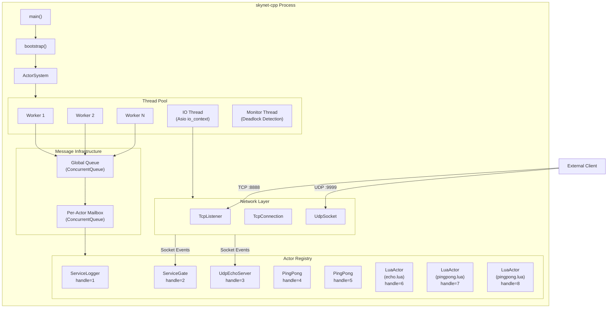
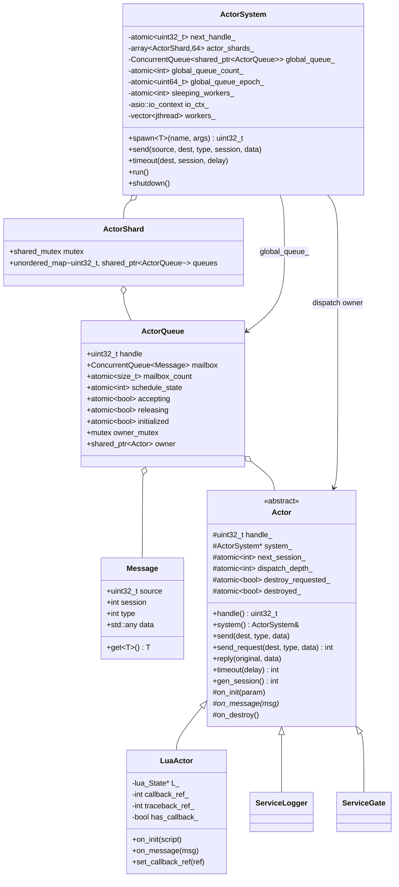
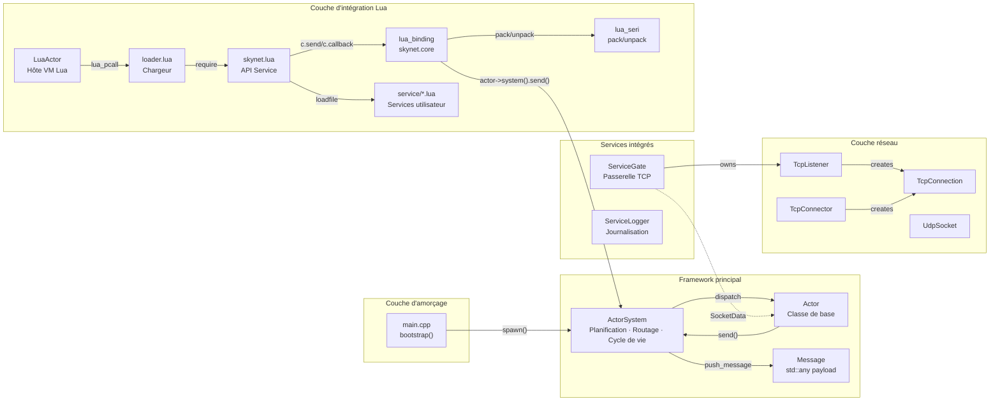
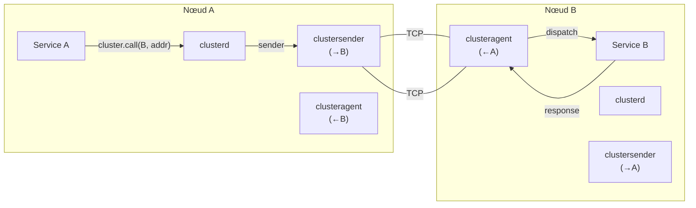
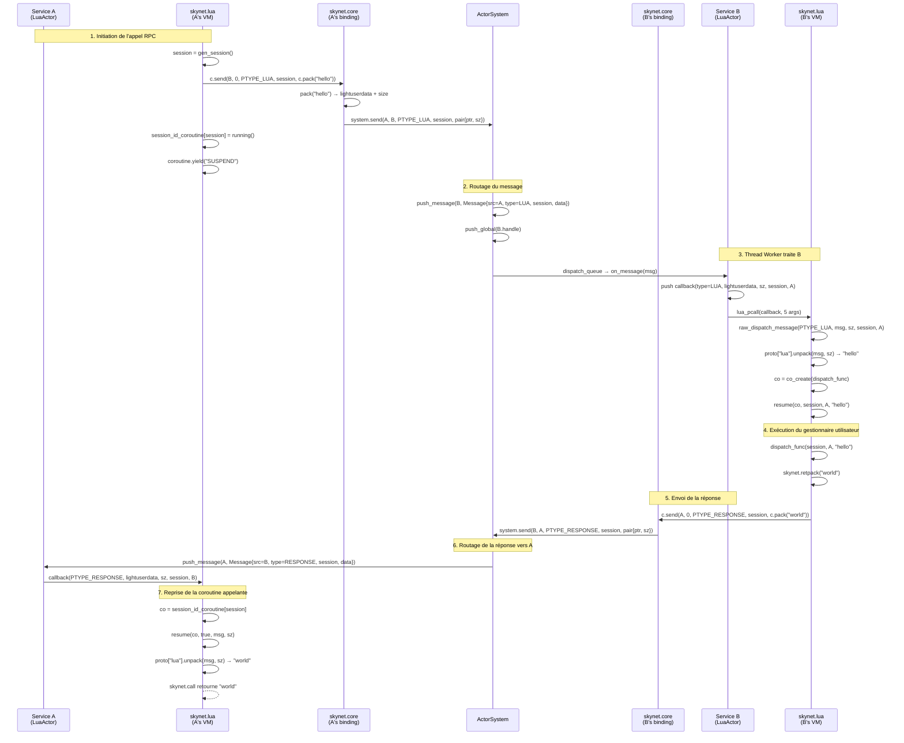

# skynet-cpp — Document de conception du projet
## Mises à Jour Récentes du Runtime

Le runtime utilise maintenant un bootstrap piloté par preload : l'entrée C++ lit uniquement `SKYNET_THREAD` et `SKYNET_PRELOAD`, utilise `examples/preload.lua` par défaut, et laisse le script preload démarrer le launcher, configurer Lua path/cpath/service path et choisir le point d'entrée applicatif. `skynet.appendpath`, `skynet.prependpath`, `skynet.appendcpath`, `skynet.appendservicepath` et `skynet.getpath` gèrent le snapshot global de chemins hérité par les nouveaux LuaActors.

L'ordonnancement utilise désormais le modèle `ActorQueue` : le registre d'acteurs est shardé par handle, la file globale stocke des objets `ActorQueue`, et la durée de vie de la queue est indépendante de l'owner Actor. Après `kill`, la queue draine ou abandonne les messages en attente de façon sûre. LuaActor met en cache callback et traceback sous forme de registry refs, et les APIs C de `skynet.core` mettent en cache le pointeur d'acteur comme closure upvalue.

Le hot path utilise `ConcurrentQueue`, atomic epoch wait/notify, le suivi des workers endormis et un compteur approximatif de file globale. Les workers 8/16 threads effectuent un court spin user-space avant de dormir afin de réduire les futex wakeups dans les charges actor RPC. Les tests sont séparés en `tests/logic`, `tests/stress`, `tests/perf` et runners coverage ; la comparaison Linux passe par Docker.

> **skynet-cpp** — Réimplémentation en C++20 moderne du framework Actor [Skynet](https://github.com/cloudwu/skynet)

---

## Table des matières

1. [Aperçu du projet](#1-aperçu-du-projet)
2. [Objectifs de conception et problèmes résolus](#2-objectifs-de-conception-et-problèmes-résolus)
3. [Choix technologiques](#3-choix-technologiques)
4. [Architecture système](#4-architecture-système)
5. [Modules principaux](#5-modules-principaux)
6. [Diagramme de classes](#6-diagramme-de-classes)
7. [Relations inter-modules](#7-relations-inter-modules)
8. [Détails d'implémentation](#8-détails-dimplémentation)
   - [8.1 Framework Actor](#81-framework-actor-skynethcpp)
   - [8.2 Couche réseau](#82-couche-réseau-networkhcpp)
   - [8.3 Service passerelle TCP](#83-service-passerelle-tcp-service_gateh)
   - [8.4 Service de journalisation](#84-service-de-journalisation-service_loggerh)
   - [8.5 Lua Actor](#85-lua-actor-lua_actorhcpp)
   - [8.6 Couche de liaison C Lua](#86-couche-de-liaison-c-lua-lua_bindingcpp)
   - [8.7 Protocole de sérialisation Lua](#87-protocole-de-sérialisation-lua-lua_serihcpp)
   - [8.8 Couche API de service Lua](#88-couche-api-de-service-lua-skynetlua)
   - [8.9 Socket Lua API](#89-socket-lua-api)
   - [8.10 GateServer Modèle de passerelle](#810-gateserver-modèle-de-passerelle)
   - [8.11 SocketChannel Multiplexage de connexion](#811-socketchannel-multiplexage-de-connexion)
   - [8.12 Cluster](#812-cluster)
   - [8.13 Debug et Profile](#813-debug-et-profile)
   - [8.14 ShareData](#814-sharedata)
   - [8.15 Queue File de sérialisation](#815-queue-file-de-sérialisation)
   - [8.16 Multicast Pub/Sub](#816-multicast-pubsub)
   - [8.17 Pilotes de base de données et bibliothèques utilitaires](#817-pilotes-de-base-de-données-et-bibliothèques-utilitaires)
9. [Exemple de flux de messages](#9-exemple-de-flux-de-messages)

---

## 1. Aperçu du projet

skynet-cpp est un framework serveur léger basé sur le modèle Actor, réimplémenté en **C++20**, dont la philosophie de conception et la sémantique API proviennent de [cloudwu/skynet](https://github.com/cloudwu/skynet). Le framework préserve l'abstraction fondamentale de skynet — **chaque service est un Actor indépendant communiquant par messages asynchrones** — tout en exploitant les fonctionnalités du C++ moderne et l'écosystème multiplateforme pour la sécurité de type, la gestion des ressources RAII et l'indépendance de plateforme.

### Structure du projet

```
skynet-cpp/
├── CMakeLists.txt                         # Build configuration
├── doc/
│   ├── design/                            # Multilingual architecture design docs
│   ├── wiki/                              # Multilingual user wiki docs
│   └── performance-optimization/          # Performance optimization notes
├── src/
│   ├── skynet.h / skynet.cpp              # ActorSystem, ActorQueue, scheduler, registry
│   ├── network.h / network.cpp            # TCP/UDP network layer (Asio)
│   ├── platform.h / platform.cpp          # Small cross-platform runtime helpers
│   ├── service_gate.h                     # TCP gateway service (C++)
│   ├── service_logger.h                   # Logger service (C++)
│   ├── lua_actor.h / lua_actor.cpp        # Lua VM host Actor
│   ├── lua_binding.cpp                    # skynet.core C bindings
│   ├── lua_seri.h / lua_seri.cpp          # Lua binary serialization
│   ├── lua_socket_binding.cpp             # socketdriver C bindings
│   ├── lua_netpack.cpp                    # netpack C bindings
│   ├── lua_cluster.cpp                    # cluster.core C bindings
│   ├── lua_profile.cpp                    # profile C bindings
│   ├── skynet_json.h                      # JSON helper
│   └── main.cpp                           # Minimal preload bootstrap entrypoint
├── lualib/
│   ├── loader.lua                         # Lua service loader; uses global path snapshot
│   ├── skynet.lua                         # Lua service API layer and path config API
│   ├── socket.lua                         # Socket API (coroutine wrapper)
│   ├── gateserver.lua                     # TCP gateway template
│   ├── sharedata.lua                      # Shared data client
│   ├── bson.lua                           # BSON codec (pure Lua)
│   └── skynet/
│       ├── socketchannel.lua              # Socket connection multiplexing
│       ├── cluster.lua                    # Cluster RPC client
│       ├── coverage.lua                   # Lua line coverage hook
│       ├── debug.lua                      # Debug protocol
│       ├── queue.lua                      # Coroutine critical section queue
│       ├── multicast.lua                  # Pub/sub client
│       ├── crypt.lua                      # SHA1/Base64/Hex helpers
│       └── db/
│           ├── redis.lua                  # Redis driver (RESP protocol)
│           ├── mysql.lua                  # MySQL driver (wire protocol)
│           └── mongo.lua                  # MongoDB driver (OP_MSG)
├── service/
│   ├── launcher.lua                       # Service launcher
│   ├── debug_console.lua                  # Debug console service
│   ├── clusterd.lua                       # Cluster manager
│   ├── clusteragent.lua                   # Cluster inbound agent
│   ├── clustersender.lua                  # Cluster outbound sender
│   ├── sharedatad.lua                     # Shared data server
│   └── multicastd.lua                     # Multicast manager service
├── examples/
│   ├── preload.lua                        # Default preload bootstrap
│   ├── main.lua                           # Example application entry service
│   ├── echo.lua                           # Example echo service
│   └── pingpong.lua                       # Example ping-pong service
├── tests/
│   ├── cpp_unit.cpp                       # C++ unit tests
│   ├── logic/                             # Logic regression preload and services
│   ├── stress/                            # Stress preload, workers, and suite
│   └── perf/                              # Performance benchmark preload and workers
├── tools/
│   ├── run_coverage.ps1                   # Windows coverage gate
│   ├── run_linux_coverage_in_docker.ps1   # Linux coverage gate via Docker
│   ├── run_perf_benchmark.ps1             # Windows perf benchmark
│   └── run_linux_perf_in_docker.ps1       # Linux/native comparison perf benchmark
└── 3rdparty/
    ├── asio/                              # Asio standalone headers
    ├── concurrentqueue/                   # moodycamel lock-free queue
    └── lua-5.5.0/                         # Skynet-modified Lua 5.5.0
```
│   ├── echo.lua                    # Exemple : service d'écho
│   └── pingpong.lua                # Exemple : service ping-pong
└── 3rdparty/
    ├── asio/                       # Bibliothèque Asio standalone
    ├── concurrentqueue/            # File d'attente sans verrou moodycamel
    └── lua-5.5.0/                  # Lua 5.5.0 modifié par Skynet
```

---

## 2. Objectifs de conception et problèmes résolus

| Dimension | Skynet original (C + Lua) | skynet-cpp (C++20) |
|---|---|---|
| **Langage** | Implémentation C pure, gestion manuelle de la mémoire | C++20, RAII + `std::shared_ptr` gestion automatique du cycle de vie |
| **Plateforme** | Linux uniquement (epoll + pthreads) | Multiplateforme (abstraction Asio, Windows/Linux/macOS) |
| **Sécurité de type** | Passage de messages par pointeur `void*`, cast à l'exécution | `std::any` + `msg.get<T>()` accès type-safe par template |
| **Primitives de concurrence** | Spinlock maison + file globale | `moodycamel::ConcurrentQueue` (MPMC sans verrou) + `std::shared_mutex` |
| **IO asynchrone** | Serveur socket maison (wrapper epoll) | Asio + `steady_timer`, intégration naturelle avec les messages Actor |
| **Modèle de threads** | Threads worker fixes + thread timer unique | Threads worker + thread IO (Asio) + thread moniteur |
| **Intégration Lua** | Couplage fort, manipulation directe de la pile Lua en C | Couches claires : `LuaActor` → C binding → API Lua |
| **Système de build** | Makefile (GCC/Clang uniquement) | CMake 3.20+ (MSVC/GCC/Clang) |

### Objectifs de conception principaux

1. **Préserver la sémantique Actor de Skynet** : identification par handle, messages asynchrones, mécanisme de session, services nommés
2. **Sécurité de type C++ moderne** : spawn par template, messages typés, détection d'erreurs à la compilation
3. **Multiplateforme** : cible principale Windows (MSVC), compatible Linux/macOS
4. **Intégration Lua** : adoption directe du Lua 5.5.0 modifié par Skynet (avec codecache), API `skynet.send/call/ret` compatible avec l'original

---

## 3. Choix technologiques

| Technologie | Version | Justification |
|---|---|---|
| **C++20** | MSVC 19.41+ / GCC 12+ | `std::jthread` (join automatique), `std::any` (messages type-safe), `std::shared_mutex` (verrou lecteur-écrivain), Concepts |
| **Asio** | 1.28.2 (standalone) | Bibliothèque IO asynchrone multiplateforme mature ; sans dépendance Boost ; support natif TCP/UDP/Timer ; `io_context` intégrable à la boucle de messages Actor |
| **moodycamel::ConcurrentQueue** | latest | File MPMC sans verrou haute performance ; header-only ; mailbox ActorQueue utilise `ConcurrentQueue`, mailbox ActorQueue et file globale utilisent `ConcurrentQueue` |
| **Lua 5.5.0 (modifié Skynet)** | 5.5.0-skynet | Fork Lua de Skynet avec **codecache** (partage de bytecode compilé entre VMs), `lua_clonefunction`, `lua_sharefunction`, `lua_pushexternalstring` et autres API étendues |
| **CMake** | 3.20+ | Build multiplateforme ; support MSVC/GCC/Clang ; CMake moderne basé sur les cibles |

---

## 4. Architecture système



---

## 5. Modules principaux

| Module | Source Files | Current Responsibility |
|---|---|---|
| **Actor Runtime** | `src/skynet.h`, `src/skynet.cpp` | `Actor`, `ActorSystem`, sharded actor registry, `ActorQueue`, weighted dispatch, timer/session, lifecycle, monitor thread |
| **Platform Helpers** | `src/platform.h`, `src/platform.cpp` | Small portability boundary for environment variables, file append/write helpers, local time formatting, process/node identity, Lua C module suffix |
| **Network Layer** | `src/network.h`, `src/network.cpp` | Cross-platform TCP listener/client/connection and UDP socket built on standalone Asio |
| **C++ Gateway** | `src/service_gate.h` | C++ TCP gateway service and connection event routing |
| **Logger** | `src/service_logger.h` | stdout/file logger service; runtime error logs route through cached logger handle |
| **Lua Actor Host** | `src/lua_actor.h`, `src/lua_actor.cpp` | Per-service Lua VM, loader execution, global path snapshot inheritance, callback/traceback registry refs, memory tracking |
| **Lua Core Binding** | `src/lua_binding.cpp` | `skynet.core` C API: send/callback/session/command/path configuration/serialization helpers |
| **Serialization Binding** | `src/lua_seri.h`, `src/lua_seri.cpp` | Skynet-compatible Lua value pack/unpack binary serialization |
| **Socket Binding** | `src/lua_socket_binding.cpp` | `socketdriver` C API for TCP/UDP listen/connect/send/close/pause/resume with shortened store lock scope |
| **Netpack Binding** | `src/lua_netpack.cpp` | 2-byte big-endian TCP frame pack/unpack/filter helpers |
| **Cluster Binding** | `src/lua_cluster.cpp` | `cluster.core` pack/unpack/multicast string helpers |
| **Profile Binding** | `src/lua_profile.cpp` | `skynet.profile` coroutine timing hooks and resume/wrap replacement |
| **JSON Helper** | `src/skynet_json.h` | Header-only JSON utility retained for runtime/support code |
| **Lua Loader** | `lualib/loader.lua` | Resolves plain service names through configured service paths and executes Lua service scripts |
| **Lua Service API** | `lualib/skynet.lua` | `start`, `dispatch`, `send`, `call`, `ret`, `timeout`, `fork`, named service APIs, path/cpath/service-path configuration APIs |
| **Socket API** | `lualib/socket.lua` | Coroutine-friendly TCP/UDP API over `socketdriver` |
| **GateServer API** | `lualib/gateserver.lua` | Lua gateway template with connect/disconnect/message handler callbacks |
| **SocketChannel** | `lualib/skynet/socketchannel.lua` | Reconnectable ordered/session socket multiplexing used by Redis/Mongo style clients |
| **Cluster** | `lualib/skynet/cluster.lua` + `service/cluster*.lua` | Cluster RPC client and cluster manager/agent/sender services |
| **Debug Console** | `lualib/skynet/debug.lua`, `service/debug_console.lua` | Debug command protocol and TCP debug console service |
| **ShareData** | `lualib/sharedata.lua`, `service/sharedatad.lua` | Shared immutable table publication, query, cache, and update notification |
| **Multicast** | `lualib/skynet/multicast.lua`, `service/multicastd.lua` | Publish/subscribe channel manager and client API |
| **Coverage** | `lualib/skynet/coverage.lua` | Lua line coverage hook used only by coverage runners |
| **DB Drivers** | `lualib/skynet/db/{redis,mysql,mongo}.lua`, `lualib/bson.lua` | Redis RESP, MySQL wire protocol, MongoDB OP_MSG/BSON clients |
| **Examples** | `examples/preload.lua`, `examples/main.lua`, `examples/echo.lua`, `examples/pingpong.lua` | Default preload and example services |
| **Tests** | `tests/cpp_unit.cpp`, `tests/logic`, `tests/stress`, `tests/perf` | C++ units, logic regression suite, stress suite, and performance benchmark suite |
| **Tools** | `tools/run_*.ps1`, `tools/run_linux_coverage.sh` | Coverage, Docker/Linux validation, Docker DB stress, and performance runners |

---

## 6. Diagramme de classes



---

## 7. Relations inter-modules



---

## 8. Détails d'implémentation

*Les détails techniques des sections 8.1 à 8.8 sont identiques à la version anglaise (`design/en.md`). Les diagrammes Mermaid, extraits de code et tables de référence API restent inchangés. Veuillez consulter la version anglaise pour les détails complets de chaque module.*

### 8.1 Framework Actor (`skynet.h/cpp`)

Le modèle de threads utilise N Workers (par défaut = nombre de cœurs CPU) + 1 thread IO (Asio) + 1 thread Moniteur (détection de deadlock toutes les 5 secondes). La stratégie de poids de planification (`calc_weight`) mélange différentes priorités entre faible latence et haut débit.

### 8.2 Couche réseau (`network.h/cpp`)

Les événements réseau sont livrés aux Actors via `PTYPE_SOCKET` + `std::any`. `TcpConnection` gère le tampon d'écriture avec contrôle de flux et demi-fermeture.

### 8.3 Service passerelle TCP (`service_gate.h`)

`ServiceGate` agit comme pont entre le framework Actor et la couche réseau, avec un pattern Agent Factory optionnel pour créer des Actors dédiés par connexion.

### 8.4 Service de journalisation (`service_logger.h`)

Centre de journalisation système. Format : `[HH:MM:SS.mmm][HANDLE][TAG] message`. Sortie simultanée vers stdout et fichier optionnel.

### 8.5 Lua Actor (`lua_actor.h/cpp`)

`LuaActor` hérite de `Actor` et héberge un `lua_State` indépendant. Sandbox sécurisé (pas de `io`/`os`), codecache désactivé, suivi mémoire, chargement non-caché.

### 8.6 Couche de liaison C Lua (`lua_binding.cpp`)

15 fonctions C enregistrées via `luaopen_skynet_core` : send, callback, genid, self, now, error, command, intcommand, addresscommand, pack, unpack, tostring, trash, redirect, harbor.

### 8.7 Protocole de sérialisation Lua (`lua_seri.h/cpp`)

Format binaire compatible avec le Skynet original. En-tête 1 octet `[TYPE:3 bits | COOKIE:5 bits]` + charge utile variable. Profondeur maximale d'imbrication : 32 niveaux.

### 8.8 Couche API de service Lua (`skynet.lua`)

API développeur : `skynet.send/call/ret/retpack/dispatch/fork/timeout/sleep/start/exit`. Pool de coroutines avec recyclage. 4 protocoles enregistrés : lua, text, response, error.

---

### 8.9 Socket Lua API

`socket.lua` encapsule le module C `socketdriver` avec une sémantique de coroutine, fournissant des API de style bloquant. Quand l'IO sous-jacent n'est pas prêt, la coroutine courante est suspendue via `skynet.wait` ; à l'achèvement de l'IO, le dispatch d'événements socket la réveille.

**Couches d'architecture** :
```
socket.lua (API utilisateur)
  └─→ socketdriver (module C)
        └─→ TcpListener / TcpConnector / UdpSocket (C++ Asio)
              └─→ Événements PTYPE_SOCKET → boîte aux lettres de l'Actor
```

**API TCP** :

| Fonction | Description |
|---|---|
| `socket.listen(host, port, handler)` | Écoute sur port TCP, handler reçoit événements accept/close/warning |
| `socket.ondata(listener_id, handler)` | Définit callback de données `handler(conn_id, data)` |
| `socket.connect(host, port)` | Connexion à l'hôte distant, bloque jusqu'à connexion ou échec |
| `socket.send(conn_id, data)` | Envoie données via connector |
| `socket.write(listener_id, conn_id, data)` | Envoie données via connexion du listener |
| `socket.read(conn_id, sz)` | Lit sz octets, bloque jusqu'aux données disponibles |
| `socket.readline(conn_id, sep)` | Lit jusqu'au délimiteur (défaut `\n`), exclut le délimiteur |
| `socket.readall(conn_id)` | Lit toutes les données disponibles |
| `socket.close(conn_id)` | Ferme la connexion |
| `socket.pause(listener_id, conn_id)` | Suspend la lecture de connexion (contrôle de flux) |
| `socket.resume(listener_id, conn_id)` | Reprend la lecture de connexion |

**API UDP** :

| Fonction | Description |
|---|---|
| `socket.udp(host, port, callback)` | Crée socket UDP, callback reçoit datagrammes |
| `socket.udp_send(id, data, host, port)` | Envoie datagramme UDP |

---

### 8.10 GateServer Modèle de passerelle

`gateserver.lua` est un modèle de haut niveau pour construire des passerelles d'accès client. Il encapsule `socket.listen` + logique de fragmentation `netpack` ; les développeurs n'ont qu'à implémenter les callbacks handler.

**Protocole de fragmentation** : chaque paquet = en-tête 2 octets big-endian + contenu, maximum 65535 octets par paquet.

**Utilisation** :
```lua
local gateserver = require "gateserver"
local handler = {}

function handler.connect(conn_id, addr, port) ... end
function handler.disconnect(conn_id) ... end
function handler.message(conn_id, data) ... end
function handler.open(source, conf) ... end

gateserver.start(handler)
```

**Callbacks handler** :

| Callback | Description |
|---|---|
| `connect(conn_id, addr, port)` | Nouveau client connecté |
| `disconnect(conn_id)` | Client déconnecté |
| `message(conn_id, data)` | Paquet métier complet reçu (en-tête supprimé) |
| `error(conn_id, msg)` | Erreur de connexion |
| `warning(conn_id, bytes)` | Tampon d'envoi dépassé le seuil |
| `open(source, conf)` | Appelé quand le gate ouvre le port d'écoute |

**Commandes de protocole Lua** (autres services peuvent envoyer au gate) : `OPEN`, `SEND`, `SENDRAW`, `CLOSE`, `KICK`.

---

### 8.11 SocketChannel Multiplexage de connexion

`socketchannel.lua` fournit une encapsulation de haut niveau pour l'accès aux services externes, supportant deux modes de protocole :

**Mode 1 : Mode séquentiel (Order Mode)**
- Chaque requête a exactement une réponse, TCP garantit l'ordre
- Adapté au protocole RESP de Redis
- `channel:request(req, response_func)` — response_func analyse la réponse

**Mode 2 : Mode session (Session Mode)**
- Chaque requête porte un session unique ; les réponses incluent le session pour correspondance
- Adapté au protocole MongoDB
- Fournir une fonction `response` globale à la création du channel ; `request` accepte un paramètre session

**Fonctionnalités clés** :
- **Reconnexion automatique** : reconnecte automatiquement à la prochaine requête après déconnexion
- **Flux d'auth** : fournir une fonction `auth` à la création, exécutée immédiatement après connexion
- **Support readline** : `channel:readline(sep)` lit par délimiteur
- **Méthode response** : `channel:response(func)` réception seule sans envoi (pour pub/sub)

```lua
-- Redis (Mode séquentiel)
local channel = socketchannel.channel { host = "127.0.0.1", port = 6379 }
local resp = channel:request(req_str, function(sock) return true, sock:readline() end)

-- MongoDB (Mode session)
local channel = socketchannel.channel {
    host = "127.0.0.1", port = 27017,
    response = function(sock) ... return session, ok, data end
}
local resp = channel:request(req_str, session_id)
```

---

### 8.12 Cluster

skynet-cpp implémente le mode cluster de skynet (pas master/slave). Chaque nœud est un processus indépendant, communiquant via TCP pour le RPC inter-nœuds.

**Architecture** :



**Architecture à trois services** :

| Service | Responsabilité |
|---|---|
| `clusterd` | Gestionnaire central : config des nœuds, cycle de vie sender/agent, enregistrement de noms, port d'écoute |
| `clustersender` | Connexion sortante (un par nœud distant) : envoie requêtes/pushes via socketchannel, reçoit réponses |
| `clusteragent` | Connexion entrante (un par connexion) : analyse requêtes, dispatche vers services locaux, relaie réponses |

**API client** (`skynet.cluster`) :

| Fonction | Description |
|---|---|
| `cluster.call(node, addr, ...)` | Appel RPC synchrone vers service distant |
| `cluster.send(node, addr, ...)` | Push asynchrone (sans réponse) |
| `cluster.open(addr, port)` | Écoute sur port pour accepter connexions entrantes |
| `cluster.reload(cfg)` | Recharge la configuration du cluster |
| `cluster.register(name, addr)` | Enregistre un nom pour accès distant |
| `cluster.query(node, name)` | Interroge un nom enregistré sur nœud distant |

**Protocole cluster** (module C `cluster.core`) : en-tête 2 octets + tag de type + adresse + session + charge utile. Supporte la segmentation automatique de grands messages (>32Ko découpés en segments multiples).

---

### 8.13 Debug et Profile

#### Protocole Debug

`debug.lua` enregistre le protocole `PTYPE_DEBUG` pour chaque service Lua, avec des commandes de débogage intégrées :

| Commande | Description |
|---|---|
| `MEM` | Retourne l'utilisation mémoire de la VM Lua courante (Ko) |
| `GC` | Déclenche le ramasse-miettes, signale le changement mémoire |
| `STAT` | Retourne nombre de tâches, longueur de file de messages, stats CPU |
| `TASK` | Retourne les informations de pile des coroutines actives |
| `INFO` | Appelle le callback `info_func` enregistré par le service |
| `EXIT` | Quitte le service proprement |
| `PING` | Vérification de vivacité (réponse immédiate) |
| `RUN` | Injecte et exécute du code Lua |

Les commandes de débogage personnalisées peuvent être enregistrées via `debug.reg_debugcmd(name, fn)`.

#### Console de débogage

`debug_console.lua` fournit une interface TCP telnet, supportant les commandes : `list`, `mem`, `gc`, `stat`, `ping`, `info`, `exit`, `kill`, `start`, `inject`.

#### Profile

Chronométrage CPU par coroutine via `lua_profile.cpp` :

```lua
local profile = require "skynet.profile"
profile.start()                 -- Démarrer le chronométrage
local cpu_time = profile.stop() -- Arrêter, retourne les secondes
```

---

### 8.14 ShareData

ShareData permet de partager des données structurées en lecture seule entre plusieurs services du même processus, typiquement utilisé pour la distribution de tables de configuration.

**Architecture** :

```
sharedatad (serveur)                sharedata (bibliothèque client)
  ├─ data_store[name]                 ├─ cache local
  │   ├─ data                         ├─ suivi de version
  │   └─ version                      └─ coroutine moniteur (mises à jour long-poll)
  └─ commandes : new/delete/
     query/update/monitor
```

**API client** (`sharedata`) :

| Fonction | Description |
|---|---|
| `sharedata.new(name, value)` | Créer des données partagées |
| `sharedata.query(name)` | Interroger les données (première requête lance coroutine moniteur) |
| `sharedata.update(name, value)` | Mettre à jour les données (notifie tous les moniteurs) |
| `sharedata.delete(name)` | Supprimer les données partagées |
| `sharedata.flush()` | Vider le cache local |
| `sharedata.deepcopy(name, ...)` | Obtenir une copie profonde |

**Différence avec l'original** : le sharedata de skynet-cpp utilise le passage de messages avec copies profondes, pas la mémoire partagée C (car chaque VM a un `_ENV` indépendant). Fonctionnellement équivalent mais la mémoire n'est pas partagée.

---

### 8.15 Queue File de sérialisation

`queue.lua` implémente des verrous mutex par coroutine, résolvant le problème de « pseudo-concurrence » au sein d'un service. Quand une API bloquante (comme `skynet.call`) est appelée pendant le traitement de message, provoquant la réentrance du service, queue garantit l'exécution sérielle des sections critiques.

**Utilisation** :
```lua
local queue = require "skynet.queue"
local cs = queue()  -- Créer une file d'exécution

function CMD.foobar()
    cs(function()
        -- Ce bloc de code ne sera pas interrompu par autre code utilisant le même cs
        skynet.call(other_service, "lua", "slow_request")
        -- Même si la ligne précédente suspend, les nouveaux messages foobar seront mis en file
    end)
end
```

**Implémentation** : Utilise `current_thread` + compteur de référence `ref` + file d'attente `thread_queue`, avec `skynet.wait/wakeup` pour ordonnancement FIFO. Supporte la réentrance (appels imbriqués dans la même coroutine ne causent pas de deadlock).

---

### 8.16 Multicast Pub/Sub

Le module Multicast fournit une messagerie publication/abonnement basée sur des canaux au sein du même processus.

**Architecture** :

| Composant | Responsabilité |
|---|---|
| Service `multicastd` | Gère les canaux (attribue IDs), maintient les listes d'abonnés, diffuse les messages |
| Client `multicast.lua` | Enregistre le protocole `PTYPE_MULTICAST`, fournit une API orientée objet |

**API** :

```lua
local multicast = require "skynet.multicast"
local mc = multicast.new()        -- Créer un canal
mc:subscribe()                     -- S'abonner
mc:publish("hello", "world")       -- Publier
mc:unsubscribe()                   -- Se désabonner
mc:delete()                        -- Supprimer le canal

-- Le récepteur définit le callback
mc.dispatch = function(channel, source, ...)
    print("received:", ...)
end
```

---

### 8.17 Pilotes de base de données et bibliothèques utilitaires

Tous les pilotes de base de données sont construits sur `socketchannel`, ne bloquant jamais les threads worker de skynet.

#### Pilote Redis (`skynet.db.redis`)

- **Protocole** : RESP (Redis Serialization Protocol)
- **Mode socketchannel** : Order (requête/réponse un-pour-un)
- **Fonctionnalités** : commandes auto-générées (metatable `__index`), pipeline par lots, mode pub/sub watch
- **Connexion** : `redis.connect({host, port, auth, db})`
- **Commandes** : `db:get(key)`, `db:set(key, val)`, `db:hgetall(key)` — toutes les commandes Redis

#### Pilote MySQL (`skynet.db.mysql`)

- **Protocole** : MySQL Wire Protocol v10
- **Authentification** : SHA1 challenge-response (MySQL 4.1+ native_password)
- **Fonctionnalités** : requête texte + prepared statement + jeux de résultats multiples
- **Connexion** : `mysql.connect({host, port, user, password, database})`
- **API** : `db:query(sql)`, `db:prepare(sql)`, `stmt:execute()`, `stmt:close()`

#### Pilote MongoDB (`skynet.db.mongo`)

- **Protocole** : OP_MSG (MongoDB 3.6+)
- **Mode socketchannel** : Session (requête/réponse appariées par requestID)
- **BSON** : utilise le codec Lua pur `bson.lua` (supporte double/string/document/array/binary/objectid/int64/null/minkey/maxkey)
- **Connexion** : `mongo.client({host, port})`
- **API** : `client:getDB(name)` → `db:getCollection(name)` → `coll:insert/find/update/delete/aggregate`
- **Curseur** : `coll:find(query):sort(s):skip(n):limit(m):toArray()`

#### Outils Crypt (`skynet.crypt`)

Fonctions cryptographiques Lua pur, utilisées pour l'authentification MySQL et similaires :

| Fonction | Description |
|---|---|
| `crypt.sha1(msg)` | Hachage SHA-1 (160 bits) |
| `crypt.hmac_sha1(key, msg)` | HMAC-SHA1 |
| `crypt.base64encode(data)` | Encodage Base64 |
| `crypt.base64decode(data)` | Décodage Base64 |
| `crypt.hexencode(data)` | Encodage hexadécimal |
| `crypt.hexdecode(data)` | Décodage hexadécimal |

#### Codec BSON (`bson`)

Bibliothèque de sérialisation BSON Lua pur pour le pilote MongoDB :

| Fonction | Description |
|---|---|
| `bson.encode(doc)` | Encoder table Lua → binaire BSON |
| `bson.encode_order(k1, v1, ...)` | Encodage préservant l'ordre |
| `bson.decode(data)` | Décoder binaire BSON → table Lua |
| `bson.objectid(hex)` | Créer/générer ObjectId |
| `bson.int64(value)` | Créer entier 64 bits |
| `bson.null` | Constante null BSON |

---

## 9. Exemple de flux de messages

Le diagramme de séquence suivant montre une chaîne d'appel RPC Lua complète : **le service A appelle `skynet.call(B, "lua", "hello")`**.



### Points de timing clés

1. **Pack/Unpack par paires** : `c.pack("hello")` sérialise côté émetteur, le récepteur désérialise via `proto.unpack(msg, sz)` — format entièrement compatible avec le Skynet original
2. **Continuité de session** : l'émetteur alloue la session → stocke dans `session_id_coroutine` → le récepteur la renvoie inchangée → l'émetteur fait correspondre et reprend la coroutine
3. **Transfert zéro-copie** : le tampon sérialisé est passé par pointeur `lightuserdata`, le récepteur libère via `skynet.trash` après `c.unpack`
4. **Suspension/reprise de coroutine** : `skynet.call` utilise `coroutine.yield("SUSPEND")` pour suspendre, `PTYPE_RESPONSE` déclenche `resume` pour continuer
```


