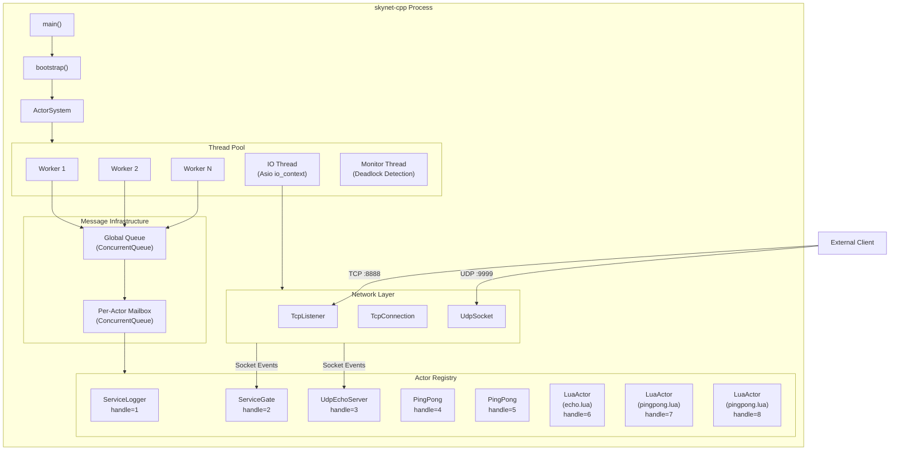
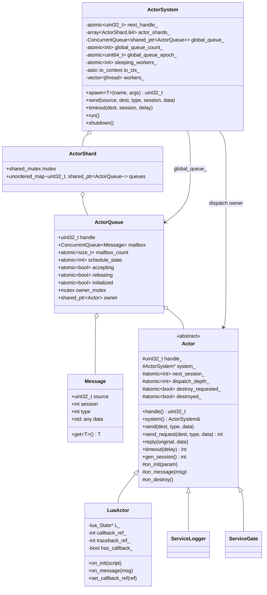
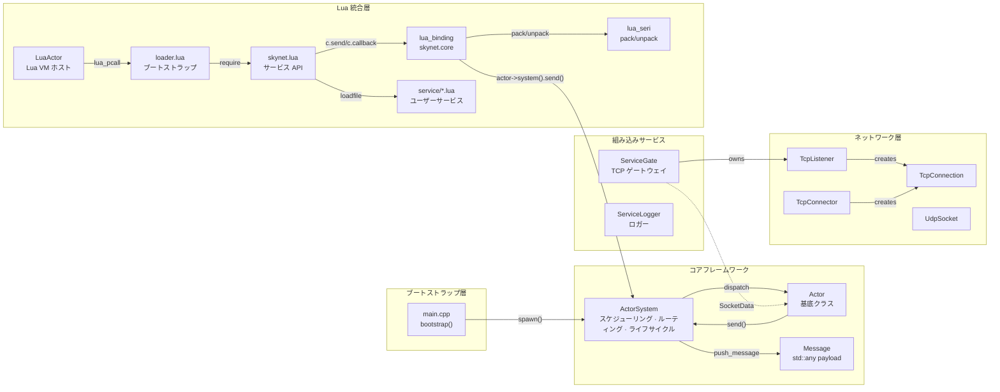
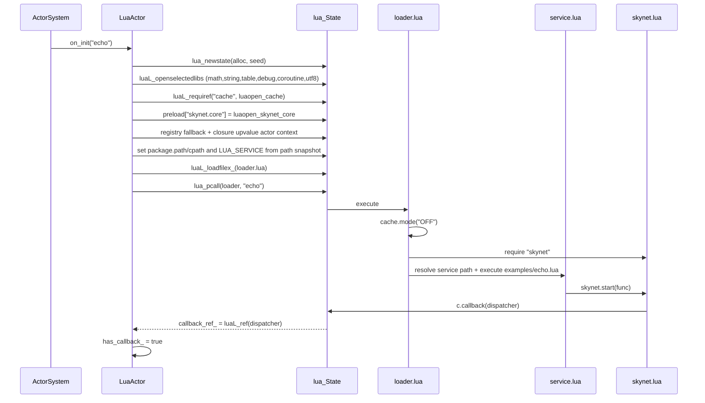
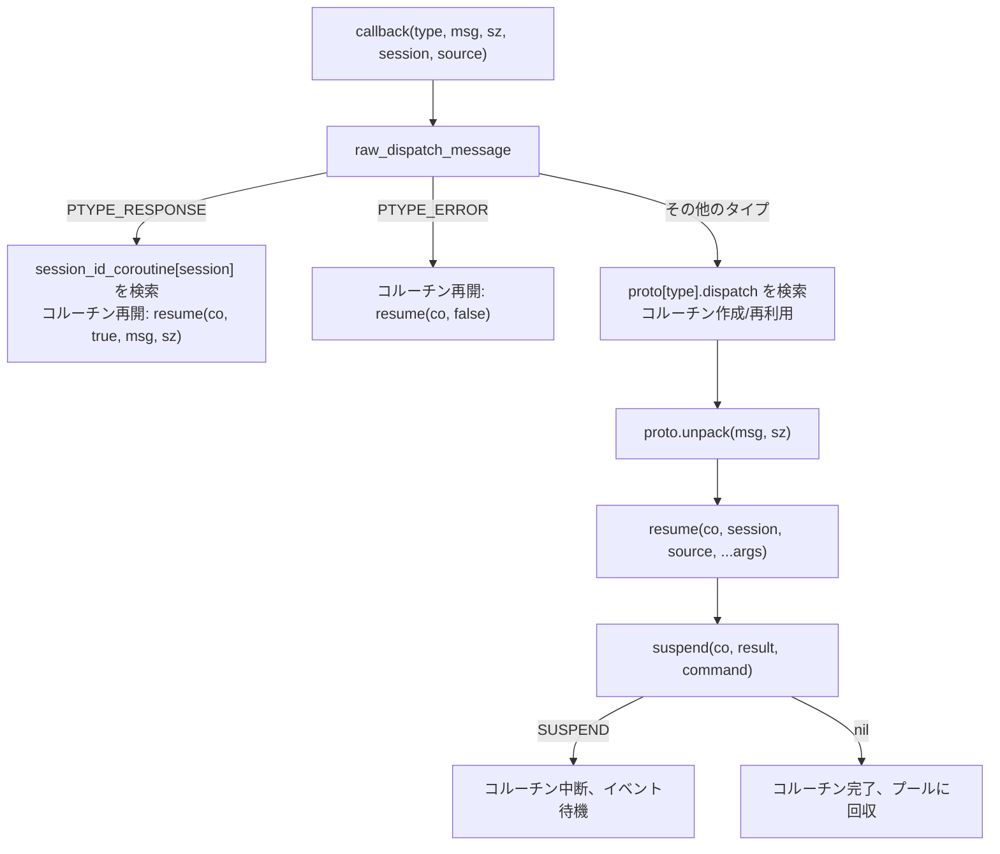
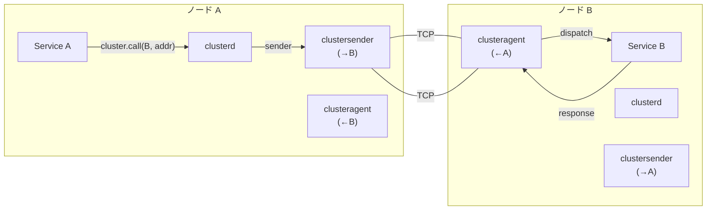
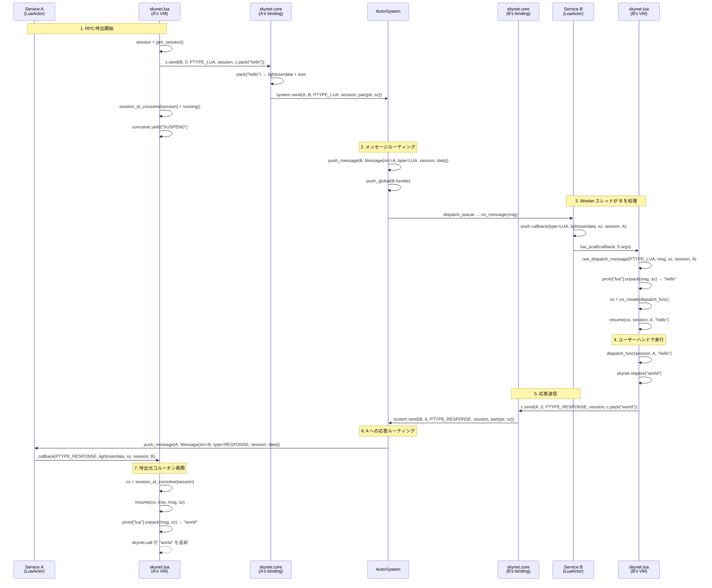

# skynet-cpp プロジェクト設計ドキュメント
## 最近のランタイム更新

現在のランタイムは preload 駆動の bootstrap を使用します。C++ エントリポイントは `SKYNET_THREAD` と `SKYNET_PRELOAD` だけを読み取り、既定値は `examples/preload.lua` です。launcher の起動、Lua path/cpath/service path の設定、アプリケーション入口の選択は preload スクリプトが行います。`skynet.appendpath`、`skynet.prependpath`、`skynet.appendcpath`、`skynet.appendservicepath`、`skynet.getpath` は、新しく作成される LuaActor が継承するグローバル Lua パス snapshot を管理します。

release モデルは install/package に対応しました。実行ファイルは source root を埋め込まず、install tree は `bin/`、`lualib/`、`service/`、`examples/`、`doc/` を使います。preload は `skynet.getcwd()` で process cwd を出力し、`skynet.setpathbase(path)` / `skynet.getpathbase()` で相対検索パスの基準を管理し、Lua `io` を開かずに `skynet.readfile` / `skynet.writefile` で pathbase 相対の業務ファイルを扱えます。

スケジューリングは `ActorQueue` モデルに移行しました。Actor registry は handle で shard され、global queue は `ActorQueue` を保持し、queue の寿命は Actor owner から分離されています。`kill` 後、queue は pending message を安全に drain/drop します。LuaActor の callback と traceback は registry ref としてキャッシュされ、`skynet.core` C API は現在の actor pointer を closure upvalue としてキャッシュします。

Hot path は `ConcurrentQueue`、atomic epoch wait/notify、sleeping worker tracking、global queue の近似カウントを使用します。8/16 threads では sleep 前に短い user-space spin を行い、actor RPC ワークロードの futex wakeup を減らします。テスト入口は `tests/logic`、`tests/stress`、`tests/perf`、coverage runner に分離され、Linux 比較は Docker で実行します。

> **skynet-cpp** — モダン C++20 で再実装された [Skynet](https://github.com/cloudwu/skynet) Actor フレームワーク

---

## 目次

1. [プロジェクト概要](#1-プロジェクト概要)
2. [設計目的と解決した課題](#2-設計目的と解決した課題)
3. [技術選定](#3-技術選定)
4. [システムアーキテクチャ概要](#4-システムアーキテクチャ概要)
5. [コアモジュール一覧](#5-コアモジュール一覧)
6. [クラス関係図](#6-クラス関係図)
7. [モジュール間呼出関係](#7-モジュール間呼出関係)
8. [各モジュール実装詳細](#8-各モジュール実装詳細)
   - [8.1 Actor フレームワーク](#81-actor-フレームワーク-skynethcpp)
   - [8.2 ネットワーク層](#82-ネットワーク層-networkhcpp)
   - [8.3 TCP ゲートウェイサービス](#83-tcp-ゲートウェイサービス-service_gateh)
   - [8.4 ロガーサービス](#84-ロガーサービス-service_loggerh)
   - [8.5 Lua Actor](#85-lua-actor-lua_actorhcpp)
   - [8.6 Lua C バインディング層](#86-lua-c-バインディング層-lua_bindingcpp)
   - [8.7 Lua シリアライゼーションプロトコル](#87-lua-シリアライゼーションプロトコル-lua_serihcpp)
   - [8.8 Lua サービス API 層](#88-lua-サービス-api-層-skynetlua)
   - [8.9 Socket Lua API](#89-socket-lua-api)
   - [8.10 GateServer ゲートウェイテンプレート](#810-gateserver-ゲートウェイテンプレート)
   - [8.11 SocketChannel 接続多重化](#811-socketchannel-接続多重化)
   - [8.12 Cluster](#812-cluster)
   - [8.13 Debug と Profile](#813-debug-と-profile)
   - [8.14 ShareData](#814-sharedata)
   - [8.15 Queue シリアライゼーションキュー](#815-queue-シリアライゼーションキュー)
   - [8.16 Multicast Pub/Sub](#816-multicast-pubsub)
   - [8.17 データベースドライバーとユーティリティライブラリ](#817-データベースドライバーとユーティリティライブラリ)
9. [メッセージフロー例](#9-メッセージフロー例)

---

## 1. プロジェクト概要

skynet-cpp は **C++20** で再実装された軽量 Actor モデルサーバーフレームワークであり、設計理念と API セマンティクスは [cloudwu/skynet](https://github.com/cloudwu/skynet) に由来します。フレームワークは skynet のコア抽象——**各サービスは独立した Actor であり、非同期メッセージで通信する**——を維持しつつ、モダン C++ の言語機能とクロスプラットフォームエコシステムを活用して型安全性、RAII リソース管理、プラットフォーム非依存性を実現しています。

### プロジェクト構造

```
skynet-cpp/
├── CMakeLists.txt                         # Build configuration
├── doc/
│   ├── design/                            # Multilingual architecture design docs
│   ├── wiki/                              # Multilingual user wiki docs
│   └── performance-optimization/          # Performance optimization notes
├── src/
│   ├── skynet.h / skynet.cpp              # ActorSystem, ActorQueue, scheduler, registry
│   ├── network.h / network.cpp            # TCP/UDP network layer (Asio)
│   ├── platform.h / platform.cpp          # Small cross-platform runtime helpers
│   ├── service_gate.h                     # TCP gateway service (C++)
│   ├── service_logger.h                   # Logger service (C++)
│   ├── lua_actor.h / lua_actor.cpp        # Lua VM host Actor
│   ├── lua_binding.cpp                    # skynet.core C bindings
│   ├── lua_seri.h / lua_seri.cpp          # Lua binary serialization
│   ├── lua_socket_binding.cpp             # socketdriver C bindings
│   ├── lua_netpack.cpp                    # netpack C bindings
│   ├── lua_cluster.cpp                    # cluster.core C bindings
│   ├── lua_profile.cpp                    # profile C bindings
│   ├── skynet_json.h                      # JSON helper
│   └── main.cpp                           # Minimal preload bootstrap entrypoint
├── lualib/
│   ├── loader.lua                         # Lua service loader; uses global path snapshot
│   ├── skynet.lua                         # Lua service API layer and path config API
│   ├── socket.lua                         # Socket API (coroutine wrapper)
│   ├── gateserver.lua                     # TCP gateway template
│   ├── sharedata.lua                      # Shared data client
│   ├── bson.lua                           # BSON codec (pure Lua)
│   └── skynet/
│       ├── socketchannel.lua              # Socket connection multiplexing
│       ├── cluster.lua                    # Cluster RPC client
│       ├── coverage.lua                   # Lua line coverage hook
│       ├── debug.lua                      # Debug protocol
│       ├── queue.lua                      # Coroutine critical section queue
│       ├── multicast.lua                  # Pub/sub client
│       ├── crypt.lua                      # SHA1/Base64/Hex helpers
│       └── db/
│           ├── redis.lua                  # Redis driver (RESP protocol)
│           ├── mysql.lua                  # MySQL driver (wire protocol)
│           └── mongo.lua                  # MongoDB driver (OP_MSG)
├── service/
│   ├── launcher.lua                       # Service launcher
│   ├── debug_console.lua                  # Debug console service
│   ├── clusterd.lua                       # Cluster manager
│   ├── clusteragent.lua                   # Cluster inbound agent
│   ├── clustersender.lua                  # Cluster outbound sender
│   ├── sharedatad.lua                     # Shared data server
│   └── multicastd.lua                     # Multicast manager service
├── examples/
│   ├── preload.lua                        # Default preload bootstrap
│   ├── main.lua                           # Example application entry service
│   ├── echo.lua                           # Example echo service
│   └── pingpong.lua                       # Example ping-pong service
├── tests/
│   ├── cpp_unit.cpp                       # C++ unit tests
│   ├── logic/                             # Logic regression preload and services
│   ├── stress/                            # Stress preload, workers, and suite
│   └── perf/                              # Performance benchmark preload and workers
├── tools/
│   ├── verify.bat                         # Runtime quick verification
│   ├── package.bat                        # Runtime package builder
│   ├── run_package_smoke.bat              # Runtime package smoke
│   └── run_linux_coverage.sh              # Linux coverage smoke
└── 3rdparty/
    ├── asio/                              # Asio standalone headers
    ├── concurrentqueue/                   # moodycamel lock-free queue
    └── lua-5.5.0/                         # Skynet-modified Lua 5.5.0
```
│   ├── echo.lua                    # サンプル：エコーサービス
│   └── pingpong.lua                # サンプル：ピンポンサービス
└── 3rdparty/
    ├── asio/                       # Asio スタンドアロンヘッダーライブラリ
    ├── concurrentqueue/            # moodycamel ロックフリーキュー
    └── lua-5.5.0/                  # Skynet 修正版 Lua 5.5.0
```

---

## 2. 設計目的と解決した課題

| 側面 | オリジナル Skynet (C + Lua) | skynet-cpp (C++20) |
|---|---|---|
| **言語** | 純粋 C 実装、手動メモリ管理 | C++20、RAII + `std::shared_ptr` による自動ライフサイクル管理 |
| **プラットフォーム** | Linux のみ（epoll + pthreads） | クロスプラットフォーム（Asio 抽象、Windows/Linux/macOS） |
| **型安全性** | `void*` ポインタでメッセージ受け渡し、実行時キャスト | `std::any` + `msg.get<T>()` テンプレート型安全アクセス |
| **並行プリミティブ** | 自製 spinlock + グローバルキュー | `moodycamel::ConcurrentQueue`（ロックフリー MPMC）+ `std::shared_mutex` |
| **非同期 IO** | 自製 socket server（epoll ラッパー） | Asio + `steady_timer`、Actor メッセージとの自然な統合 |
| **スレッドモデル** | 固定 worker スレッド + 単一 timer スレッド | worker スレッド + IO スレッド（Asio）+ monitor スレッド |
| **Lua 統合** | 密結合、C コードで直接 Lua スタック操作 | 明確な階層化：`LuaActor` → C binding → Lua API |
| **ビルドシステム** | Makefile（GCC/Clang のみ） | CMake 3.20+（MSVC/GCC/Clang） |

### コア設計目標

1. **Skynet の Actor セマンティクス維持**：handle 識別、非同期メッセージ、session メカニズム、名前付きサービス
2. **モダン C++ 型安全性**：テンプレート spawn、型付きメッセージ、コンパイル時エラー検出
3. **クロスプラットフォーム**：主要ターゲット Windows (MSVC)、Linux/macOS 互換
4. **Lua 統合**：Skynet 修正版 Lua 5.5.0（codecache 含む）を直接採用、オリジナル互換の `skynet.send/call/ret` API 提供

---

## 3. 技術選定

| 技術 | バージョン | 選定理由 |
|---|---|---|
| **C++20** | MSVC 19.41+ / GCC 12+ | `std::jthread`（自動 join）、`std::any`（型安全メッセージ）、`std::shared_mutex`（読み書きロック）、Concepts |
| **Asio** | 1.28.2（standalone） | 成熟したクロスプラットフォーム非同期 IO ライブラリ；Boost 依存不要；TCP/UDP/Timer のネイティブサポート；`io_context` が Actor メッセージループと統合可能 |
| **moodycamel::ConcurrentQueue** | latest | 高性能ロックフリー MPMC キュー；ヘッダーオンリー；ActorQueue mailbox と global dispatch queue は `ConcurrentQueue` 使用 |
| **Lua 5.5.0（Skynet 修正版）** | 5.5.0-skynet | Skynet の Lua フォーク、**codecache**（複数 VM 間のコンパイル済みバイトコード共有）、`lua_clonefunction`、`lua_sharefunction`、`lua_pushexternalstring` 等の拡張 API 搭載 |
| **CMake** | 3.20+ | クロスプラットフォームビルド；MSVC/GCC/Clang サポート；target-based モダン CMake |

---

## 4. システムアーキテクチャ概要



---

## 5. コアモジュール一覧

| Module | Source Files | Current Responsibility |
|---|---|---|
| **Actor Runtime** | `src/skynet.h`, `src/skynet.cpp` | `Actor`, `ActorSystem`, sharded actor registry, `ActorQueue`, weighted dispatch, timer/session, lifecycle, monitor thread |
| **Platform Helpers** | `src/platform.h`, `src/platform.cpp` | Small portability boundary for environment variables, file append/write helpers, local time formatting, process/node identity, Lua C module suffix |
| **Network Layer** | `src/network.h`, `src/network.cpp` | Cross-platform TCP listener/client/connection and UDP socket built on standalone Asio |
| **C++ Gateway** | `src/service_gate.h` | C++ TCP gateway service and connection event routing |
| **Logger** | `src/service_logger.h` | stdout/file logger service; runtime error logs route through cached logger handle |
| **Lua Actor Host** | `src/lua_actor.h`, `src/lua_actor.cpp` | Per-service Lua VM, loader execution, global path snapshot inheritance, callback/traceback registry refs, memory tracking |
| **Lua Core Binding** | `src/lua_binding.cpp` | `skynet.core` C API: send/callback/session/command/path configuration/serialization helpers |
| **Serialization Binding** | `src/lua_seri.h`, `src/lua_seri.cpp` | Skynet-compatible Lua value pack/unpack binary serialization |
| **Socket Binding** | `src/lua_socket_binding.cpp` | `socketdriver` C API for TCP/UDP listen/connect/send/close/pause/resume with shortened store lock scope |
| **Netpack Binding** | `src/lua_netpack.cpp` | 2-byte big-endian TCP frame pack/unpack/filter helpers |
| **Cluster Binding** | `src/lua_cluster.cpp` | `cluster.core` pack/unpack/multicast string helpers |
| **Profile Binding** | `src/lua_profile.cpp` | `skynet.profile` coroutine timing hooks and resume/wrap replacement |
| **JSON Helper** | `src/skynet_json.h` | Header-only JSON utility retained for runtime/support code |
| **Lua Loader** | `lualib/loader.lua` | Resolves plain service names through configured service paths and executes Lua service scripts |
| **Lua Service API** | `lualib/skynet.lua` | `start`, `dispatch`, `send`, `call`, `ret`, `timeout`, `fork`, named service APIs, path/cpath/service-path configuration APIs |
| **Socket API** | `lualib/socket.lua` | Coroutine-friendly TCP/UDP API over `socketdriver` |
| **GateServer API** | `lualib/gateserver.lua` | Lua gateway template with connect/disconnect/message handler callbacks |
| **SocketChannel** | `lualib/skynet/socketchannel.lua` | Reconnectable ordered/session socket multiplexing used by Redis/Mongo style clients |
| **Cluster** | `lualib/skynet/cluster.lua` + `service/cluster*.lua` | Cluster RPC client and cluster manager/agent/sender services |
| **Debug Console** | `lualib/skynet/debug.lua`, `service/debug_console.lua` | Debug command protocol and TCP debug console service |
| **ShareData** | `lualib/sharedata.lua`, `service/sharedatad.lua` | Shared immutable table publication, query, cache, and update notification |
| **Multicast** | `lualib/skynet/multicast.lua`, `service/multicastd.lua` | Publish/subscribe channel manager and client API |
| **Coverage** | `lualib/skynet/coverage.lua` | Lua line coverage hook used only by coverage runners |
| **DB Drivers** | `lualib/skynet/db/{redis,mysql,mongo}.lua`, `lualib/bson.lua` | Redis RESP, MySQL wire protocol, MongoDB OP_MSG/BSON clients |
| **Examples** | `examples/preload.lua`, `examples/main.lua`, `examples/echo.lua`, `examples/pingpong.lua` | Default preload and example services |
| **Tests** | `tests/cpp_unit.cpp`, `tests/logic`, `tests/stress`, `tests/perf` | C++ units, logic regression suite, stress suite, and performance benchmark suite |
| **Tools** | `tools/verify.*`, `tools/package.*`, `tools/run_package_smoke.*`, `tools/run_linux_coverage.sh` | Minimal runtime verification, package smoke, and Linux coverage smoke; full coverage, perf, Docker DB, long-run validation, and native comparison live in the parent best-practice project |

---

## 6. クラス関係図



---

## 7. モジュール間呼出関係



### 主要呼出パス

| パス | 説明 |
|---|---|
| `main → ActorSystem::spawn<T>()` | Actor インスタンス作成、handle 割り当て、`on_init` 呼出 |
| `Actor::send() → ActorSystem::send() → push_message()` | target ActorQueue mailbox へメッセージ送信 |
| `worker_loop → global_queue → dispatch_queue → on_message` | Worker スレッドが global queue から ActorQueue を取得し、重み付き batch で dispatch |
| `TcpListener → SocketAccept/SocketData → ServiceGate::on_message` | ネットワークイベントが `PTYPE_SOCKET` 経由で Gate に配信 |
| `LuaActor::on_init → loader.lua → skynet.lua → service.lua` | Lua サービスのロードチェーン |
| `skynet.send() → c.send() → lsend() → ActorSystem::send()` | Lua メッセージ送信の完全パス |
| `skynet.call() → yield → PTYPE_RESPONSE → resume` | Lua 同期 RPC 呼出のコルーチン切り替え |

---

## 8. 各モジュール実装詳細

### 8.1 Actor フレームワーク (`skynet.h/cpp`)

#### メッセージタイプ列挙型

```cpp
enum MessageType {
    PTYPE_TEXT     = 0,   // プレーンテキストメッセージ
    PTYPE_RESPONSE = 1,   // RPC 応答 / Timer コールバック
    PTYPE_SYSTEM   = 4,   // システムメッセージ
    PTYPE_SOCKET   = 6,   // ネットワークイベント
    PTYPE_ERROR    = 7,   // エラー通知
    PTYPE_TIMER    = 8,   // （予約）
    PTYPE_LUA      = 10,  // Lua シリアライズメッセージ
};
```

#### Message 構造体

```cpp
struct Message {
    uint32_t source = 0;     // 送信者 handle
    int      session = 0;    // セッション ID（0 = fire-and-forget）
    int      type = PTYPE_TEXT;
    std::any data;           // 型付きペイロード

    template<typename T> const T& get() const;  // 型安全アクセス
    bool has_data() const;
};
```

`std::any` はオリジナル Skynet の `void* msg + size_t sz` を置き換え、コンパイル時の型チェックにより不正なポインタキャストを防止します。

#### Actor 基底クラス

各 Actor は以下を所有：
- **一意の handle**（`uint32_t`）：グローバル一意識別子
- **独立した mailbox**（`ConcurrentQueue<Message>`）：ロックフリー MPMC キュー
- **セッションアロケータ**（`atomic<int>`）：RPC call 用のインクリメンタル session ID 生成

Actor ライフサイクル：`spawn()` → `on_init()` → ループ `on_message()` → `kill()` → `on_destroy()`

#### ActorSystem スケジューラ

**スレッドモデル**：

| スレッド | 数 | 責務 |
|---|---|---|
| Worker | N（デフォルト=CPU コア数） | `global_queue_` から `ActorQueue` を取得し、重み付き batch で dispatch |
| IO | 1 | `asio::io_context` を実行、全非同期ネットワーク IO と Timer を処理 |
| Monitor | 1 | 5 秒ごとに Worker のデッドロック検出（バージョン番号比較） |

**スケジューリングウェイト戦略**（`calc_weight`）：

```
Worker 1..N/4    → weight=-1 → 毎回 1 メッセージ処理（低レイテンシ優先）
Worker N/4..N/2  → weight= 0 → キュー内全メッセージ処理（スループット優先）
Worker N/2..3N/4 → weight= 1 → n/2 メッセージ処理
Worker 3N/4..N   → weight= 2 → n/4 メッセージ処理
```

異なるウェイトの Worker を混在させることで、**低レイテンシと高スループットのバランス**を確保します。

**デッドロック検出**（`WorkerMonitor`）：

各 Worker は `WorkerMonitor` を持ちます。`dispatch_queue` の前後で `begin(src, dst)` / `end()` を呼び出し、バージョン番号をインクリメントします。Monitor スレッドは 5 秒ごとに `version` と `check_version` を比較し、Worker が `busy` 状態でバージョンが変わらない場合、デッドロックと判定して警告を出力します。

**Timer 実装**：

```cpp
void ActorSystem::timeout(uint32_t dest, int session, milliseconds delay) {
    auto timer = make_shared<asio::steady_timer>(io_ctx_, delay);
    timer->async_wait([this, dest, session, timer](auto& ec) {
        if (!ec) send(0, dest, PTYPE_RESPONSE, session, {});
    });
}
```

Timer は新しいスレッドを起動せず、Asio `io_context` にポストし、期限到来後に `PTYPE_RESPONSE` メッセージとしてターゲット Actor に配信します。

---

### 8.2 ネットワーク層 (`network.h/cpp`)

#### Socket イベント構造体

ネットワークイベントは `PTYPE_SOCKET` + `std::any` 経由で Actor に送信されます：

| イベント | 構造体 | フィールド |
|---|---|---|
| 新規接続 | `SocketAccept` | `connection_id`, `remote_address`, `remote_port` |
| データ受信 | `SocketData` | `connection_id`, `data` |
| 接続切断 | `SocketClose` | `connection_id` |
| 接続確立 | `SocketOpen` | `connection_id`, `remote_address`, `remote_port` |
| 送信バッファ警告 | `SocketWarning` | `connection_id`, `pending_bytes` |
| UDP データ | `SocketUDP` | `data`, `remote_address`, `remote_port` |

#### TcpConnection

単一 TCP 接続の管理：

- **読み取り**：8KB バッファで循環 `async_read_some`、データを `SocketData` として owner Actor に配信
- **書き込み**：`deque<string>` 書き込みキューでシリアライズ書き込み；`pending_bytes_` を追跡、1MB 超で `SocketWarning` 発生
- **フロー制御**：`pause()` / `resume()` で読み取りレートを制御
- **ハーフクローズ**：`shutdown_write()` で FIN を送信しつつ読み取りは継続

#### TcpListener

TCP サーバー：

- 循環 `async_accept`、新規接続ごとに `TcpConnection` を作成
- `connection_id` で接続プールを管理（`unordered_map<int, shared_ptr<TcpConnection>>`）
- `send(conn_id, data)` / `close_connection(conn_id)` で ID 指定操作

#### TcpConnector

TCP クライアントコネクタ：

- `async_resolve` → `async_connect` → `TcpConnection` 作成
- 接続成功で `SocketOpen` 送信、失敗で `SocketError` 送信

#### UdpSocket

UDP 送受信：

- 64KB 受信バッファ、循環 `async_receive_from`
- 受信データを `SocketUDP` として owner Actor に配信
- `send_to(data, host, port)` で非同期送信

---

### 8.3 TCP ゲートウェイサービス (`service_gate.h`)

`ServiceGate` は Actor フレームワークとネットワーク層のブリッジです：

```
Client ──TCP──→ TcpListener ──SocketAccept──→ ServiceGate
                TcpConnection ──SocketData──→ ServiceGate ──forward──→ Agent Actor
```

**Agent ファクトリパターン**：

```cpp
using AgentFactory = std::function<uint32_t(
    ServiceGate& gate, int conn_id,
    const std::string& addr, uint16_t port)>;
```

新規接続時に `AgentFactory` が設定されていれば、Gate は接続専用の Agent Actor を自動作成し、以降のデータを `PTYPE_TEXT` 経由で Agent に転送します。ファクトリ未設定の場合、データは Gate 内で直接処理されます（シンプルなエコーサービスに適合）。

**イベントディスパッチ**：

| イベントタイプ | コールバック | デフォルト動作 |
|---|---|---|
| `SocketAccept` | `on_accept()` | ファクトリがあれば agent 作成 |
| `SocketData` | `on_data()` | agent があれば転送 |
| `SocketClose` | `on_close()` | agent マッピングをクリーンアップ |
| `SocketWarning` | — | ログ警告 |

---

### 8.4 ロガーサービス (`service_logger.h`)

システムレベルのロギングセンター。全 `ActorSystem::error()` 呼出は最終的に `"logger"` という名前の Actor にルーティングされます：

**ログフォーマット**：
```
[HH:MM:SS.mmm][HANDLE][TAG] message
```

- `HANDLE`：8 桁 16 進数 Actor handle
- `TAG`：`ERROR`（`PTYPE_ERROR`）または `INFO`（`PTYPE_TEXT`）
- stdout とオプションのログファイルに同時出力

---

### 8.5 Lua Actor (`lua_actor.h/cpp`)

`LuaActor` は `Actor` を継承し、各 Lua サービスに独立した `lua_State` をホストします。

#### 初期化フロー (`on_init`)



**主要な設計判断**：

1. **セキュリティサンドボックス**：`io` と `os` ライブラリを開放しない（Lua サービスによる直接ファイル/プロセス操作を防止）
2. **Codecache 無効化**：`cache.mode("OFF")` でコードキャッシュを無効化し、複数 VM 間の `_ENV` 共有による `require` が nil になる問題を回避
3. **メモリ追跡**：カスタム `lua_alloc` で各 VM のメモリ使用量を記録、制限と自動警告をサポート
4. **非キャッシュロード**：`loader.lua` は `luaL_loadfilex_`（非キャッシュ版）でロードし、各 VM の独立実行を保証

#### メッセージディスパッチ (`on_message`)

コールバックシグネチャ：`callback(type, msg, sz, session, source)`

| メッセージタイプ | msg パラメータ | sz パラメータ |
|---|---|---|
| `PTYPE_LUA` / `PTYPE_RESPONSE` | `lightuserdata`（シリアライズバッファポインタ） | バイト長 |
| `PTYPE_TEXT` / `PTYPE_ERROR` | Lua string | 文字列長 |
| その他（Timer 等） | nil | 0 |

#### メモリアロケータ

```
割り当て戦略：
  if nsize == 0           → free(ptr), return nullptr
  if mem_ > mem_limit_    → 割り当て拒否（OOM 保護）
  if mem_ > mem_report_   → メモリ警告出力、mem_report_ *= 2
  else                    → realloc(ptr, nsize)
```

---

### 8.6 Lua C バインディング層 (`lua_binding.cpp`)

`luaopen_skynet_core` が登録する 15 個の C 関数で `skynet.core` モジュールを構成：

| 関数 | シグネチャ | 説明 |
|---|---|---|
| `send` | `(dest, source, type, session, msg [,sz])` → `session` | メッセージ送信、source は無視（常に self 使用） |
| `callback` | `(func)` → nil | メッセージコールバック登録 |
| `genid` | `()` → `session_id` | インクリメンタル session ID 割り当て |
| `self` | `()` → `handle` | 現在の Actor handle 返却 |
| `now` | `()` → `centiseconds` | 起動からの経過時間（センチ秒） |
| `error` | `(text)` → nil | ActorSystem 経由で logger にルーティング |
| `command` | `(cmd, param)` → `string\|nil` | サービスコマンド（REG/NAME/QUERY/EXIT/KILL/TIMEOUT/NOW） |
| `intcommand` | `(cmd, param)` → `int\|nil` | コマンドバリアント、整数返却 |
| `addresscommand` | `(cmd, param)` → `int\|nil` | コマンドバリアント、handle 整数返却 |
| `pack` | `(...)` → `lightuserdata, size` | Lua 値のシリアライズ |
| `unpack` | `(msg, sz)` → `...values` | デシリアライズ |
| `tostring` | `(msg, sz)` → `string` | lightuserdata を Lua string に変換 |
| `trash` | `(msg, sz)` → nil | lightuserdata バッファ解放 |
| `redirect` | `(dest, src, type, session, msg, sz)` → nil | 明示的 source 指定で送信 |
| `harbor` | `(addr)` → `0, 0` | スタブ（単一プロセス、harbor 不要） |

**command サブコマンド詳細**：

| コマンド | パラメータ | 戻り値 | 動作 |
|---|---|---|---|
| `REG` | `"name"` | `":handle"` | 現在の Actor の名前を登録 |
| `NAME` | `"name :handle"` | `":handle"` | 指定 handle の名前を登録 |
| `QUERY` | `"name"` | `":handle"` または nil | 名前付きサービスの検索 |
| `EXIT` | — | nil | 現在の Actor を終了 |
| `KILL` | `":handle"` または `"name"` | nil | 対象 Actor を終了 |
| `TIMEOUT` | `"centisecs"` | `"session"` | タイマー登録 |
| `NOW` | — | `"centisecs"` | 現在時刻 |

---

### 8.7 Lua シリアライゼーションプロトコル (`lua_seri.h/cpp`)

オリジナル Skynet と完全互換のバイナリシリアライゼーションフォーマット。

#### エンコードフォーマット

各値は **1 バイトヘッダ + 可変長ペイロード** でエンコード：

```
Header = [TYPE: 3 bits | COOKIE: 5 bits]
```

| TYPE | 値 | COOKIE 意味 | ペイロード |
|---|---|---|---|
| NIL | 0 | — | なし |
| BOOLEAN | 1 | 0=false, 1=true | なし |
| NUMBER | 2 | サブタイプ | 下表参照 |
| USERDATA | 3 | — | 8 バイトポインタ |
| SHORT_STRING | 4 | 長さ（0-31） | 0-31 バイト |
| LONG_STRING | 5 | 2 または 4 | 2/4 バイト長 + データ |
| TABLE | 6 | 配列サイズ | 配列要素 + ハッシュペア + NIL 終端 |

**数値サブタイプ**（NUMBER の COOKIE フィールド）：

| COOKIE | タイプ | ペイロードサイズ |
|---|---|---|
| 0 | ZERO | 0（値は 0） |
| 1 | BYTE | 1（uint8） |
| 2 | WORD | 2（uint16） |
| 4 | DWORD | 4（int32） |
| 6 | QWORD | 8（int64） |
| 8 | DOUBLE | 8（IEEE754） |

**テーブルエンコード**：
```
[Header: TYPE_TABLE | min(array_size, 31)]
  [array_size >= 31 の場合: varint エンコードの実際サイズ]
  [配列要素 1..n 再帰エンコード]
  [ハッシュペア: key,value 交互再帰エンコード]
  [NIL 終端]
```

**メモリモデル**：

- **Pack**：128 バイトブロックのリンクリストに書き込み、最後に単一 `malloc` バッファに統合、`(lightuserdata, size)` を返却
- **Unpack**：バッファからシーケンシャルに読み取り、再帰的に Lua 値を再構築
- **最大ネスト深度**：32 レベル

---

### 8.8 Lua サービス API 層 (`skynet.lua`)

`skynet.lua` は Lua サービス開発者向けの API 層であり、`skynet.core` C バインディングをラップして高レベルインターフェースを提供します。

#### コルーチンプールとメッセージディスパッチ



#### 登録済みプロトコル

| 名前 | ID | pack | unpack |
|---|---|---|---|
| `lua` | 10 (`PTYPE_LUA`) | `c.pack`（バイナリシリアライゼーション） | `c.unpack` |
| `text` | 0 (`PTYPE_TEXT`) | identity | `c.tostring` |
| `response` | 1 | — | — |
| `error` | 7 | — | — |

#### パブリック API

**メッセージ送信**：

| 関数 | 説明 |
|---|---|
| `skynet.send(addr, typename, ...)` | 非同期送信、自動 pack、session 返却 |
| `skynet.rawsend(addr, type, session, msg, sz)` | 生送信、pack なし |
| `skynet.call(addr, typename, ...)` | 同期 RPC：送信 → yield → PTYPE_RESPONSE 待機 → unpack → 返却 |
| `skynet.ret(msg, sz)` | PTYPE_RESPONSE 応答送信 |
| `skynet.retpack(...)` | `skynet.ret(skynet.pack(...))` のショートカット |

**コルーチン制御**：

| 関数 | 説明 |
|---|---|
| `skynet.dispatch(typename, func)` | タイプハンドラ登録：`func(session, source, ...)` |
| `skynet.fork(func, ...)` | 新コルーチン作成、fork_queue に追加して遅延実行 |
| `skynet.timeout(ti, func)` | `ti` センチ秒後に func を実行 |
| `skynet.sleep(ti)` | 現在のコルーチンを `ti` センチ秒ブロック |
| `skynet.yield()` | 現在のコルーチンを譲渡（`sleep(0)` と同等） |

**サービス管理**：

| 関数 | 説明 |
|---|---|
| `skynet.start(func)` | サービスエントリポイント：コールバック登録 + `timeout(0, func)` |
| `skynet.exit()` | 現在のサービスを終了 |
| `skynet.self()` | 現在の Actor handle |
| `skynet.register(name)` | サービス名を登録 |
| `skynet.name(name, handle)` | 指定 handle の名前を登録 |

**ユーティリティ関数**：

| 関数 | 説明 |
|---|---|
| `skynet.address(handle)` | `":xxxxxxxx"` 形式にフォーマット |
| `skynet.error(...)` | 引数を連結して logger に送信 |
| `skynet.now()` | 現在時刻（センチ秒） |
| `skynet.pack(...)` | シリアライズ → `(lightuserdata, size)` |
| `skynet.unpack(msg, sz)` | デシリアライズ → `...values` |
| `skynet.tostring(msg, sz)` | lightuserdata を string に変換 |
| `skynet.trash(msg, sz)` | lightuserdata バッファ解放 |

---

### 8.9 Socket Lua API

`socket.lua` は `socketdriver` C モジュールをコルーチンセマンティクスでラップし、ブロッキングスタイルの API を提供します。下層の IO が準備できていない場合、現在のコルーチンは `skynet.wait` で一時停止され、IO 完了時に socket イベントディスパッチが再開します。

**アーキテクチャ層**:
```
socket.lua (ユーザー API)
  └─→ socketdriver (C モジュール)
        └─→ TcpListener / TcpConnector / UdpSocket (C++ Asio)
              └─→ PTYPE_SOCKET イベント → Actor メールボックス
```

**TCP API**:

| 関数 | 説明 |
|---|---|
| `socket.listen(host, port, handler)` | TCP ポートでリッスン、handler が accept/close/warning イベントを受信 |
| `socket.ondata(listener_id, handler)` | データコールバック `handler(conn_id, data)` を設定 |
| `socket.connect(host, port)` | リモートホストに接続、接続確立または失敗までブロック |
| `socket.send(conn_id, data)` | connector 経由でデータ送信 |
| `socket.write(listener_id, conn_id, data)` | listener の接続経由でデータ送信 |
| `socket.read(conn_id, sz)` | sz バイト読み取り、データ準備までブロック |
| `socket.readline(conn_id, sep)` | デリミタまで読み取り（デフォルト `\n`）、デリミタ除外 |
| `socket.readall(conn_id)` | 利用可能な全データ読み取り |
| `socket.close(conn_id)` | 接続を閉じる |
| `socket.pause(listener_id, conn_id)` | 接続読み取り一時停止（フロー制御） |
| `socket.resume(listener_id, conn_id)` | 接続読み取り再開 |

**UDP API**:

| 関数 | 説明 |
|---|---|
| `socket.udp(host, port, callback)` | UDP ソケット作成、callback がデータグラム受信 |
| `socket.udp_send(id, data, host, port)` | UDP データグラム送信 |

---

### 8.10 GateServer ゲートウェイテンプレート

`gateserver.lua` はクライアントアクセスゲートウェイ構築用の高レベルテンプレートです。`socket.listen` + `netpack` フレーミングロジックをカプセル化し、開発者は handler コールバックを実装するだけです。

**フレーミングプロトコル**: 各パケット = 2バイトビッグエンディアン長さヘッダー + データ内容、パケット最大 65535 バイト。

**使用方法**:
```lua
local gateserver = require "gateserver"
local handler = {}

function handler.connect(conn_id, addr, port) ... end
function handler.disconnect(conn_id) ... end
function handler.message(conn_id, data) ... end
function handler.open(source, conf) ... end

gateserver.start(handler)
```

**handler コールバック**:

| コールバック | 説明 |
|---|---|
| `connect(conn_id, addr, port)` | 新規クライアント接続 |
| `disconnect(conn_id)` | クライアント切断 |
| `message(conn_id, data)` | 完全なビジネスパケット受信（長さヘッダー除去済み） |
| `error(conn_id, msg)` | 接続エラー |
| `warning(conn_id, bytes)` | 送信バッファ閾値超過 |
| `open(source, conf)` | gate がリッスンポートを開く時に呼出 |

**Lua プロトコルコマンド**（他のサービスが gate に送信可能）: `OPEN`、`SEND`、`SENDRAW`、`CLOSE`、`KICK`。

---

### 8.11 SocketChannel 接続多重化

`socketchannel.lua` は外部サービスアクセス用の高レベルカプセル化を提供し、2つのプロトコルモードをサポート:

**モード 1: 順序モード（Order Mode）**
- 各リクエストに正確に1つのレスポンス、TCP が順序を保証
- Redis RESP プロトコルに適合
- `channel:request(req, response_func)` — response_func がレスポンスを解析

**モード 2: セッションモード（Session Mode）**
- 各リクエストが一意の session を持ち、レスポンスに session を含めてマッチング
- MongoDB プロトコルに適合
- channel 作成時にグローバル `response` 関数を提供、`request` が session パラメータを受け取る

**コア機能**:
- **自動再接続**: 切断後、次のリクエストで自動的に再接続
- **認証フロー**: 作成時に `auth` 関数を提供、接続後即座に実行
- **readline サポート**: `channel:readline(sep)` デリミタで読み取り
- **response メソッド**: `channel:response(func)` 送信なしの受信のみ（pub/sub 用）

```lua
-- Redis（順序モード）
local channel = socketchannel.channel { host = "127.0.0.1", port = 6379 }
local resp = channel:request(req_str, function(sock) return true, sock:readline() end)

-- MongoDB（セッションモード）
local channel = socketchannel.channel {
    host = "127.0.0.1", port = 27017,
    response = function(sock) ... return session, ok, data end
}
local resp = channel:request(req_str, session_id)
```

---

### 8.12 Cluster

skynet-cpp は skynet のクラスターモード（master/slave ではない）を実装。各ノードは独立プロセスで、TCP 経由でノード間 RPC を実行。

**アーキテクチャ**:



**3サービスアーキテクチャ**:

| サービス | 責務 |
|---|---|
| `clusterd` | 中央マネージャー: ノード設定、sender/agent ライフサイクル、名前登録、リッスンポート |
| `clustersender` | アウトバウンド接続（リモートノードごとに1つ）: socketchannel 経由でリクエスト/プッシュ送信、レスポンス受信 |
| `clusteragent` | インバウンド接続（着信接続ごとに1つ）: リクエスト解析、ローカルサービスへディスパッチ、レスポンスリレー |

**クライアント API**（`skynet.cluster`）:

| 関数 | 説明 |
|---|---|
| `cluster.call(node, addr, ...)` | リモートサービスへの同期 RPC 呼出 |
| `cluster.send(node, addr, ...)` | 非同期プッシュ（レスポンスなし） |
| `cluster.open(addr, port)` | インバウンド接続受け入れ用ポートリッスン |
| `cluster.reload(cfg)` | クラスター設定リロード |
| `cluster.register(name, addr)` | リモートアクセス用名前登録 |
| `cluster.query(node, name)` | リモートノードの登録名照会 |

**クラスタープロトコル**（C モジュール `cluster.core`）: 2バイト長さヘッダー + タイプタグ + アドレス + session + ペイロード。大きなメッセージの自動セグメンテーションをサポート（>32KB で複数セグメントに分割）。

---

### 8.13 Debug と Profile

#### デバッグプロトコル

`debug.lua` は各 Lua サービスに `PTYPE_DEBUG` プロトコルを登録し、組み込みデバッグコマンドを提供:

| コマンド | 説明 |
|---|---|
| `MEM` | 現在の Lua VM メモリ使用量を返す（KB） |
| `GC` | ガベージコレクションを実行、メモリ変化を報告 |
| `STAT` | タスク数、メッセージキュー長、CPU 統計を返す |
| `TASK` | アクティブなコルーチンのスタック情報を返す |
| `INFO` | サービス登録の `info_func` コールバックを呼出 |
| `EXIT` | サービスを正常終了 |
| `PING` | 生存確認（即座にレスポンス） |
| `RUN` | Lua コードをインジェクト・実行 |

カスタムデバッグコマンドは `debug.reg_debugcmd(name, fn)` で登録可能。

#### デバッグコンソール

`debug_console.lua` は TCP telnet インターフェースを提供、コマンド: `list`、`mem`、`gc`、`stat`、`ping`、`info`、`exit`、`kill`、`start`、`inject`。

#### Profile

`lua_profile.cpp` 経由のコルーチンレベル CPU 計測:

```lua
local profile = require "skynet.profile"
profile.start()                 -- 計測開始
local cpu_time = profile.stop() -- 計測停止、秒数を返す
```

---

### 8.14 ShareData

ShareData は同一プロセス内の複数サービス間で読み取り専用の構造化データを共有するためのもので、典型的には設定テーブルの配布に使用。

**アーキテクチャ**:

```
sharedatad（サーバー）              sharedata（クライアントライブラリ）
  ├─ data_store[name]               ├─ ローカルキャッシュ
  │   ├─ data                       ├─ バージョン追跡
  │   └─ version                    └─ モニターコルーチン（ロングポール更新）
  └─ コマンド: new/delete/
     query/update/monitor
```

**クライアント API**（`sharedata`）:

| 関数 | 説明 |
|---|---|
| `sharedata.new(name, value)` | 共有データ作成 |
| `sharedata.query(name)` | データ照会（初回照会でモニターコルーチン起動） |
| `sharedata.update(name, value)` | データ更新（全モニターに通知） |
| `sharedata.delete(name)` | 共有データ削除 |
| `sharedata.flush()` | ローカルキャッシュクリア |
| `sharedata.deepcopy(name, ...)` | ディープコピー取得 |

**オリジナルとの違い**: skynet-cpp の sharedata はメッセージパッシングとディープコピーを使用し、C 共有メモリは使用しません（各 VM が独立した `_ENV` を持つため）。機能的には同等ですがメモリは共有されません。

---

### 8.15 Queue シリアライゼーションキュー

`queue.lua` はコルーチンレベルのミューテックスロックを実装し、単一サービス内の「疑似並行性」問題を解決。メッセージ処理中にブロッキング API（`skynet.call` など）を呼び出してサービスの再入が発生した場合、queue がクリティカルセクションの直列実行を保証。

**使用方法**:
```lua
local queue = require "skynet.queue"
local cs = queue()  -- 実行キュー作成

function CMD.foobar()
    cs(function()
        -- このコードブロックは同じ cs を使用する他のコードに中断されない
        skynet.call(other_service, "lua", "slow_request")
        -- 上の行がサスペンドしても、新しい foobar メッセージはキューイングされる
    end)
end
```

**実装**: `current_thread` + `ref` 参照カウント + `thread_queue` 待機キューを使用し、`skynet.wait/wakeup` で FIFO スケジューリング。再入可能（同一コルーチン内のネストされた呼出はデッドロックしない）。

---

### 8.16 Multicast Pub/Sub

Multicast モジュールは同一プロセス内のチャネルベースの発行/購読メッセージングを提供。

**アーキテクチャ**:

| コンポーネント | 責務 |
|---|---|
| `multicastd` サービス | チャネル管理（ID 割り当て）、購読者リスト維持、メッセージブロードキャスト |
| `multicast.lua` クライアント | `PTYPE_MULTICAST` プロトコル登録、オブジェクト指向 API 提供 |

**API**:

```lua
local multicast = require "skynet.multicast"
local mc = multicast.new()        -- チャネル作成
mc:subscribe()                     -- 購読
mc:publish("hello", "world")       -- 発行
mc:unsubscribe()                   -- 購読解除
mc:delete()                        -- チャネル削除

-- 受信側がコールバック設定
mc.dispatch = function(channel, source, ...)
    print("received:", ...)
end
```

---

### 8.17 データベースドライバーとユーティリティライブラリ

全データベースドライバーは `socketchannel` 上に構築され、skynet ワーカースレッドをブロックしません。

#### Redis ドライバー (`skynet.db.redis`)

- **プロトコル**: RESP (Redis Serialization Protocol)
- **socketchannel モード**: Order（リクエスト/レスポンス一対一）
- **機能**: 自動生成コマンド（metatable `__index`）、パイプラインバッチ、pub/sub watch モード
- **接続**: `redis.connect({host, port, auth, db})`
- **コマンド**: `db:get(key)`、`db:set(key, val)`、`db:hgetall(key)` — 全 Redis コマンド

#### MySQL ドライバー (`skynet.db.mysql`)

- **プロトコル**: MySQL Wire Protocol v10
- **認証**: SHA1 チャレンジレスポンス（MySQL 4.1+ native_password）
- **機能**: テキストクエリ + prepared statement + 複数結果セット
- **接続**: `mysql.connect({host, port, user, password, database})`
- **API**: `db:query(sql)`、`db:prepare(sql)`、`stmt:execute()`、`stmt:close()`

#### MongoDB ドライバー (`skynet.db.mongo`)

- **プロトコル**: OP_MSG (MongoDB 3.6+)
- **socketchannel モード**: Session（リクエスト/レスポンスを requestID でマッチング）
- **BSON**: 純粋 Lua コーデック `bson.lua` を使用（double/string/document/array/binary/objectid/int64/null/minkey/maxkey 対応）
- **接続**: `mongo.client({host, port})`
- **API**: `client:getDB(name)` → `db:getCollection(name)` → `coll:insert/find/update/delete/aggregate`
- **カーソル**: `coll:find(query):sort(s):skip(n):limit(m):toArray()`

#### Crypt ツール (`skynet.crypt`)

純粋 Lua 暗号化関数、MySQL 認証等に使用:

| 関数 | 説明 |
|---|---|
| `crypt.sha1(msg)` | SHA-1 ハッシュ（160ビット） |
| `crypt.hmac_sha1(key, msg)` | HMAC-SHA1 |
| `crypt.base64encode(data)` | Base64 エンコード |
| `crypt.base64decode(data)` | Base64 デコード |
| `crypt.hexencode(data)` | 16進エンコード |
| `crypt.hexdecode(data)` | 16進デコード |

#### BSON コーデック (`bson`)

MongoDB ドライバー用の純粋 Lua BSON シリアライゼーションライブラリ:

| 関数 | 説明 |
|---|---|
| `bson.encode(doc)` | Lua テーブル → BSON バイナリにエンコード |
| `bson.encode_order(k1, v1, ...)` | 順序保持エンコード |
| `bson.decode(data)` | BSON バイナリ → Lua テーブルにデコード |
| `bson.objectid(hex)` | ObjectId 作成/生成 |
| `bson.int64(value)` | 64ビット整数作成 |
| `bson.null` | BSON null 定数 |

---

## 9. メッセージフロー例

以下は完全な Lua RPC 呼出チェーンを示します：**サービス A が `skynet.call(B, "lua", "hello")` を呼出**。



### 主要タイミングポイント

1. **Pack/Unpack がペアで使用**：`c.pack("hello")` が送信側でシリアライズ、受信側が `proto.unpack(msg, sz)` でデシリアライズ — フォーマットはオリジナル Skynet と完全互換
2. **session の連続性**：送信側がsession 割り当て → `session_id_coroutine` に格納 → 受信側がそのまま返却 → 送信側がマッチングしてコルーチンを再開
3. **ゼロコピー転送**：シリアライズバッファは `lightuserdata` ポインタで転送、受信側は `c.unpack` 後に `skynet.trash` で解放
4. **コルーチンの中断/再開**：`skynet.call` は `coroutine.yield("SUSPEND")` で中断、`PTYPE_RESPONSE` 受信後に `resume` で再開
```
