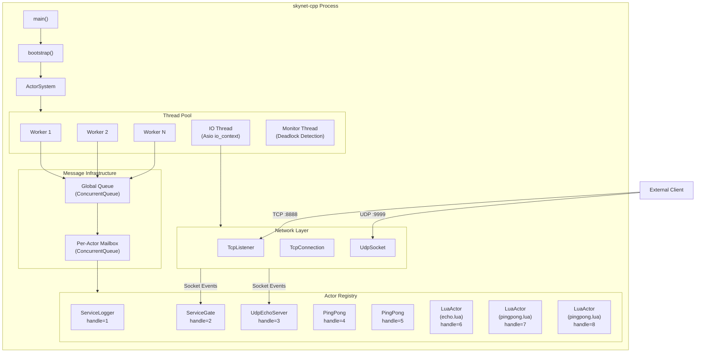
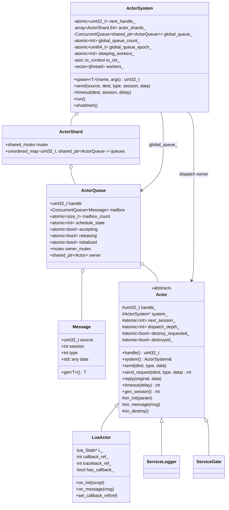
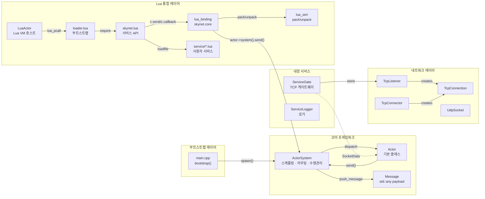
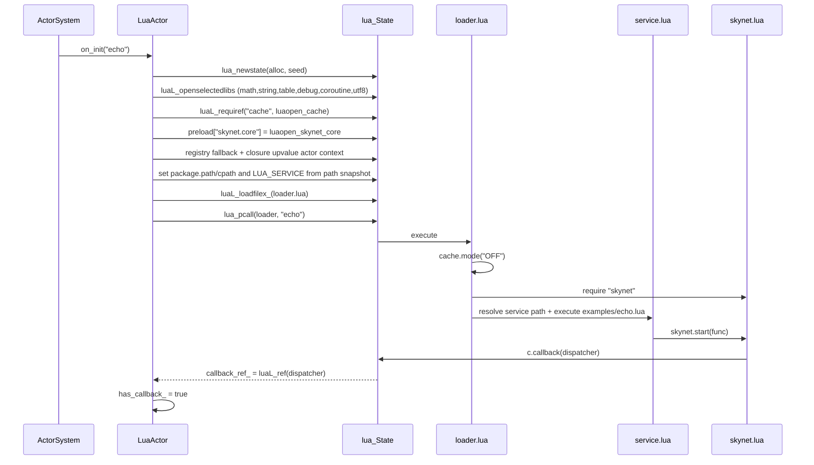
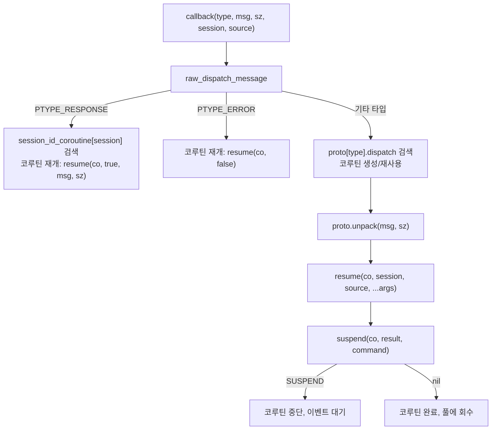
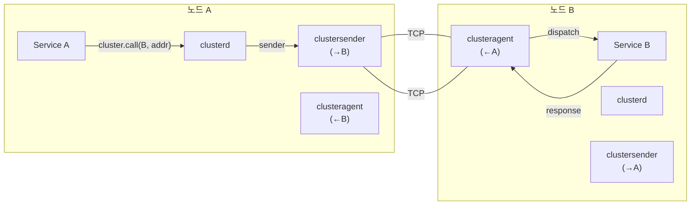
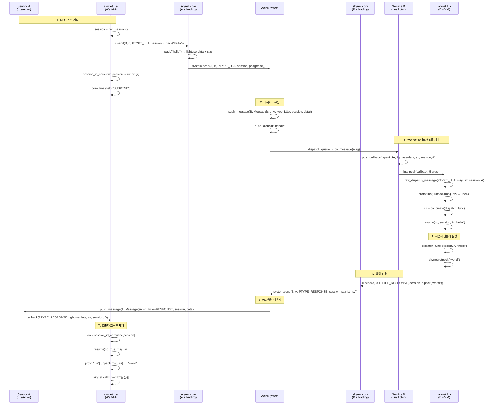

# skynet-cpp 프로젝트 설계 문서
## 최근 런타임 업데이트

현재 런타임은 preload 기반 bootstrap을 사용합니다. C++ 엔트리포인트는 `SKYNET_THREAD`와 `SKYNET_PRELOAD`만 읽고, 기본 preload는 `examples/preload.lua`입니다. launcher 시작, Lua path/cpath/service path 설정, 애플리케이션 진입점 선택은 preload 스크립트가 담당합니다. `skynet.appendpath`, `skynet.prependpath`, `skynet.appendcpath`, `skynet.appendservicepath`, `skynet.getpath`는 새 LuaActor가 상속하는 전역 Lua 경로 snapshot을 관리합니다.

release 모델은 install/package 친화적으로 변경되었습니다. 실행 파일에는 source root가 내장되지 않고 설치 트리는 `bin/`, `lualib/`, `service/`, `examples/`, `doc/` 구조를 사용합니다. preload는 `skynet.getcwd()`로 process cwd를 출력하고 `skynet.setpathbase(path)` / `skynet.getpathbase()`로 상대 검색 경로 기준을 관리하며, Lua `io`를 열지 않고 `skynet.readfile` / `skynet.writefile`로 pathbase 상대 업무 파일을 다룰 수 있습니다.

스케줄링은 `ActorQueue` 모델로 전환되었습니다. actor registry는 handle 기준으로 shard되고, global queue는 `ActorQueue` 객체를 저장하며, queue 수명은 Actor owner와 분리됩니다. `kill` 이후 queue가 pending message를 안전하게 drain/drop합니다. LuaActor callback과 traceback은 registry ref로 캐시되고, `skynet.core` C API는 현재 actor pointer를 closure upvalue로 캐시합니다.

Hot path는 `ConcurrentQueue`, atomic epoch wait/notify, sleeping worker 추적, global queue 근사 카운트를 사용합니다. 8/16 thread worker는 sleep 전에 짧은 user-space spin을 수행해 actor RPC workload의 futex wakeup을 줄입니다. 테스트 엔트리는 `tests/logic`, `tests/stress`, `tests/perf`, coverage runner로 분리되었고 Linux 비교는 Docker에서 실행됩니다.

> **skynet-cpp** — 모던 C++20으로 재구현한 [Skynet](https://github.com/cloudwu/skynet) Actor 프레임워크

---

## 목차

1. [프로젝트 개요](#1-프로젝트-개요)
2. [설계 목적과 해결한 문제](#2-설계-목적과-해결한-문제)
3. [기술 선정](#3-기술-선정)
4. [시스템 아키텍처 개요](#4-시스템-아키텍처-개요)
5. [핵심 모듈 목록](#5-핵심-모듈-목록)
6. [클래스 관계도](#6-클래스-관계도)
7. [모듈 간 호출 관계](#7-모듈-간-호출-관계)
8. [각 모듈 구현 상세](#8-각-모듈-구현-상세)
   - [8.1 Actor 프레임워크](#81-actor-프레임워크-skynethcpp)
   - [8.2 네트워크 레이어](#82-네트워크-레이어-networkhcpp)
   - [8.3 TCP 게이트웨이 서비스](#83-tcp-게이트웨이-서비스-service_gateh)
   - [8.4 로거 서비스](#84-로거-서비스-service_loggerh)
   - [8.5 Lua Actor](#85-lua-actor-lua_actorhcpp)
   - [8.6 Lua C 바인딩 레이어](#86-lua-c-바인딩-레이어-lua_bindingcpp)
   - [8.7 Lua 직렬화 프로토콜](#87-lua-직렬화-프로토콜-lua_serihcpp)
   - [8.8 Lua 서비스 API 레이어](#88-lua-서비스-api-레이어-skynetlua)
   - [8.9 Socket Lua API](#89-socket-lua-api)
   - [8.10 GateServer 게이트웨이 템플릿](#810-gateserver-게이트웨이-템플릿)
   - [8.11 SocketChannel 연결 다중화](#811-socketchannel-연결-다중화)
   - [8.12 Cluster](#812-cluster)
   - [8.13 Debug 및 Profile](#813-debug-및-profile)
   - [8.14 ShareData](#814-sharedata)
   - [8.15 Queue 직렬화 큐](#815-queue-직렬화-큐)
   - [8.16 Multicast Pub/Sub](#816-multicast-pubsub)
   - [8.17 데이터베이스 드라이버 및 유틸리티 라이브러리](#817-데이터베이스-드라이버-및-유틸리티-라이브러리)
9. [메시지 흐름 예시](#9-메시지-흐름-예시)

---

## 1. 프로젝트 개요

skynet-cpp는 **C++20**으로 재구현한 경량 Actor 모델 서버 프레임워크로, 설계 철학과 API 시맨틱은 [cloudwu/skynet](https://github.com/cloudwu/skynet)에서 유래합니다. 프레임워크는 skynet의 핵심 추상화——**각 서비스는 독립된 Actor이며 비동기 메시지로 통신**——를 유지하면서, 모던 C++의 언어 기능과 크로스플랫폼 생태계를 활용하여 타입 안전성, RAII 리소스 관리, 플랫폼 독립성을 제공합니다.

### 프로젝트 구조

```
skynet-cpp/
├── CMakeLists.txt                         # Build configuration
├── doc/
│   ├── design/                            # Multilingual architecture design docs
│   ├── wiki/                              # Multilingual user wiki docs
│   └── performance-optimization/          # Performance optimization notes
├── src/
│   ├── skynet.h / skynet.cpp              # ActorSystem, ActorQueue, scheduler, registry
│   ├── network.h / network.cpp            # TCP/UDP network layer (Asio)
│   ├── platform.h / platform.cpp          # Small cross-platform runtime helpers
│   ├── service_gate.h                     # TCP gateway service (C++)
│   ├── service_logger.h                   # Logger service (C++)
│   ├── lua_actor.h / lua_actor.cpp        # Lua VM host Actor
│   ├── lua_binding.cpp                    # skynet.core C bindings
│   ├── lua_seri.h / lua_seri.cpp          # Lua binary serialization
│   ├── lua_socket_binding.cpp             # socketdriver C bindings
│   ├── lua_netpack.cpp                    # netpack C bindings
│   ├── lua_cluster.cpp                    # cluster.core C bindings
│   ├── lua_profile.cpp                    # profile C bindings
│   ├── skynet_json.h                      # JSON helper
│   └── main.cpp                           # Minimal preload bootstrap entrypoint
├── lualib/
│   ├── loader.lua                         # Lua service loader; uses global path snapshot
│   ├── skynet.lua                         # Lua service API layer and path config API
│   ├── socket.lua                         # Socket API (coroutine wrapper)
│   ├── gateserver.lua                     # TCP gateway template
│   ├── sharedata.lua                      # Shared data client
│   ├── bson.lua                           # BSON codec (pure Lua)
│   └── skynet/
│       ├── socketchannel.lua              # Socket connection multiplexing
│       ├── cluster.lua                    # Cluster RPC client
│       ├── coverage.lua                   # Lua line coverage hook
│       ├── debug.lua                      # Debug protocol
│       ├── queue.lua                      # Coroutine critical section queue
│       ├── multicast.lua                  # Pub/sub client
│       ├── crypt.lua                      # SHA1/Base64/Hex helpers
│       └── db/
│           ├── redis.lua                  # Redis driver (RESP protocol)
│           ├── mysql.lua                  # MySQL driver (wire protocol)
│           └── mongo.lua                  # MongoDB driver (OP_MSG)
├── service/
│   ├── launcher.lua                       # Service launcher
│   ├── debug_console.lua                  # Debug console service
│   ├── clusterd.lua                       # Cluster manager
│   ├── clusteragent.lua                   # Cluster inbound agent
│   ├── clustersender.lua                  # Cluster outbound sender
│   ├── sharedatad.lua                     # Shared data server
│   └── multicastd.lua                     # Multicast manager service
├── examples/
│   ├── preload.lua                        # Default preload bootstrap
│   ├── main.lua                           # Example application entry service
│   ├── echo.lua                           # Example echo service
│   └── pingpong.lua                       # Example ping-pong service
├── tests/
│   ├── cpp_unit.cpp                       # C++ unit tests
│   ├── logic/                             # Logic regression preload and services
│   ├── stress/                            # Stress preload, workers, and suite
│   └── perf/                              # Performance benchmark preload and workers
├── tools/
│   ├── verify.bat                         # Runtime quick verification
│   ├── package.bat                        # Runtime package builder
│   ├── run_package_smoke.bat              # Runtime package smoke
│   └── run_linux_coverage.sh              # Linux coverage smoke
└── 3rdparty/
    ├── asio/                              # Asio standalone headers
    ├── concurrentqueue/                   # moodycamel lock-free queue
    └── lua-5.5.0/                         # Skynet-modified Lua 5.5.0
```
│   ├── echo.lua                    # 예제: 에코 서비스
│   └── pingpong.lua                # 예제: 핑퐁 서비스
└── 3rdparty/
    ├── asio/                       # Asio 독립 헤더 라이브러리
    ├── concurrentqueue/            # moodycamel 락프리 큐
    └── lua-5.5.0/                  # Skynet 수정판 Lua 5.5.0
```

---

## 2. 설계 목적과 해결한 문제

| 차원 | 원본 Skynet (C + Lua) | skynet-cpp (C++20) |
|---|---|---|
| **언어** | 순수 C 구현, 수동 메모리 관리 | C++20, RAII + `std::shared_ptr` 자동 수명 관리 |
| **플랫폼** | Linux 전용 (epoll + pthreads) | 크로스플랫폼 (Asio 추상화, Windows/Linux/macOS) |
| **타입 안전성** | `void*` 포인터로 메시지 전달, 런타임 cast | `std::any` + `msg.get<T>()` 템플릿 타입 안전 접근 |
| **병행 프리미티브** | 자체 spinlock + 글로벌 큐 | `moodycamel::ConcurrentQueue` (락프리 MPMC) + `std::shared_mutex` |
| **비동기 IO** | 자체 socket server (epoll 래퍼) | Asio + `steady_timer`, Actor 메시지와 자연스러운 통합 |
| **스레드 모델** | 고정 worker 스레드 + 단일 timer 스레드 | worker 스레드 + IO 스레드 (Asio) + monitor 스레드 |
| **Lua 통합** | 밀결합, C 코드에서 직접 Lua 스택 조작 | 명확한 계층화: `LuaActor` → C binding → Lua API |
| **빌드 시스템** | Makefile (GCC/Clang만) | CMake 3.20+ (MSVC/GCC/Clang) |

### 핵심 설계 목표

1. **Skynet의 Actor 시맨틱 유지**: handle 식별, 비동기 메시지, session 메커니즘, 명명 서비스
2. **모던 C++ 타입 안전성**: 템플릿 spawn, 타입화된 메시지, 컴파일 타임 오류 포착
3. **크로스플랫폼**: 주요 대상 Windows (MSVC), Linux/macOS 호환
4. **Lua 통합**: Skynet 수정판 Lua 5.5.0 (codecache 포함) 직접 채택, 원본 호환 `skynet.send/call/ret` API 제공

---

## 3. 기술 선정

| 기술 | 버전 | 선정 이유 |
|---|---|---|
| **C++20** | MSVC 19.41+ / GCC 12+ | `std::jthread` (자동 join), `std::any` (타입 안전 메시지), `std::shared_mutex` (읽기/쓰기 잠금), Concepts |
| **Asio** | 1.28.2 (standalone) | 성숙한 크로스플랫폼 비동기 IO 라이브러리; Boost 의존성 없음; TCP/UDP/Timer 네이티브 지원; `io_context`가 Actor 메시지 루프와 통합 가능 |
| **moodycamel::ConcurrentQueue** | latest | 고성능 락프리 MPMC 큐; 헤더 온리; ActorQueue mailbox와 global dispatch queue는 `ConcurrentQueue` 사용 |
| **Lua 5.5.0 (Skynet 수정판)** | 5.5.0-skynet | Skynet의 Lua 포크, **codecache** (복수 VM 간 컴파일된 바이트코드 공유), `lua_clonefunction`, `lua_sharefunction`, `lua_pushexternalstring` 등 확장 API 탑재 |
| **CMake** | 3.20+ | 크로스플랫폼 빌드; MSVC/GCC/Clang 지원; target-based 모던 CMake |

---

## 4. 시스템 아키텍처 개요



---

## 5. 핵심 모듈 목록

| Module | Source Files | Current Responsibility |
|---|---|---|
| **Actor Runtime** | `src/skynet.h`, `src/skynet.cpp` | `Actor`, `ActorSystem`, sharded actor registry, `ActorQueue`, weighted dispatch, timer/session, lifecycle, monitor thread |
| **Platform Helpers** | `src/platform.h`, `src/platform.cpp` | Small portability boundary for environment variables, file append/write helpers, local time formatting, process/node identity, Lua C module suffix |
| **Network Layer** | `src/network.h`, `src/network.cpp` | Cross-platform TCP listener/client/connection and UDP socket built on standalone Asio |
| **C++ Gateway** | `src/service_gate.h` | C++ TCP gateway service and connection event routing |
| **Logger** | `src/service_logger.h` | stdout/file logger service; runtime error logs route through cached logger handle |
| **Lua Actor Host** | `src/lua_actor.h`, `src/lua_actor.cpp` | Per-service Lua VM, loader execution, global path snapshot inheritance, callback/traceback registry refs, memory tracking |
| **Lua Core Binding** | `src/lua_binding.cpp` | `skynet.core` C API: send/callback/session/command/path configuration/serialization helpers |
| **Serialization Binding** | `src/lua_seri.h`, `src/lua_seri.cpp` | Skynet-compatible Lua value pack/unpack binary serialization |
| **Socket Binding** | `src/lua_socket_binding.cpp` | `socketdriver` C API for TCP/UDP listen/connect/send/close/pause/resume with shortened store lock scope |
| **Netpack Binding** | `src/lua_netpack.cpp` | 2-byte big-endian TCP frame pack/unpack/filter helpers |
| **Cluster Binding** | `src/lua_cluster.cpp` | `cluster.core` pack/unpack/multicast string helpers |
| **Profile Binding** | `src/lua_profile.cpp` | `skynet.profile` coroutine timing hooks and resume/wrap replacement |
| **JSON Helper** | `src/skynet_json.h` | Header-only JSON utility retained for runtime/support code |
| **Lua Loader** | `lualib/loader.lua` | Resolves plain service names through configured service paths and executes Lua service scripts |
| **Lua Service API** | `lualib/skynet.lua` | `start`, `dispatch`, `send`, `call`, `ret`, `timeout`, `fork`, named service APIs, path/cpath/service-path configuration APIs |
| **Socket API** | `lualib/socket.lua` | Coroutine-friendly TCP/UDP API over `socketdriver` |
| **GateServer API** | `lualib/gateserver.lua` | Lua gateway template with connect/disconnect/message handler callbacks |
| **SocketChannel** | `lualib/skynet/socketchannel.lua` | Reconnectable ordered/session socket multiplexing used by Redis/Mongo style clients |
| **Cluster** | `lualib/skynet/cluster.lua` + `service/cluster*.lua` | Cluster RPC client and cluster manager/agent/sender services |
| **Debug Console** | `lualib/skynet/debug.lua`, `service/debug_console.lua` | Debug command protocol and TCP debug console service |
| **ShareData** | `lualib/sharedata.lua`, `service/sharedatad.lua` | Shared immutable table publication, query, cache, and update notification |
| **Multicast** | `lualib/skynet/multicast.lua`, `service/multicastd.lua` | Publish/subscribe channel manager and client API |
| **Coverage** | `lualib/skynet/coverage.lua` | Lua line coverage hook used only by coverage runners |
| **DB Drivers** | `lualib/skynet/db/{redis,mysql,mongo}.lua`, `lualib/bson.lua` | Redis RESP, MySQL wire protocol, MongoDB OP_MSG/BSON clients |
| **Examples** | `examples/preload.lua`, `examples/main.lua`, `examples/echo.lua`, `examples/pingpong.lua` | Default preload and example services |
| **Tests** | `tests/cpp_unit.cpp`, `tests/logic`, `tests/stress`, `tests/perf` | C++ units, logic regression suite, stress suite, and performance benchmark suite |
| **Tools** | `tools/verify.*`, `tools/package.*`, `tools/run_package_smoke.*`, `tools/run_linux_coverage.sh` | Minimal runtime verification, package smoke, and Linux coverage smoke; full coverage, perf, Docker DB, long-run validation, and native comparison live in the parent best-practice project |

---

## 6. 클래스 관계도



---

## 7. 모듈 간 호출 관계



### 주요 호출 경로

| 경로 | 설명 |
|---|---|
| `main → ActorSystem::spawn<T>()` | Actor 인스턴스 생성, handle 할당, `on_init` 호출 |
| `Actor::send() → ActorSystem::send() → push_message()` | 대상 ActorQueue mailbox로 메시지 전송 |
| `worker_loop → global_queue → dispatch_queue → on_message` | Worker 스레드가 global queue에서 ActorQueue를 가져와 weighted batch로 dispatch |
| `TcpListener → SocketAccept/SocketData → ServiceGate::on_message` | 네트워크 이벤트가 `PTYPE_SOCKET` 경유로 Gate에 전달 |
| `LuaActor::on_init → loader.lua → skynet.lua → service.lua` | Lua 서비스 로딩 체인 |
| `skynet.send() → c.send() → lsend() → ActorSystem::send()` | Lua 메시지 전송의 전체 경로 |
| `skynet.call() → yield → PTYPE_RESPONSE → resume` | Lua 동기 RPC 호출의 코루틴 전환 |

---

## 8. 각 모듈 구현 상세

### 8.1 Actor 프레임워크 (`skynet.h/cpp`)

#### 메시지 타입 열거형

```cpp
enum MessageType {
    PTYPE_TEXT     = 0,   // 일반 텍스트 메시지
    PTYPE_RESPONSE = 1,   // RPC 응답 / Timer 콜백
    PTYPE_SYSTEM   = 4,   // 시스템 메시지
    PTYPE_SOCKET   = 6,   // 네트워크 이벤트
    PTYPE_ERROR    = 7,   // 오류 알림
    PTYPE_TIMER    = 8,   // (예약)
    PTYPE_LUA      = 10,  // Lua 직렬화 메시지
};
```

#### Message 구조체

```cpp
struct Message {
    uint32_t source = 0;     // 발신자 handle
    int      session = 0;    // 세션 ID (0 = fire-and-forget)
    int      type = PTYPE_TEXT;
    std::any data;           // 타입화된 페이로드

    template<typename T> const T& get() const;  // 타입 안전 접근
    bool has_data() const;
};
```

`std::any`는 원본 Skynet의 `void* msg + size_t sz`를 대체하여, 컴파일 타임 타입 체크로 잘못된 포인터 cast를 방지합니다.

#### Actor 기본 클래스

각 Actor는 다음을 소유:
- **고유 handle** (`uint32_t`): 전역 고유 식별자
- **독립 mailbox** (`ConcurrentQueue<Message>`): 락프리 MPMC 큐
- **세션 할당기** (`atomic<int>`): RPC call용 증분 session ID 생성

Actor 수명주기: `spawn()` → `on_init()` → 루프 `on_message()` → `kill()` → `on_destroy()`

#### ActorSystem 스케줄러

**스레드 모델**:

| 스레드 | 수 | 책임 |
|---|---|---|
| Worker | N (기본=CPU 코어 수) | `global_queue_`에서 `ActorQueue`를 가져와 weighted batch로 dispatch |
| IO | 1 | `asio::io_context` 실행, 모든 비동기 네트워크 IO와 Timer 처리 |
| Monitor | 1 | 5초마다 Worker 데드락 검사 (버전 번호 비교) |

**스케줄링 가중치 전략** (`calc_weight`):

```
Worker 1..N/4    → weight=-1 → 매번 1개 메시지 처리 (저지연 우선)
Worker N/4..N/2  → weight= 0 → 큐의 모든 메시지 처리 (처리량 우선)
Worker N/2..3N/4 → weight= 1 → n/2개 메시지 처리
Worker 3N/4..N   → weight= 2 → n/4개 메시지 처리
```

서로 다른 가중치의 Worker를 혼합하여 **저지연과 고처리량 사이의 균형**을 보장합니다.

**데드락 감지** (`WorkerMonitor`):

각 Worker는 `WorkerMonitor`를 가집니다. `dispatch_queue` 전후로 `begin(src, dst)` / `end()`를 호출하여 버전 번호를 증분합니다. Monitor 스레드는 5초마다 `version`과 `check_version`을 비교하여, Worker가 `busy` 상태이고 버전이 변하지 않으면 데드락으로 판정하고 경고를 출력합니다.

**Timer 구현**:

```cpp
void ActorSystem::timeout(uint32_t dest, int session, milliseconds delay) {
    auto timer = make_shared<asio::steady_timer>(io_ctx_, delay);
    timer->async_wait([this, dest, session, timer](auto& ec) {
        if (!ec) send(0, dest, PTYPE_RESPONSE, session, {});
    });
}
```

Timer는 새 스레드를 시작하지 않고 Asio `io_context`에 포스트하며, 만료 시 `PTYPE_RESPONSE` 메시지로 대상 Actor에 전달합니다.

---

### 8.2 네트워크 레이어 (`network.h/cpp`)

#### Socket 이벤트 구조체

네트워크 이벤트는 `PTYPE_SOCKET` + `std::any`로 Actor에 전송됩니다:

| 이벤트 | 구조체 | 필드 |
|---|---|---|
| 새 연결 | `SocketAccept` | `connection_id`, `remote_address`, `remote_port` |
| 데이터 수신 | `SocketData` | `connection_id`, `data` |
| 연결 종료 | `SocketClose` | `connection_id` |
| 연결 성립 | `SocketOpen` | `connection_id`, `remote_address`, `remote_port` |
| 전송 버퍼 경고 | `SocketWarning` | `connection_id`, `pending_bytes` |
| UDP 데이터 | `SocketUDP` | `data`, `remote_address`, `remote_port` |

#### TcpConnection

단일 TCP 연결 관리:

- **읽기**: 8KB 버퍼로 순환 `async_read_some`, 데이터를 `SocketData`로 패키징하여 owner Actor에 전달
- **쓰기**: `deque<string>` 쓰기 큐로 직렬화 쓰기; `pending_bytes_` 추적, 1MB 초과 시 `SocketWarning` 발생
- **흐름 제어**: `pause()` / `resume()`으로 읽기 속도 제어
- **하프 클로즈**: `shutdown_write()`로 FIN 전송하면서 읽기는 유지

#### TcpListener

TCP 서버:

- 순환 `async_accept`, 새 연결마다 `TcpConnection` 생성
- `connection_id`로 연결 풀 관리 (`unordered_map<int, shared_ptr<TcpConnection>>`)
- `send(conn_id, data)` / `close_connection(conn_id)`으로 ID별 조작

#### TcpConnector

TCP 클라이언트 커넥터:

- `async_resolve` → `async_connect` → `TcpConnection` 생성
- 연결 성공 시 `SocketOpen` 전송, 실패 시 `SocketError` 전송

#### UdpSocket

UDP 송수신:

- 64KB 수신 버퍼, 순환 `async_receive_from`
- 수신 데이터를 `SocketUDP`로 패키징하여 owner Actor에 전달
- `send_to(data, host, port)`로 비동기 전송

---

### 8.3 TCP 게이트웨이 서비스 (`service_gate.h`)

`ServiceGate`는 Actor 프레임워크와 네트워크 레이어 사이의 브리지입니다:

```
Client ──TCP──→ TcpListener ──SocketAccept──→ ServiceGate
                TcpConnection ──SocketData──→ ServiceGate ──forward──→ Agent Actor
```

**Agent 팩토리 패턴**:

```cpp
using AgentFactory = std::function<uint32_t(
    ServiceGate& gate, int conn_id,
    const std::string& addr, uint16_t port)>;
```

새 연결이 도착할 때 `AgentFactory`가 설정되어 있으면, Gate는 연결 전용 Agent Actor를 자동 생성하고 이후 데이터를 `PTYPE_TEXT`로 Agent에 전달합니다. 팩토리 미설정 시 데이터는 Gate 내에서 직접 처리됩니다 (간단한 에코 서비스에 적합).

**이벤트 디스패치**:

| 이벤트 타입 | 콜백 | 기본 동작 |
|---|---|---|
| `SocketAccept` | `on_accept()` | 팩토리가 있으면 agent 생성 |
| `SocketData` | `on_data()` | agent가 있으면 전달 |
| `SocketClose` | `on_close()` | agent 매핑 정리 |
| `SocketWarning` | — | 로그 경고 |

---

### 8.4 로거 서비스 (`service_logger.h`)

시스템 수준 로깅 센터. 모든 `ActorSystem::error()` 호출은 최종적으로 `"logger"` 이름의 Actor로 라우팅됩니다:

**로그 포맷**:
```
[HH:MM:SS.mmm][HANDLE][TAG] message
```

- `HANDLE`: 8자리 16진수 Actor handle
- `TAG`: `ERROR` (`PTYPE_ERROR`) 또는 `INFO` (`PTYPE_TEXT`)
- stdout과 옵션 로그 파일에 동시 출력

---

### 8.5 Lua Actor (`lua_actor.h/cpp`)

`LuaActor`는 `Actor`를 상속하여 각 Lua 서비스에 독립된 `lua_State`를 호스트합니다.

#### 초기화 흐름 (`on_init`)



**주요 설계 결정**:

1. **보안 샌드박스**: `io`와 `os` 라이브러리 미개방 (Lua 서비스의 직접 파일/프로세스 조작 방지)
2. **Codecache 비활성화**: `cache.mode("OFF")`로 코드 캐시를 비활성화하여, 복수 VM 간 `_ENV` 공유로 인한 `require` nil 문제 회피
3. **메모리 추적**: 커스텀 `lua_alloc`으로 각 VM의 메모리 사용량 기록, 제한 및 자동 경고 지원
4. **비캐시 로딩**: `loader.lua`는 `luaL_loadfilex_` (비캐시 변형)으로 로드하여 각 VM의 독립 실행 보장

#### 메시지 디스패치 (`on_message`)

콜백 시그니처: `callback(type, msg, sz, session, source)`

| 메시지 타입 | msg 파라미터 | sz 파라미터 |
|---|---|---|
| `PTYPE_LUA` / `PTYPE_RESPONSE` | `lightuserdata` (직렬화 버퍼 포인터) | 바이트 길이 |
| `PTYPE_TEXT` / `PTYPE_ERROR` | Lua string | 문자열 길이 |
| 기타 (Timer 등) | nil | 0 |

#### 메모리 할당기

```
할당 전략:
  if nsize == 0           → free(ptr), return nullptr
  if mem_ > mem_limit_    → 할당 거부 (OOM 보호)
  if mem_ > mem_report_   → 메모리 경고 출력, mem_report_ *= 2
  else                    → realloc(ptr, nsize)
```

---

### 8.6 Lua C 바인딩 레이어 (`lua_binding.cpp`)

`luaopen_skynet_core`가 등록하는 15개 C 함수로 `skynet.core` 모듈을 구성:

| 함수 | 시그니처 | 설명 |
|---|---|---|
| `send` | `(dest, source, type, session, msg [,sz])` → `session` | 메시지 전송, source 무시 (항상 self 사용) |
| `callback` | `(func)` → nil | 메시지 콜백 등록 |
| `genid` | `()` → `session_id` | 증분 session ID 할당 |
| `self` | `()` → `handle` | 현재 Actor handle 반환 |
| `now` | `()` → `centiseconds` | 시작 후 경과 시간 (센티초) |
| `error` | `(text)` → nil | ActorSystem 경유로 logger에 라우팅 |
| `command` | `(cmd, param)` → `string\|nil` | 서비스 명령 (REG/NAME/QUERY/EXIT/KILL/TIMEOUT/NOW) |
| `intcommand` | `(cmd, param)` → `int\|nil` | 명령 변형, 정수 반환 |
| `addresscommand` | `(cmd, param)` → `int\|nil` | 명령 변형, handle 정수 반환 |
| `pack` | `(...)` → `lightuserdata, size` | Lua 값 직렬화 |
| `unpack` | `(msg, sz)` → `...values` | 역직렬화 |
| `tostring` | `(msg, sz)` → `string` | lightuserdata를 Lua string으로 변환 |
| `trash` | `(msg, sz)` → nil | lightuserdata 버퍼 해제 |
| `redirect` | `(dest, src, type, session, msg, sz)` → nil | 명시적 source 지정 전송 |
| `harbor` | `(addr)` → `0, 0` | 스텁 (단일 프로세스, harbor 불필요) |

**command 서브명령 상세**:

| 명령 | 파라미터 | 반환 | 동작 |
|---|---|---|---|
| `REG` | `"name"` | `":handle"` | 현재 Actor의 이름 등록 |
| `NAME` | `"name :handle"` | `":handle"` | 지정 handle의 이름 등록 |
| `QUERY` | `"name"` | `":handle"` 또는 nil | 명명 서비스 조회 |
| `EXIT` | — | nil | 현재 Actor 종료 |
| `KILL` | `":handle"` 또는 `"name"` | nil | 대상 Actor 종료 |
| `TIMEOUT` | `"centisecs"` | `"session"` | 타이머 등록 |
| `NOW` | — | `"centisecs"` | 현재 시각 |

---

### 8.7 Lua 직렬화 프로토콜 (`lua_seri.h/cpp`)

원본 Skynet과 완전 호환되는 바이너리 직렬화 포맷.

#### 인코딩 포맷

각 값은 **1바이트 헤더 + 가변 길이 페이로드**로 인코딩:

```
Header = [TYPE: 3 bits | COOKIE: 5 bits]
```

| TYPE | 값 | COOKIE 의미 | 페이로드 |
|---|---|---|---|
| NIL | 0 | — | 없음 |
| BOOLEAN | 1 | 0=false, 1=true | 없음 |
| NUMBER | 2 | 서브타입 인코딩 | 하단 표 참조 |
| USERDATA | 3 | — | 8바이트 포인터 |
| SHORT_STRING | 4 | 길이 (0-31) | 0-31바이트 |
| LONG_STRING | 5 | 2 또는 4 | 2/4바이트 길이 + 데이터 |
| TABLE | 6 | 배열 크기 | 배열 요소 + 해시 쌍 + NIL 종단자 |

**숫자 서브타입** (NUMBER의 COOKIE 필드):

| COOKIE | 타입 | 페이로드 크기 |
|---|---|---|
| 0 | ZERO | 0 (값은 0) |
| 1 | BYTE | 1 (uint8) |
| 2 | WORD | 2 (uint16) |
| 4 | DWORD | 4 (int32) |
| 6 | QWORD | 8 (int64) |
| 8 | DOUBLE | 8 (IEEE754) |

**테이블 인코딩**:
```
[Header: TYPE_TABLE | min(array_size, 31)]
  [array_size >= 31인 경우: varint 인코딩된 실제 크기]
  [배열 요소 1..n 재귀 인코딩]
  [해시 쌍: key,value 교대 재귀 인코딩]
  [NIL 종단자]
```

**메모리 모델**:

- **Pack**: 128바이트 블록 연결 리스트에 기록, 마지막에 단일 `malloc` 버퍼로 통합, `(lightuserdata, size)` 반환
- **Unpack**: 버퍼에서 순차 읽기, 재귀적으로 Lua 값 재구성
- **최대 중첩 깊이**: 32레벨

---

### 8.8 Lua 서비스 API 레이어 (`skynet.lua`)

`skynet.lua`는 Lua 서비스 개발자를 위한 API 레이어로, `skynet.core` C 바인딩을 래핑하여 고수준 인터페이스를 제공합니다.

#### 코루틴 풀과 메시지 디스패치



#### 등록된 프로토콜

| 이름 | ID | pack | unpack |
|---|---|---|---|
| `lua` | 10 (`PTYPE_LUA`) | `c.pack` (바이너리 직렬화) | `c.unpack` |
| `text` | 0 (`PTYPE_TEXT`) | identity | `c.tostring` |
| `response` | 1 | — | — |
| `error` | 7 | — | — |

#### 퍼블릭 API

**메시지 전송**:

| 함수 | 설명 |
|---|---|
| `skynet.send(addr, typename, ...)` | 비동기 전송, 자동 pack, session 반환 |
| `skynet.rawsend(addr, type, session, msg, sz)` | 원시 전송, pack 없음 |
| `skynet.call(addr, typename, ...)` | 동기 RPC: 전송 → yield → PTYPE_RESPONSE 대기 → unpack → 반환 |
| `skynet.ret(msg, sz)` | PTYPE_RESPONSE 응답 전송 |
| `skynet.retpack(...)` | `skynet.ret(skynet.pack(...))` 단축키 |

**코루틴 제어**:

| 함수 | 설명 |
|---|---|
| `skynet.dispatch(typename, func)` | 타입 핸들러 등록: `func(session, source, ...)` |
| `skynet.fork(func, ...)` | 새 코루틴 생성, fork_queue에 추가하여 지연 실행 |
| `skynet.timeout(ti, func)` | `ti` 센티초 후 func 실행 |
| `skynet.sleep(ti)` | 현재 코루틴을 `ti` 센티초 블록 |
| `skynet.yield()` | 현재 코루틴 양보 (`sleep(0)`과 동일) |

**서비스 관리**:

| 함수 | 설명 |
|---|---|
| `skynet.start(func)` | 서비스 진입점: 콜백 등록 + `timeout(0, func)` |
| `skynet.exit()` | 현재 서비스 종료 |
| `skynet.self()` | 현재 Actor handle |
| `skynet.register(name)` | 서비스명 등록 |
| `skynet.name(name, handle)` | 지정 handle의 이름 등록 |

**유틸리티 함수**:

| 함수 | 설명 |
|---|---|
| `skynet.address(handle)` | `":xxxxxxxx"` 형식으로 포맷 |
| `skynet.error(...)` | 인수를 연결하여 logger에 전송 |
| `skynet.now()` | 현재 시각 (센티초) |
| `skynet.pack(...)` | 직렬화 → `(lightuserdata, size)` |
| `skynet.unpack(msg, sz)` | 역직렬화 → `...values` |
| `skynet.tostring(msg, sz)` | lightuserdata를 string으로 변환 |
| `skynet.trash(msg, sz)` | lightuserdata 버퍼 해제 |

---

### 8.9 Socket Lua API

`socket.lua`는 `socketdriver` C 모듈을 코루틴 시맨틱으로 래핑하여 블로킹 스타일 API를 제공합니다. 하위 IO가 준비되지 않으면 현재 코루틴이 `skynet.wait`로 일시 정지되고, IO 완료 시 socket 이벤트 디스패치가 재개합니다.

**아키텍처 레이어**:
```
socket.lua (사용자 API)
  └─→ socketdriver (C 모듈)
        └─→ TcpListener / TcpConnector / UdpSocket (C++ Asio)
              └─→ PTYPE_SOCKET 이벤트 → Actor 메일박스
```

**TCP API**:

| 함수 | 설명 |
|---|---|
| `socket.listen(host, port, handler)` | TCP 포트 리슨, handler가 accept/close/warning 이벤트 수신 |
| `socket.ondata(listener_id, handler)` | 데이터 콜백 `handler(conn_id, data)` 설정 |
| `socket.connect(host, port)` | 원격 호스트 연결, 연결 또는 실패까지 블록 |
| `socket.send(conn_id, data)` | connector를 통해 데이터 전송 |
| `socket.write(listener_id, conn_id, data)` | listener의 연결을 통해 데이터 전송 |
| `socket.read(conn_id, sz)` | sz 바이트 읽기, 데이터 준비까지 블록 |
| `socket.readline(conn_id, sep)` | 구분자까지 읽기 (기본 `\n`), 구분자 제외 |
| `socket.readall(conn_id)` | 사용 가능한 모든 데이터 읽기 |
| `socket.close(conn_id)` | 연결 닫기 |
| `socket.pause(listener_id, conn_id)` | 연결 읽기 일시 정지 (흐름 제어) |
| `socket.resume(listener_id, conn_id)` | 연결 읽기 재개 |

**UDP API**:

| 함수 | 설명 |
|---|---|
| `socket.udp(host, port, callback)` | UDP 소켓 생성, callback이 데이터그램 수신 |
| `socket.udp_send(id, data, host, port)` | UDP 데이터그램 전송 |

---

### 8.10 GateServer 게이트웨이 템플릿

`gateserver.lua`는 클라이언트 접속 게이트웨이 구축을 위한 고수준 템플릿입니다. `socket.listen` + `netpack` 프레이밍 로직을 캡슐화하여, 개발자는 handler 콜백만 구현하면 됩니다.

**프레이밍 프로토콜**: 각 패킷 = 2바이트 빅엔디안 길이 헤더 + 데이터 내용, 패킷당 최대 65535 바이트.

**사용법**:
```lua
local gateserver = require "gateserver"
local handler = {}

function handler.connect(conn_id, addr, port) ... end
function handler.disconnect(conn_id) ... end
function handler.message(conn_id, data) ... end
function handler.open(source, conf) ... end

gateserver.start(handler)
```

**handler 콜백**:

| 콜백 | 설명 |
|---|---|
| `connect(conn_id, addr, port)` | 새 클라이언트 연결 |
| `disconnect(conn_id)` | 클라이언트 연결 해제 |
| `message(conn_id, data)` | 완전한 비즈니스 패킷 수신 (길이 헤더 제거됨) |
| `error(conn_id, msg)` | 연결 오류 |
| `warning(conn_id, bytes)` | 전송 버퍼 임계값 초과 |
| `open(source, conf)` | gate가 리슨 포트 열 때 호출 |

**Lua 프로토콜 명령** (다른 서비스가 gate에 전송 가능): `OPEN`, `SEND`, `SENDRAW`, `CLOSE`, `KICK`.

---

### 8.11 SocketChannel 연결 다중화

`socketchannel.lua`는 외부 서비스 접근을 위한 고수준 캡슐화를 제공하며, 두 가지 프로토콜 모드를 지원:

**모드 1: 순서 모드 (Order Mode)**
- 각 요청에 정확히 하나의 응답, TCP가 순서 보장
- Redis RESP 프로토콜에 적합
- `channel:request(req, response_func)` — response_func가 응답 파싱

**모드 2: 세션 모드 (Session Mode)**
- 각 요청이 고유 session을 포함, 응답에 session 포함하여 매칭
- MongoDB 프로토콜에 적합
- channel 생성 시 글로벌 `response` 함수 제공, `request`가 session 파라미터 수신

**핵심 기능**:
- **자동 재연결**: 연결 해제 후 다음 요청 시 자동 재연결
- **인증 흐름**: 생성 시 `auth` 함수 제공, 연결 후 즉시 실행
- **readline 지원**: `channel:readline(sep)` 구분자로 읽기
- **response 메서드**: `channel:response(func)` 전송 없이 수신만 (pub/sub용)

```lua
-- Redis (순서 모드)
local channel = socketchannel.channel { host = "127.0.0.1", port = 6379 }
local resp = channel:request(req_str, function(sock) return true, sock:readline() end)

-- MongoDB (세션 모드)
local channel = socketchannel.channel {
    host = "127.0.0.1", port = 27017,
    response = function(sock) ... return session, ok, data end
}
local resp = channel:request(req_str, session_id)
```

---

### 8.12 Cluster

skynet-cpp는 skynet의 cluster 모드 (master/slave 아님)를 구현합니다. 각 노드는 독립 프로세스이며, TCP를 통해 노드 간 RPC를 수행합니다.

**아키텍처**:



**3서비스 아키텍처**:

| 서비스 | 책임 |
|---|---|
| `clusterd` | 중앙 매니저: 노드 설정, sender/agent 수명 주기, 이름 등록, 리슨 포트 |
| `clustersender` | 아웃바운드 연결 (원격 노드당 하나): socketchannel을 통해 요청/푸시 전송, 응답 수신 |
| `clusteragent` | 인바운드 연결 (수신 연결당 하나): 요청 파싱, 로컬 서비스로 디스패치, 응답 릴레이 |

**클라이언트 API** (`skynet.cluster`):

| 함수 | 설명 |
|---|---|
| `cluster.call(node, addr, ...)` | 원격 서비스에 동기 RPC 호출 |
| `cluster.send(node, addr, ...)` | 비동기 푸시 (응답 없음) |
| `cluster.open(addr, port)` | 인바운드 연결 수락용 포트 리슨 |
| `cluster.reload(cfg)` | 클러스터 설정 리로드 |
| `cluster.register(name, addr)` | 원격 접근용 이름 등록 |
| `cluster.query(node, name)` | 원격 노드의 등록된 이름 조회 |

**클러스터 프로토콜** (C 모듈 `cluster.core`): 2바이트 길이 헤더 + 타입 태그 + 주소 + session + 페이로드. 대용량 메시지 자동 세그멘테이션 지원 (>32KB 시 다중 세그먼트로 분할).

---

### 8.13 Debug 및 Profile

#### 디버그 프로토콜

`debug.lua`는 각 Lua 서비스에 `PTYPE_DEBUG` 프로토콜을 등록하고, 내장 디버그 명령을 제공:

| 명령 | 설명 |
|---|---|
| `MEM` | 현재 Lua VM 메모리 사용량 반환 (KB) |
| `GC` | 가비지 컬렉션 실행, 메모리 변화 보고 |
| `STAT` | 태스크 수, 메시지 큐 길이, CPU 통계 반환 |
| `TASK` | 활성 코루틴 스택 정보 반환 |
| `INFO` | 서비스 등록 `info_func` 콜백 호출 |
| `EXIT` | 서비스 정상 종료 |
| `PING` | 생존 확인 (즉시 응답) |
| `RUN` | Lua 코드 인젝트 및 실행 |

커스텀 디버그 명령은 `debug.reg_debugcmd(name, fn)`으로 등록 가능.

#### 디버그 콘솔

`debug_console.lua`는 TCP telnet 인터페이스를 제공, 명령: `list`, `mem`, `gc`, `stat`, `ping`, `info`, `exit`, `kill`, `start`, `inject`.

#### Profile

`lua_profile.cpp`를 통한 코루틴 레벨 CPU 타이밍:

```lua
local profile = require "skynet.profile"
profile.start()                 -- 타이밍 시작
local cpu_time = profile.stop() -- 타이밍 중지, 초 반환
```

---

### 8.14 ShareData

ShareData는 동일 프로세스 내 여러 서비스 간 읽기 전용 구조화 데이터 공유를 지원하며, 일반적으로 설정 테이블 배포에 사용.

**아키텍처**:

```
sharedatad (서버)                   sharedata (클라이언트 라이브러리)
  ├─ data_store[name]                 ├─ 로컬 캐시
  │   ├─ data                         ├─ 버전 추적
  │   └─ version                      └─ 모니터 코루틴 (롱폴 업데이트)
  └─ 명령: new/delete/
     query/update/monitor
```

**클라이언트 API** (`sharedata`):

| 함수 | 설명 |
|---|---|
| `sharedata.new(name, value)` | 공유 데이터 생성 |
| `sharedata.query(name)` | 데이터 조회 (첫 조회 시 모니터 코루틴 시작) |
| `sharedata.update(name, value)` | 데이터 업데이트 (모든 모니터에 알림) |
| `sharedata.delete(name)` | 공유 데이터 삭제 |
| `sharedata.flush()` | 로컬 캐시 클리어 |
| `sharedata.deepcopy(name, ...)` | 딥카피 획득 |

**원본과의 차이**: skynet-cpp의 sharedata는 메시지 패싱과 딥카피를 사용하며, C 공유 메모리는 사용하지 않습니다 (각 VM이 독립된 `_ENV`를 가지므로). 기능적으로 동등하지만 메모리는 공유되지 않습니다.

---

### 8.15 Queue 직렬화 큐

`queue.lua`는 코루틴 레벨 뮤텍스 락을 구현하여, 단일 서비스 내 "유사 동시성" 문제를 해결합니다. 메시지 처리 중 블로킹 API (`skynet.call` 등) 호출로 서비스 재진입이 발생할 때, queue는 크리티컬 섹션의 직렬 실행을 보장합니다.

**사용법**:
```lua
local queue = require "skynet.queue"
local cs = queue()  -- 실행 큐 생성

function CMD.foobar()
    cs(function()
        -- 이 코드 블록은 같은 cs를 사용하는 다른 코드에 의해 중단되지 않음
        skynet.call(other_service, "lua", "slow_request")
        -- 위 줄이 일시 정지되더라도, 새 foobar 메시지는 큐잉됨
    end)
end
```

**구현**: `current_thread` + `ref` 참조 카운트 + `thread_queue` 대기 큐를 사용하며, `skynet.wait/wakeup`으로 FIFO 스케줄링. 재진입 지원 (동일 코루틴 내 중첩 호출은 데드락하지 않음).

---

### 8.16 Multicast Pub/Sub

Multicast 모듈은 동일 프로세스 내 채널 기반 발행/구독 메시징을 제공합니다.

**아키텍처**:

| 컴포넌트 | 책임 |
|---|---|
| `multicastd` 서비스 | 채널 관리 (ID 할당), 구독자 목록 유지, 메시지 브로드캐스트 |
| `multicast.lua` 클라이언트 | `PTYPE_MULTICAST` 프로토콜 등록, 객체 지향 API 제공 |

**API**:

```lua
local multicast = require "skynet.multicast"
local mc = multicast.new()        -- 채널 생성
mc:subscribe()                     -- 구독
mc:publish("hello", "world")       -- 발행
mc:unsubscribe()                   -- 구독 해제
mc:delete()                        -- 채널 삭제

-- 수신 측 콜백 설정
mc.dispatch = function(channel, source, ...)
    print("received:", ...)
end
```

---

### 8.17 데이터베이스 드라이버 및 유틸리티 라이브러리

모든 데이터베이스 드라이버는 `socketchannel` 위에 구축되어, skynet 워커 스레드를 블록하지 않습니다.

#### Redis 드라이버 (`skynet.db.redis`)

- **프로토콜**: RESP (Redis Serialization Protocol)
- **socketchannel 모드**: Order (요청/응답 일대일)
- **기능**: 자동 생성 명령 (metatable `__index`), 파이프라인 배치, pub/sub watch 모드
- **연결**: `redis.connect({host, port, auth, db})`
- **명령**: `db:get(key)`, `db:set(key, val)`, `db:hgetall(key)` — 모든 Redis 명령

#### MySQL 드라이버 (`skynet.db.mysql`)

- **프로토콜**: MySQL Wire Protocol v10
- **인증**: SHA1 challenge-response (MySQL 4.1+ native_password)
- **기능**: 텍스트 쿼리 + prepared statement + 다중 결과 세트
- **연결**: `mysql.connect({host, port, user, password, database})`
- **API**: `db:query(sql)`, `db:prepare(sql)`, `stmt:execute()`, `stmt:close()`

#### MongoDB 드라이버 (`skynet.db.mongo`)

- **프로토콜**: OP_MSG (MongoDB 3.6+)
- **socketchannel 모드**: Session (요청/응답을 requestID로 매칭)
- **BSON**: 순수 Lua 코덱 `bson.lua` 사용 (double/string/document/array/binary/objectid/int64/null/minkey/maxkey 지원)
- **연결**: `mongo.client({host, port})`
- **API**: `client:getDB(name)` → `db:getCollection(name)` → `coll:insert/find/update/delete/aggregate`
- **커서**: `coll:find(query):sort(s):skip(n):limit(m):toArray()`

#### Crypt 도구 (`skynet.crypt`)

순수 Lua 암호화 함수, MySQL 인증 등에 사용:

| 함수 | 설명 |
|---|---|
| `crypt.sha1(msg)` | SHA-1 해시 (160비트) |
| `crypt.hmac_sha1(key, msg)` | HMAC-SHA1 |
| `crypt.base64encode(data)` | Base64 인코딩 |
| `crypt.base64decode(data)` | Base64 디코딩 |
| `crypt.hexencode(data)` | 16진수 인코딩 |
| `crypt.hexdecode(data)` | 16진수 디코딩 |

#### BSON 코덱 (`bson`)

MongoDB 드라이버용 순수 Lua BSON 직렬화 라이브러리:

| 함수 | 설명 |
|---|---|
| `bson.encode(doc)` | Lua 테이블 → BSON 바이너리 인코딩 |
| `bson.encode_order(k1, v1, ...)` | 순서 보존 인코딩 |
| `bson.decode(data)` | BSON 바이너리 → Lua 테이블 디코딩 |
| `bson.objectid(hex)` | ObjectId 생성 |
| `bson.int64(value)` | 64비트 정수 생성 |
| `bson.null` | BSON null 상수 |

---

## 9. 메시지 흐름 예시

다음은 완전한 Lua RPC 호출 체인을 보여줍니다: **서비스 A가 `skynet.call(B, "lua", "hello")`를 호출**.



### 핵심 타이밍 포인트

1. **Pack/Unpack 쌍으로 사용**: `c.pack("hello")`가 송신측에서 직렬화, 수신측이 `proto.unpack(msg, sz)`로 역직렬화 — 포맷은 원본 Skynet과 완전 호환
2. **session 연속성**: 송신측이 session 할당 → `session_id_coroutine`에 저장 → 수신측이 그대로 반환 → 송신측이 매칭하여 코루틴 재개
3. **제로카피 전달**: 직렬화 버퍼가 `lightuserdata` 포인터로 전달, 수신측은 `c.unpack` 후 `skynet.trash`로 해제
4. **코루틴 중단/재개**: `skynet.call`은 `coroutine.yield("SUSPEND")`로 중단, `PTYPE_RESPONSE` 수신 후 `resume`으로 재개
```
