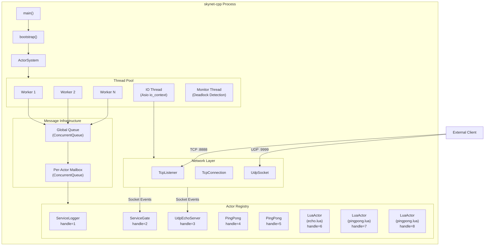
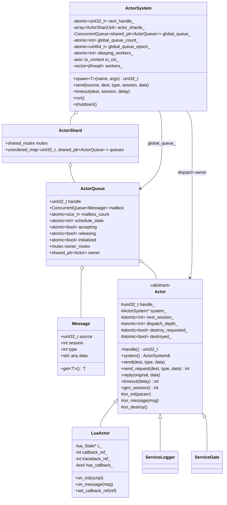
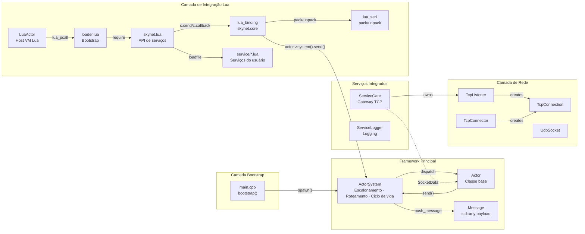
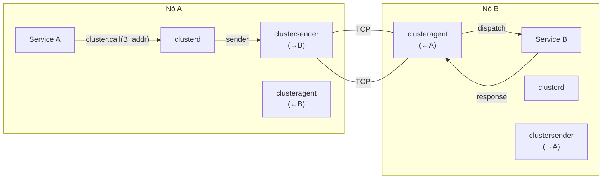
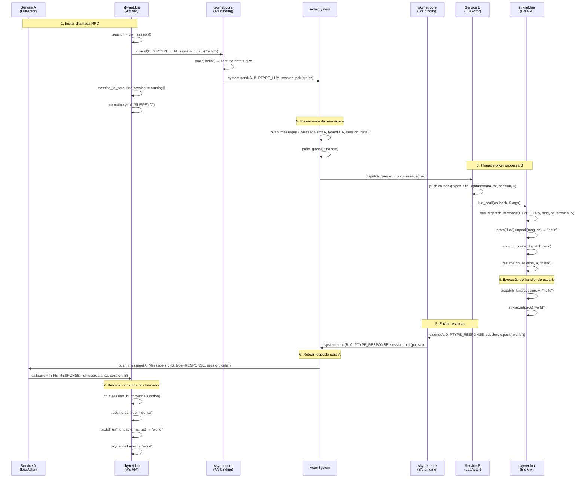

# skynet-cpp — Documento de Design do Projeto
## Atualizações Recentes do Runtime

O runtime agora usa bootstrap dirigido por preload: a entrada C++ lê apenas `SKYNET_THREAD` e `SKYNET_PRELOAD`, usa `examples/preload.lua` por padrão e deixa o script preload iniciar o launcher, configurar Lua path/cpath/service path e escolher a entrada da aplicação. `skynet.appendpath`, `skynet.prependpath`, `skynet.appendcpath`, `skynet.appendservicepath` e `skynet.getpath` gerenciam o snapshot global de caminhos herdado por novos LuaActors.

O agendamento agora usa o modelo `ActorQueue`: o registro de atores é particionado por handle, a fila global armazena objetos `ActorQueue`, e a vida da fila é independente do owner Actor. Após `kill`, a fila drena ou descarta mensagens pendentes com segurança. LuaActor armazena callback e traceback como registry refs, e as APIs C de `skynet.core` armazenam o ponteiro do actor como closure upvalue.

O hot path usa `ConcurrentQueue`, atomic epoch wait/notify, rastreamento de workers dormindo e contagem aproximada da fila global. Workers com 8/16 threads fazem um breve spin em user space antes de dormir para reduzir futex wakeups em workloads actor RPC. Os testes foram separados em `tests/logic`, `tests/stress`, `tests/perf` e runners de coverage; a comparação Linux roda via Docker.

> **skynet-cpp** — Reimplementação moderna em C++20 do framework de atores [Skynet](https://github.com/cloudwu/skynet)

---

## Índice

1. [Visão Geral do Projeto](#1-visão-geral-do-projeto)
2. [Objetivos de Design e Problemas Resolvidos](#2-objetivos-de-design-e-problemas-resolvidos)
3. [Seleção de Tecnologia](#3-seleção-de-tecnologia)
4. [Arquitetura do Sistema](#4-arquitetura-do-sistema)
5. [Módulos Principais](#5-módulos-principais)
6. [Diagrama de Classes](#6-diagrama-de-classes)
7. [Relações entre Módulos](#7-relações-entre-módulos)
8. [Detalhes de Implementação](#8-detalhes-de-implementação)
   - [8.1 Framework de Atores](#81-framework-de-atores-skynethcpp)
   - [8.2 Camada de Rede](#82-camada-de-rede-networkhcpp)
   - [8.3 Serviço Gateway TCP](#83-serviço-gateway-tcp-service_gateh)
   - [8.4 Serviço de Logging](#84-serviço-de-logging-service_loggerh)
   - [8.5 Lua Actor](#85-lua-actor-lua_actorhcpp)
   - [8.6 Camada de Binding C Lua](#86-camada-de-binding-c-lua-lua_bindingcpp)
   - [8.7 Protocolo de Serialização Lua](#87-protocolo-de-serialização-lua-lua_serihcpp)
   - [8.8 Camada API de Serviço Lua](#88-camada-api-de-serviço-lua-skynetlua)
   - [8.9 Socket Lua API](#89-socket-lua-api)
   - [8.10 GateServer Modelo de Gateway](#810-gateserver-modelo-de-gateway)
   - [8.11 SocketChannel Multiplexação de Conexão](#811-socketchannel-multiplexação-de-conexão)
   - [8.12 Cluster](#812-cluster)
   - [8.13 Debug e Profile](#813-debug-e-profile)
   - [8.14 ShareData](#814-sharedata)
   - [8.15 Queue Fila de Serialização](#815-queue-fila-de-serialização)
   - [8.16 Multicast Pub/Sub](#816-multicast-pubsub)
   - [8.17 Drivers de Banco de Dados e Bibliotecas Utilitárias](#817-drivers-de-banco-de-dados-e-bibliotecas-utilitárias)
9. [Exemplo de Fluxo de Mensagens](#9-exemplo-de-fluxo-de-mensagens)

---

## 1. Visão Geral do Projeto

skynet-cpp é um framework de servidor leve baseado no modelo de atores, reimplementado em **C++20**. Sua filosofia de design e semântica de API derivam do [cloudwu/skynet](https://github.com/cloudwu/skynet). O framework preserva a abstração central do skynet — **cada serviço é um ator independente que se comunica por mensagens assíncronas** — enquanto aproveita recursos modernos do C++ e o ecossistema multiplataforma para segurança de tipos, gerenciamento automático de recursos via RAII e independência de plataforma.

### Estrutura do Projeto

```
skynet-cpp/
├── CMakeLists.txt                         # Build configuration
├── doc/
│   ├── design/                            # Multilingual architecture design docs
│   ├── wiki/                              # Multilingual user wiki docs
│   └── performance-optimization/          # Performance optimization notes
├── src/
│   ├── skynet.h / skynet.cpp              # ActorSystem, ActorQueue, scheduler, registry
│   ├── network.h / network.cpp            # TCP/UDP network layer (Asio)
│   ├── platform.h / platform.cpp          # Small cross-platform runtime helpers
│   ├── service_gate.h                     # TCP gateway service (C++)
│   ├── service_logger.h                   # Logger service (C++)
│   ├── lua_actor.h / lua_actor.cpp        # Lua VM host Actor
│   ├── lua_binding.cpp                    # skynet.core C bindings
│   ├── lua_seri.h / lua_seri.cpp          # Lua binary serialization
│   ├── lua_socket_binding.cpp             # socketdriver C bindings
│   ├── lua_netpack.cpp                    # netpack C bindings
│   ├── lua_cluster.cpp                    # cluster.core C bindings
│   ├── lua_profile.cpp                    # profile C bindings
│   ├── skynet_json.h                      # JSON helper
│   └── main.cpp                           # Minimal preload bootstrap entrypoint
├── lualib/
│   ├── loader.lua                         # Lua service loader; uses global path snapshot
│   ├── skynet.lua                         # Lua service API layer and path config API
│   ├── socket.lua                         # Socket API (coroutine wrapper)
│   ├── gateserver.lua                     # TCP gateway template
│   ├── sharedata.lua                      # Shared data client
│   ├── bson.lua                           # BSON codec (pure Lua)
│   └── skynet/
│       ├── socketchannel.lua              # Socket connection multiplexing
│       ├── cluster.lua                    # Cluster RPC client
│       ├── coverage.lua                   # Lua line coverage hook
│       ├── debug.lua                      # Debug protocol
│       ├── queue.lua                      # Coroutine critical section queue
│       ├── multicast.lua                  # Pub/sub client
│       ├── crypt.lua                      # SHA1/Base64/Hex helpers
│       └── db/
│           ├── redis.lua                  # Redis driver (RESP protocol)
│           ├── mysql.lua                  # MySQL driver (wire protocol)
│           └── mongo.lua                  # MongoDB driver (OP_MSG)
├── service/
│   ├── launcher.lua                       # Service launcher
│   ├── debug_console.lua                  # Debug console service
│   ├── clusterd.lua                       # Cluster manager
│   ├── clusteragent.lua                   # Cluster inbound agent
│   ├── clustersender.lua                  # Cluster outbound sender
│   ├── sharedatad.lua                     # Shared data server
│   └── multicastd.lua                     # Multicast manager service
├── examples/
│   ├── preload.lua                        # Default preload bootstrap
│   ├── main.lua                           # Example application entry service
│   ├── echo.lua                           # Example echo service
│   └── pingpong.lua                       # Example ping-pong service
├── tests/
│   ├── cpp_unit.cpp                       # C++ unit tests
│   ├── logic/                             # Logic regression preload and services
│   ├── stress/                            # Stress preload, workers, and suite
│   └── perf/                              # Performance benchmark preload and workers
├── tools/
│   ├── run_coverage.ps1                   # Windows coverage gate
│   ├── run_linux_coverage_in_docker.ps1   # Linux coverage gate via Docker
│   ├── run_perf_benchmark.ps1             # Windows perf benchmark
│   └── run_linux_perf_in_docker.ps1       # Linux/native comparison perf benchmark
└── 3rdparty/
    ├── asio/                              # Asio standalone headers
    ├── concurrentqueue/                   # moodycamel lock-free queue
    └── lua-5.5.0/                         # Skynet-modified Lua 5.5.0
```

---

## 2. Objetivos de Design e Problemas Resolvidos

| Dimensão | Skynet Original (C + Lua) | skynet-cpp (C++20) |
|---|---|---|
| **Linguagem** | Implementação C pura, gerenciamento manual de memória | C++20, RAII + `std::shared_ptr` gerenciamento automático do ciclo de vida |
| **Plataforma** | Apenas Linux (epoll + pthreads) | Multiplataforma (abstração Asio, Windows/Linux/macOS) |
| **Segurança de tipos** | Ponteiros `void*` para passagem de mensagens, cast em tempo de execução | `std::any` + `msg.get<T>()` acesso seguro baseado em templates |
| **Concorrência** | Spinlock próprio + fila global | `moodycamel::ConcurrentQueue` (lock-free MPMC) + `std::shared_mutex` |
| **IO Assíncrono** | Servidor de sockets próprio (wrapper epoll) | Asio + `steady_timer`, integração natural com mensagens de atores |
| **Modelo de threads** | Threads worker fixas + thread timer única | Threads worker + thread IO (Asio) + thread monitor |
| **Integração Lua** | Acoplamento forte, manipulação direta da stack Lua em C | Camadas claras: `LuaActor` → C-Binding → Lua-API |
| **Sistema de build** | Makefile (apenas GCC/Clang) | CMake 3.20+ (MSVC/GCC/Clang) |

### Objetivos de Design Principais

1. **Preservar a semântica de atores do Skynet**: identificação por handle, mensagens assíncronas, mecanismo de sessões, serviços nomeados
2. **Segurança de tipos moderna com C++**: spawn com templates, mensagens tipadas, detecção de erros em tempo de compilação
3. **Multiplataforma**: alvo principal Windows (MSVC), compatível com Linux/macOS
4. **Integração Lua**: adoção direta do Lua 5.5.0 modificado do Skynet (com codecache), API compatível `skynet.send/call/ret`

---

## 3. Seleção de Tecnologia

| Tecnologia | Versão | Justificativa |
|---|---|---|
| **C++20** | MSVC 19.41+ / GCC 12+ | `std::jthread` (auto-join), `std::any` (mensagens com tipo seguro), `std::shared_mutex` (bloqueio leitor-escritor), Concepts |
| **Asio** | 1.28.2 (standalone) | IO assíncrono multiplataforma maduro; sem dependência do Boost; suporte nativo TCP/UDP/Timer; `io_context` integrável com loop de mensagens de atores |
| **moodycamel::ConcurrentQueue** | latest | Fila MPMC lock-free de alto desempenho; header-only; mailbox ActorQueue usa `ConcurrentQueue`, mailbox ActorQueue e fila global usam `ConcurrentQueue` |
| **Lua 5.5.0 (modificado pelo Skynet)** | 5.5.0-skynet | Fork Lua do Skynet com **codecache** (bytecode compilado compartilhado entre VMs), APIs estendidas `lua_clonefunction`, `lua_sharefunction`, `lua_pushexternalstring` |
| **CMake** | 3.20+ | Build multiplataforma; suporte MSVC/GCC/Clang; CMake moderno baseado em targets |

---

## 4. Arquitetura do Sistema



---

## 5. Módulos Principais

| Module | Source Files | Current Responsibility |
|---|---|---|
| **Actor Runtime** | `src/skynet.h`, `src/skynet.cpp` | `Actor`, `ActorSystem`, sharded actor registry, `ActorQueue`, weighted dispatch, timer/session, lifecycle, monitor thread |
| **Platform Helpers** | `src/platform.h`, `src/platform.cpp` | Small portability boundary for environment variables, file append/write helpers, local time formatting, process/node identity, Lua C module suffix |
| **Network Layer** | `src/network.h`, `src/network.cpp` | Cross-platform TCP listener/client/connection and UDP socket built on standalone Asio |
| **C++ Gateway** | `src/service_gate.h` | C++ TCP gateway service and connection event routing |
| **Logger** | `src/service_logger.h` | stdout/file logger service; runtime error logs route through cached logger handle |
| **Lua Actor Host** | `src/lua_actor.h`, `src/lua_actor.cpp` | Per-service Lua VM, loader execution, global path snapshot inheritance, callback/traceback registry refs, memory tracking |
| **Lua Core Binding** | `src/lua_binding.cpp` | `skynet.core` C API: send/callback/session/command/path configuration/serialization helpers |
| **Serialization Binding** | `src/lua_seri.h`, `src/lua_seri.cpp` | Skynet-compatible Lua value pack/unpack binary serialization |
| **Socket Binding** | `src/lua_socket_binding.cpp` | `socketdriver` C API for TCP/UDP listen/connect/send/close/pause/resume with shortened store lock scope |
| **Netpack Binding** | `src/lua_netpack.cpp` | 2-byte big-endian TCP frame pack/unpack/filter helpers |
| **Cluster Binding** | `src/lua_cluster.cpp` | `cluster.core` pack/unpack/multicast string helpers |
| **Profile Binding** | `src/lua_profile.cpp` | `skynet.profile` coroutine timing hooks and resume/wrap replacement |
| **JSON Helper** | `src/skynet_json.h` | Header-only JSON utility retained for runtime/support code |
| **Lua Loader** | `lualib/loader.lua` | Resolves plain service names through configured service paths and executes Lua service scripts |
| **Lua Service API** | `lualib/skynet.lua` | `start`, `dispatch`, `send`, `call`, `ret`, `timeout`, `fork`, named service APIs, path/cpath/service-path configuration APIs |
| **Socket API** | `lualib/socket.lua` | Coroutine-friendly TCP/UDP API over `socketdriver` |
| **GateServer API** | `lualib/gateserver.lua` | Lua gateway template with connect/disconnect/message handler callbacks |
| **SocketChannel** | `lualib/skynet/socketchannel.lua` | Reconnectable ordered/session socket multiplexing used by Redis/Mongo style clients |
| **Cluster** | `lualib/skynet/cluster.lua` + `service/cluster*.lua` | Cluster RPC client and cluster manager/agent/sender services |
| **Debug Console** | `lualib/skynet/debug.lua`, `service/debug_console.lua` | Debug command protocol and TCP debug console service |
| **ShareData** | `lualib/sharedata.lua`, `service/sharedatad.lua` | Shared immutable table publication, query, cache, and update notification |
| **Multicast** | `lualib/skynet/multicast.lua`, `service/multicastd.lua` | Publish/subscribe channel manager and client API |
| **Coverage** | `lualib/skynet/coverage.lua` | Lua line coverage hook used only by coverage runners |
| **DB Drivers** | `lualib/skynet/db/{redis,mysql,mongo}.lua`, `lualib/bson.lua` | Redis RESP, MySQL wire protocol, MongoDB OP_MSG/BSON clients |
| **Examples** | `examples/preload.lua`, `examples/main.lua`, `examples/echo.lua`, `examples/pingpong.lua` | Default preload and example services |
| **Tests** | `tests/cpp_unit.cpp`, `tests/logic`, `tests/stress`, `tests/perf` | C++ units, logic regression suite, stress suite, and performance benchmark suite |
| **Tools** | `tools/run_*.ps1`, `tools/run_linux_coverage.sh` | Coverage, Docker/Linux validation, Docker DB stress, and performance runners |

---

## 6. Diagrama de Classes



---

## 7. Relações entre Módulos



---

## 8. Detalhes de Implementação

*Os detalhes técnicos das seções 8.1–8.8 são idênticos à versão em inglês (`design/en.md`). Os diagramas Mermaid, trechos de código e tabelas de referência de API permanecem inalterados. Para os detalhes completos de cada módulo, consulte a versão em inglês.*

---

### 8.9 Socket Lua API

`socket.lua` encapsula o módulo C `socketdriver` com semântica de coroutine, fornecendo APIs de estilo bloqueante. Quando o IO subjacente não está pronto, a coroutine atual é suspensa via `skynet.wait`; após a conclusão do IO, o dispatch de eventos do socket a reativa.

**Camadas de arquitetura**:
```
socket.lua (API do usuário)
  └─→ socketdriver (módulo C)
        └─→ TcpListener / TcpConnector / UdpSocket (C++ Asio)
              └─→ Eventos PTYPE_SOCKET → caixa de correio do Actor
```

**API TCP**:

| Função | Descrição |
|---|---|
| `socket.listen(host, port, handler)` | Escuta porta TCP, handler recebe eventos accept/close/warning |
| `socket.ondata(listener_id, handler)` | Define callback de dados `handler(conn_id, data)` |
| `socket.connect(host, port)` | Conecta ao host remoto, bloqueia até conectado ou falha |
| `socket.send(conn_id, data)` | Envia dados via connector |
| `socket.write(listener_id, conn_id, data)` | Envia dados via conexão do listener |
| `socket.read(conn_id, sz)` | Lê sz bytes, bloqueia até dados disponíveis |
| `socket.readline(conn_id, sep)` | Lê até delimitador (padrão `\n`), exclui delimitador |
| `socket.readall(conn_id)` | Lê todos os dados disponíveis |
| `socket.close(conn_id)` | Fecha conexão |
| `socket.pause(listener_id, conn_id)` | Pausa leitura da conexão (controle de fluxo) |
| `socket.resume(listener_id, conn_id)` | Retoma leitura da conexão |

**API UDP**:

| Função | Descrição |
|---|---|
| `socket.udp(host, port, callback)` | Cria socket UDP, callback recebe datagramas |
| `socket.udp_send(id, data, host, port)` | Envia datagrama UDP |

---

### 8.10 GateServer Modelo de Gateway

`gateserver.lua` é um modelo de alto nível para construir gateways de acesso ao cliente. Encapsula `socket.listen` + lógica de fragmentação `netpack`; desenvolvedores só precisam implementar callbacks handler.

**Protocolo de fragmentação**: cada pacote = cabeçalho de 2 bytes big-endian + conteúdo, máximo 65535 bytes por pacote.

**Uso**:
```lua
local gateserver = require "gateserver"
local handler = {}

function handler.connect(conn_id, addr, port) ... end
function handler.disconnect(conn_id) ... end
function handler.message(conn_id, data) ... end
function handler.open(source, conf) ... end

gateserver.start(handler)
```

**Callbacks handler**:

| Callback | Descrição |
|---|---|
| `connect(conn_id, addr, port)` | Novo cliente conectado |
| `disconnect(conn_id)` | Cliente desconectado |
| `message(conn_id, data)` | Pacote de negócio completo recebido (cabeçalho removido) |
| `error(conn_id, msg)` | Erro de conexão |
| `warning(conn_id, bytes)` | Buffer de envio excedeu limite |
| `open(source, conf)` | Chamado quando gate abre porta de escuta |

**Comandos de protocolo Lua** (outros serviços podem enviar ao gate): `OPEN`, `SEND`, `SENDRAW`, `CLOSE`, `KICK`.

---

### 8.11 SocketChannel Multiplexação de Conexão

`socketchannel.lua` fornece encapsulamento de alto nível para acesso a serviços externos, suportando dois modos de protocolo:

**Modo 1: Modo Sequencial (Order Mode)**
- Cada requisição tem exatamente uma resposta, TCP garante ordenação
- Adequado para protocolo RESP do Redis
- `channel:request(req, response_func)` — response_func analisa a resposta

**Modo 2: Modo Sessão (Session Mode)**
- Cada requisição porta um session único; respostas incluem session para correspondência
- Adequado para protocolo MongoDB
- Fornecer função `response` global ao criar o channel; `request` recebe parâmetro session

**Recursos principais**:
- **Reconexão automática**: reconecta automaticamente na próxima requisição após desconexão
- **Fluxo de auth**: fornecer função `auth` na criação, executada imediatamente após conexão
- **Suporte a readline**: `channel:readline(sep)` lê por delimitador
- **Método response**: `channel:response(func)` apenas recebe sem enviar (para pub/sub)

```lua
-- Redis (Modo Sequencial)
local channel = socketchannel.channel { host = "127.0.0.1", port = 6379 }
local resp = channel:request(req_str, function(sock) return true, sock:readline() end)

-- MongoDB (Modo Sessão)
local channel = socketchannel.channel {
    host = "127.0.0.1", port = 27017,
    response = function(sock) ... return session, ok, data end
}
local resp = channel:request(req_str, session_id)
```

---

### 8.12 Cluster

skynet-cpp implementa o modo cluster do skynet (não master/slave). Cada nó é um processo independente, comunicando via TCP para RPC entre nós.

**Arquitetura**:



**Arquitetura de três serviços**:

| Serviço | Responsabilidade |
|---|---|
| `clusterd` | Gerenciador central: config de nós, ciclo de vida de sender/agent, registro de nomes, porta de escuta |
| `clustersender` | Conexão de saída (um por nó remoto): envia requisições/pushes via socketchannel, recebe respostas |
| `clusteragent` | Conexão de entrada (um por conexão): analisa requisições, despacha para serviços locais, retransmite respostas |

**API do cliente** (`skynet.cluster`):

| Função | Descrição |
|---|---|
| `cluster.call(node, addr, ...)` | Chamada RPC síncrona para serviço remoto |
| `cluster.send(node, addr, ...)` | Push assíncrono (sem resposta) |
| `cluster.open(addr, port)` | Escuta porta para aceitar conexões de entrada |
| `cluster.reload(cfg)` | Recarrega configuração do cluster |
| `cluster.register(name, addr)` | Registra nome para acesso remoto |
| `cluster.query(node, name)` | Consulta nome registrado em nó remoto |

**Protocolo de cluster** (módulo C `cluster.core`): cabeçalho de 2 bytes + tag de tipo + endereço + session + payload. Suporta segmentação automática de mensagens grandes (>32KB dividida em múltiplos segmentos).

---

### 8.13 Debug e Profile

#### Protocolo Debug

`debug.lua` registra o protocolo `PTYPE_DEBUG` para cada serviço Lua, com comandos de depuração integrados:

| Comando | Descrição |
|---|---|
| `MEM` | Retorna uso de memória da VM Lua atual (KB) |
| `GC` | Dispara coleta de lixo, reporta mudança de memória |
| `STAT` | Retorna contagem de tarefas, comprimento da fila de mensagens, estatísticas de CPU |
| `TASK` | Retorna informações da pilha de coroutines ativas |
| `INFO` | Chama callback `info_func` registrado pelo serviço |
| `EXIT` | Encerra serviço graciosamente |
| `PING` | Verificação de vivacidade (resposta imediata) |
| `RUN` | Injeta e executa código Lua |

Comandos de depuração personalizados podem ser registrados via `debug.reg_debugcmd(name, fn)`.

#### Console de Depuração

`debug_console.lua` fornece interface TCP telnet, suportando comandos: `list`, `mem`, `gc`, `stat`, `ping`, `info`, `exit`, `kill`, `start`, `inject`.

#### Profile

Temporização de CPU por coroutine via `lua_profile.cpp`:

```lua
local profile = require "skynet.profile"
profile.start()                 -- Iniciar temporização
local cpu_time = profile.stop() -- Parar temporização, retorna segundos
```

---

### 8.14 ShareData

ShareData permite compartilhar dados estruturados somente leitura entre múltiplos serviços no mesmo processo, tipicamente usado para distribuição de tabelas de configuração.

**Arquitetura**:

```
sharedatad (servidor)               sharedata (biblioteca cliente)
  ├─ data_store[name]                 ├─ cache local
  │   ├─ data                         ├─ rastreamento de versão
  │   └─ version                      └─ coroutine monitor (atualizações long-poll)
  └─ comandos: new/delete/
     query/update/monitor
```

**API do cliente** (`sharedata`):

| Função | Descrição |
|---|---|
| `sharedata.new(name, value)` | Criar dados compartilhados |
| `sharedata.query(name)` | Consultar dados (primeira consulta inicia coroutine monitor) |
| `sharedata.update(name, value)` | Atualizar dados (notifica todos os monitores) |
| `sharedata.delete(name)` | Deletar dados compartilhados |
| `sharedata.flush()` | Limpar cache local |
| `sharedata.deepcopy(name, ...)` | Obter cópia profunda |

**Diferença do original**: o sharedata do skynet-cpp usa passagem de mensagens com cópias profundas, não memória compartilhada C (pois cada VM tem `_ENV` independente). Funcionalmente equivalente, mas a memória não é compartilhada.

---

### 8.15 Queue Fila de Serialização

`queue.lua` implementa locks mutex por coroutine, resolvendo o problema de "pseudo-concorrência" dentro de um serviço. Quando uma API bloqueante (como `skynet.call`) é chamada durante o processamento de mensagem, causando reentrada do serviço, queue garante execução serial de seções críticas.

**Uso**:
```lua
local queue = require "skynet.queue"
local cs = queue()  -- Criar uma fila de execução

function CMD.foobar()
    cs(function()
        -- Este bloco de código não será interrompido por outro código usando o mesmo cs
        skynet.call(other_service, "lua", "slow_request")
        -- Mesmo se a linha acima suspender, novas mensagens foobar serão enfileiradas
    end)
end
```

**Implementação**: Usa `current_thread` + contagem de referência `ref` + fila de espera `thread_queue`, com `skynet.wait/wakeup` para agendamento FIFO. Suporta reentrância (chamadas aninhadas na mesma coroutine não causam deadlock).

---

### 8.16 Multicast Pub/Sub

O módulo Multicast fornece mensagens de publicação/assinatura baseadas em canal dentro do mesmo processo.

**Arquitetura**:

| Componente | Responsabilidade |
|---|---|
| Serviço `multicastd` | Gerencia canais (atribui IDs), mantém listas de assinantes, transmite mensagens |
| Cliente `multicast.lua` | Registra protocolo `PTYPE_MULTICAST`, fornece API orientada a objetos |

**API**:

```lua
local multicast = require "skynet.multicast"
local mc = multicast.new()        -- Criar canal
mc:subscribe()                     -- Assinar
mc:publish("hello", "world")       -- Publicar
mc:unsubscribe()                   -- Cancelar assinatura
mc:delete()                        -- Deletar canal

-- Receptor define callback
mc.dispatch = function(channel, source, ...)
    print("received:", ...)
end
```

---

### 8.17 Drivers de Banco de Dados e Bibliotecas Utilitárias

Todos os drivers de banco de dados são construídos sobre `socketchannel`, nunca bloqueando threads worker do skynet.

#### Driver Redis (`skynet.db.redis`)

- **Protocolo**: RESP (Redis Serialization Protocol)
- **Modo socketchannel**: Order (requisição/resposta um-para-um)
- **Recursos**: comandos gerados automaticamente (metatable `__index`), pipeline em lote, modo pub/sub watch
- **Conexão**: `redis.connect({host, port, auth, db})`
- **Comandos**: `db:get(key)`, `db:set(key, val)`, `db:hgetall(key)` — todos os comandos Redis

#### Driver MySQL (`skynet.db.mysql`)

- **Protocolo**: MySQL Wire Protocol v10
- **Autenticação**: SHA1 challenge-response (MySQL 4.1+ native_password)
- **Recursos**: consulta de texto + prepared statement + múltiplos conjuntos de resultados
- **Conexão**: `mysql.connect({host, port, user, password, database})`
- **API**: `db:query(sql)`, `db:prepare(sql)`, `stmt:execute()`, `stmt:close()`

#### Driver MongoDB (`skynet.db.mongo`)

- **Protocolo**: OP_MSG (MongoDB 3.6+)
- **Modo socketchannel**: Session (requisição/resposta correspondidos por requestID)
- **BSON**: usa codec Lua puro `bson.lua` (suporta double/string/document/array/binary/objectid/int64/null/minkey/maxkey)
- **Conexão**: `mongo.client({host, port})`
- **API**: `client:getDB(name)` → `db:getCollection(name)` → `coll:insert/find/update/delete/aggregate`
- **Cursor**: `coll:find(query):sort(s):skip(n):limit(m):toArray()`

#### Ferramentas Crypt (`skynet.crypt`)

Funções criptográficas Lua puro, usadas para autenticação MySQL e similares:

| Função | Descrição |
|---|---|
| `crypt.sha1(msg)` | Hash SHA-1 (160 bits) |
| `crypt.hmac_sha1(key, msg)` | HMAC-SHA1 |
| `crypt.base64encode(data)` | Codificação Base64 |
| `crypt.base64decode(data)` | Decodificação Base64 |
| `crypt.hexencode(data)` | Codificação hexadecimal |
| `crypt.hexdecode(data)` | Decodificação hexadecimal |

#### Codec BSON (`bson`)

Biblioteca de serialização BSON Lua puro para o driver MongoDB:

| Função | Descrição |
|---|---|
| `bson.encode(doc)` | Codificar tabela Lua → binário BSON |
| `bson.encode_order(k1, v1, ...)` | Codificação preservando ordem |
| `bson.decode(data)` | Decodificar binário BSON → tabela Lua |
| `bson.objectid(hex)` | Criar/gerar ObjectId |
| `bson.int64(value)` | Criar inteiro de 64 bits |
| `bson.null` | Constante null BSON |

---

## 9. Exemplo de Fluxo de Mensagens

O diagrama de sequência a seguir mostra uma cadeia completa de chamada RPC Lua: **Service A chama `skynet.call(B, "lua", "hello")`**.



### Pontos-Chave de Sincronização

1. **Pack/Unpack em pares**: `c.pack("hello")` serializa no lado emissor, o receptor deserializa via `proto.unpack(msg, sz)` — formato totalmente compatível com o Skynet original
2. **Continuidade de sessão**: o emissor atribui sessão → armazena em `session_id_coroutine` → o receptor a devolve inalterada → o emissor compara e retoma a coroutine
3. **Transferência zero-copy**: o buffer serializado é passado por ponteiro `lightuserdata`, o receptor libera após `c.unpack` via `skynet.trash`
4. **Suspensão/retomada de coroutine**: `skynet.call` usa `coroutine.yield("SUSPEND")` para suspender, `PTYPE_RESPONSE` aciona `resume` para continuar


