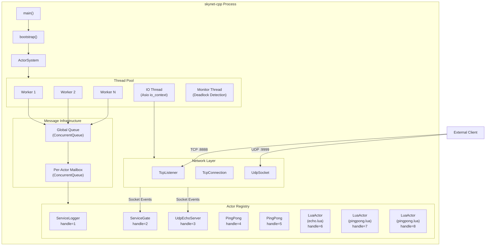
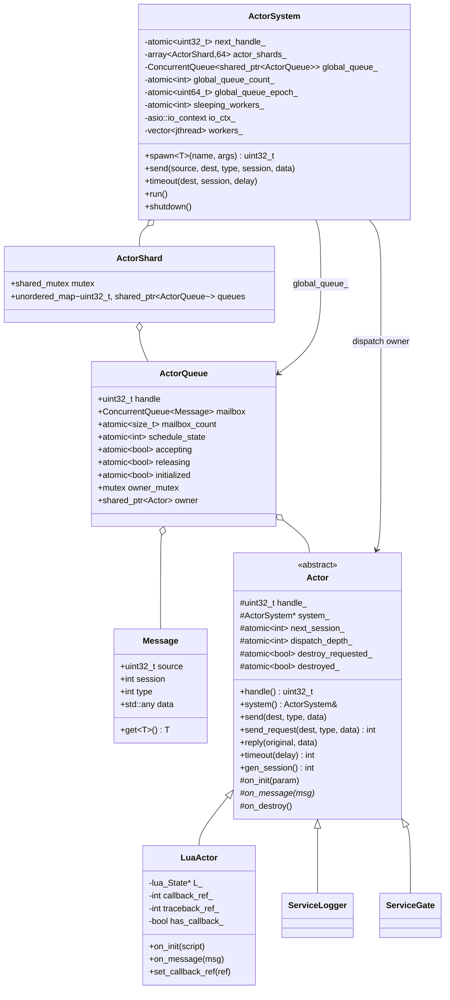
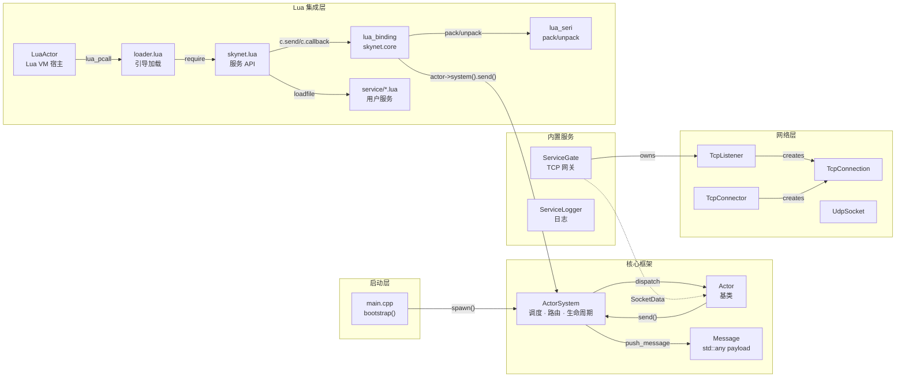
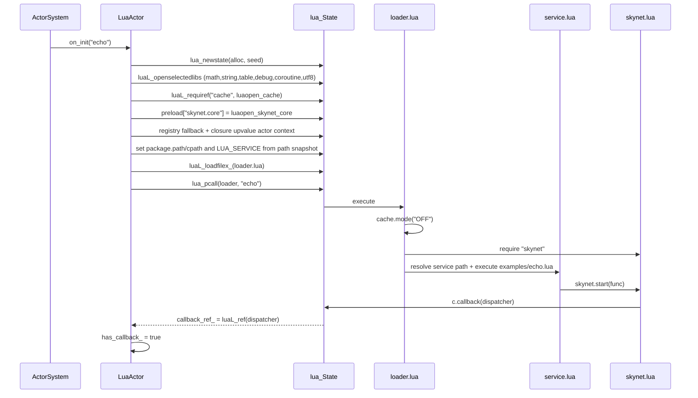
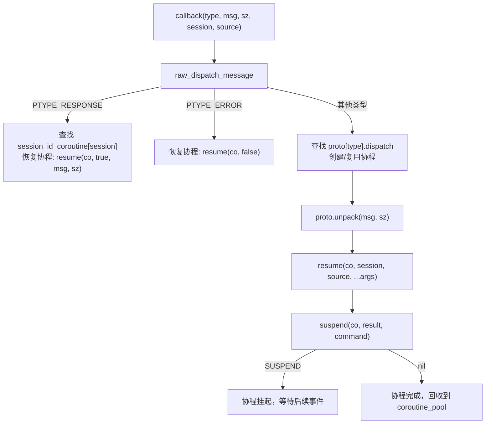
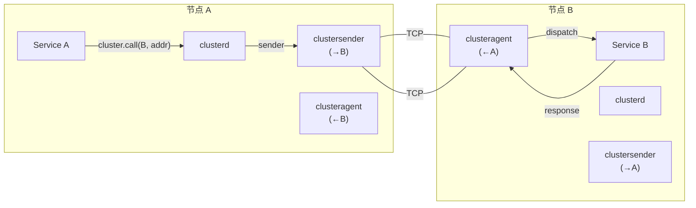
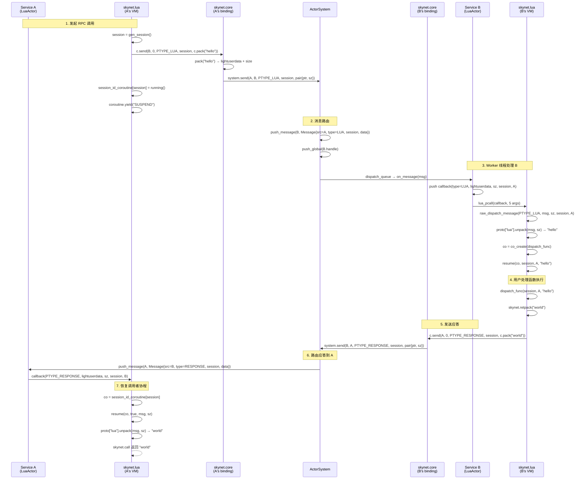

# skynet-cpp 项目设计文档
## 最近运行时更新

当前实现已经迁移到 preload 驱动的启动链路：C++ 入口只读取 `SKYNET_THREAD` 和 `SKYNET_PRELOAD`，默认 preload 为 `examples/preload.lua`；launcher、Lua path/cpath/service path 和业务入口都由 preload 显式配置。`skynet.appendpath`、`skynet.prependpath`、`skynet.appendcpath`、`skynet.appendservicepath`、`skynet.getpath` 提供全局 Lua 路径快照，新创建的 LuaActor 会继承该配置。

发布模型已经改为 install/package 友好：二进制不再包含源码根目录，安装树使用 `bin/`、`lualib/`、`service/`、`examples/`、`doc/` 布局。preload 可以通过 `skynet.getcwd()` 打印进程 cwd，通过 `skynet.setpathbase(path)` / `skynet.getpathbase()` 管理相对搜索路径基准；`skynet.readfile` / `skynet.writefile` 按 pathbase 解析业务文件，不打开 Lua `io` 库。

核心调度已改为 `ActorQueue` 模型：registry 按 handle 分片，global queue 存 `ActorQueue`，queue 生命周期独立于 Actor owner；kill 后 queue 负责 drain/drop pending message。LuaActor callback 和 traceback 通过 registry ref 缓存，`skynet.core` C API 通过 closure upvalue 缓存当前 actor 指针，避免每条消息或每次 C API 调用反复做 registry 字符串查找。

性能路径使用 `ConcurrentQueue` + atomic epoch wait/notify + sleeping worker 计数 + global queue 近似计数；8/16 线程在进入睡眠前有短暂用户态 idle spin，减少 actor RPC 场景中的 futex wakeup。测试入口已拆分为 `tests/logic`、`tests/stress`、`tests/perf` 和 coverage 工具脚本，Linux 对比通过 Docker 运行。

> **skynet-cpp** — 用现代 C++20 重新实现的 [Skynet](https://github.com/cloudwu/skynet) Actor 框架

---

## 目录

1. [项目概述](#1-项目概述)
2. [设计目的与解决的问题](#2-设计目的与解决的问题)
3. [技术选型](#3-技术选型)
4. [系统架构总览](#4-系统架构总览)
5. [核心模块一览](#5-核心模块一览)
6. [类关系图](#6-类关系图)
7. [模块调用关系](#7-模块调用关系)
8. [各模块实现细节](#8-各模块实现细节)
   - [8.1 Actor 框架](#81-actor-框架-skynethcpp)
   - [8.2 网络层](#82-网络层-networkhcpp)
   - [8.3 TCP 网关服务](#83-tcp-网关服务-service_gateh)
   - [8.4 日志服务](#84-日志服务-service_loggerh)
   - [8.5 Lua Actor](#85-lua-actor-lua_actorhcpp)
   - [8.6 Lua C 绑定层](#86-lua-c-绑定层-lua_bindingcpp)
   - [8.7 Lua 序列化协议](#87-lua-序列化协议-lua_serihcpp)
   - [8.8 Lua 服务 API 层](#88-lua-服务-api-层-skynetlua)
   - [8.9 Socket Lua API](#89-socket-lua-api)
   - [8.10 GateServer 网关模板](#810-gateserver-网关模板)
   - [8.11 SocketChannel 连接多路复用](#811-socketchannel-连接多路复用)
   - [8.12 Cluster 集群](#812-cluster-集群)
   - [8.13 Debug 调试与 Profile](#813-debug-调试与-profile)
   - [8.14 ShareData 共享数据](#814-sharedata-共享数据)
   - [8.15 Queue 消息序列化队列](#815-queue-消息序列化队列)
   - [8.16 Multicast 发布/订阅](#816-multicast-发布订阅)
   - [8.17 数据库驱动与工具库](#817-数据库驱动与工具库)
9. [消息流转示例](#9-消息流转示例)

---

## 1. 项目概述

skynet-cpp 是一个用 **C++20** 重新实现的轻量级 Actor 模型服务端框架，其设计理念和 API 语义来源于 [cloudwu/skynet](https://github.com/cloudwu/skynet)。框架保持了 skynet 的核心抽象——**每个服务是一个独立 Actor，通过异步消息通信**，同时利用现代 C++ 的语言特性和跨平台生态带来类型安全、RAII 资源管理和平台无关性。

### 项目结构

```
skynet-cpp/
├── CMakeLists.txt                         # Build configuration
├── doc/
│   ├── design/                            # Multilingual architecture design docs
│   ├── wiki/                              # Multilingual user wiki docs
│   └── performance-optimization/          # Performance optimization notes
├── src/
│   ├── skynet.h / skynet.cpp              # ActorSystem, ActorQueue, scheduler, registry
│   ├── network.h / network.cpp            # TCP/UDP network layer (Asio)
│   ├── platform.h / platform.cpp          # Small cross-platform runtime helpers
│   ├── service_gate.h                     # TCP gateway service (C++)
│   ├── service_logger.h                   # Logger service (C++)
│   ├── lua_actor.h / lua_actor.cpp        # Lua VM host Actor
│   ├── lua_binding.cpp                    # skynet.core C bindings
│   ├── lua_seri.h / lua_seri.cpp          # Lua binary serialization
│   ├── lua_socket_binding.cpp             # socketdriver C bindings
│   ├── lua_netpack.cpp                    # netpack C bindings
│   ├── lua_cluster.cpp                    # cluster.core C bindings
│   ├── lua_profile.cpp                    # profile C bindings
│   ├── skynet_json.h                      # JSON helper
│   └── main.cpp                           # Minimal preload bootstrap entrypoint
├── lualib/
│   ├── loader.lua                         # Lua service loader; uses global path snapshot
│   ├── skynet.lua                         # Lua service API layer and path config API
│   ├── socket.lua                         # Socket API (coroutine wrapper)
│   ├── gateserver.lua                     # TCP gateway template
│   ├── sharedata.lua                      # Shared data client
│   ├── bson.lua                           # BSON codec (pure Lua)
│   └── skynet/
│       ├── socketchannel.lua              # Socket connection multiplexing
│       ├── cluster.lua                    # Cluster RPC client
│       ├── coverage.lua                   # Lua line coverage hook
│       ├── debug.lua                      # Debug protocol
│       ├── queue.lua                      # Coroutine critical section queue
│       ├── multicast.lua                  # Pub/sub client
│       ├── crypt.lua                      # SHA1/Base64/Hex helpers
│       └── db/
│           ├── redis.lua                  # Redis driver (RESP protocol)
│           ├── mysql.lua                  # MySQL driver (wire protocol)
│           └── mongo.lua                  # MongoDB driver (OP_MSG)
├── service/
│   ├── launcher.lua                       # Service launcher
│   ├── debug_console.lua                  # Debug console service
│   ├── clusterd.lua                       # Cluster manager
│   ├── clusteragent.lua                   # Cluster inbound agent
│   ├── clustersender.lua                  # Cluster outbound sender
│   ├── sharedatad.lua                     # Shared data server
│   └── multicastd.lua                     # Multicast manager service
├── examples/
│   ├── preload.lua                        # Default preload bootstrap
│   ├── main.lua                           # Example application entry service
│   ├── echo.lua                           # Example echo service
│   └── pingpong.lua                       # Example ping-pong service
├── tests/
│   ├── cpp_unit.cpp                       # C++ unit tests
│   ├── logic/                             # Logic regression preload and services
│   ├── stress/                            # Stress preload, workers, and suite
│   └── perf/                              # Performance benchmark preload and workers
├── tools/
│   ├── verify.bat                         # Runtime quick verification
│   ├── package.bat                        # Runtime package builder
│   ├── run_package_smoke.bat              # Runtime package smoke
│   └── run_linux_coverage.sh              # Linux coverage smoke
└── 3rdparty/
    ├── asio/                              # Asio standalone headers
    ├── concurrentqueue/                   # moodycamel lock-free queue
    └── lua-5.5.0/                         # Skynet-modified Lua 5.5.0
```

---

## 2. 设计目的与解决的问题

| 维度 | 原版 Skynet (C + Lua) | skynet-cpp (C++20) |
|---|---|---|
| **语言** | 纯 C 实现，手动管理内存 | C++20，RAII + `std::shared_ptr` 自动管理生命周期 |
| **平台** | 仅 Linux（epoll + pthreads） | 跨平台（Asio 抽象，Windows/Linux/macOS） |
| **类型安全** | `void*` 指针传递消息，运行时 cast | `std::any` + `msg.get<T>()` 模板类型安全获取 |
| **并发原语** | 自研 spinlock + 全局队列 | `moodycamel::ConcurrentQueue`（无锁 MPMC）+ `std::shared_mutex` |
| **异步 IO** | 自研 socket server（epoll 封装） | Asio + `steady_timer`，与 Actor 消息自然集成 |
| **线程模型** | 固定 worker 线程 + 单 timer 线程 | worker 线程 + IO 线程（Asio）+ monitor 线程 |
| **Lua 集成** | 深度耦合，C 代码中直接操作 Lua 栈 | 清晰分层：`LuaActor` → C binding → Lua API |
| **构建系统** | Makefile（GCC/Clang only） | CMake 3.20+（MSVC/GCC/Clang） |

### 核心设计目标

1. **保留 Skynet 的 Actor 语义**：handle 标识、异步消息、session 机制、命名服务
2. **现代 C++ 类型安全**：模板 spawn、类型化消息、编译期错误捕获
3. **跨平台**：首要目标 Windows (MSVC)，同时兼容 Linux/macOS
4. **Lua 集成**：直接采用 Skynet 修改版 Lua 5.5.0（含 codecache），提供与原版一致的 `skynet.send/call/ret` API

---

## 3. 技术选型

| 技术 | 版本 | 选型理由 |
|---|---|---|
| **C++20** | MSVC 19.41+ / GCC 12+ | `std::jthread`（自动 join）、`std::any`（类型安全消息）、`std::shared_mutex`（读写锁）、概念（Concepts） |
| **Asio** | 1.28.2（standalone） | 成熟的跨平台异步 IO 库；无需 Boost 依赖；天然支持 TCP/UDP/Timer；`io_context` 可与 Actor 消息循环集成 |
| **moodycamel::ConcurrentQueue** | latest | 高性能无锁 MPMC 队列；单头文件；ActorQueue mailbox 和全局调度队列都使用 `ConcurrentQueue` |
| **Lua 5.5.0（Skynet 修改版）** | 5.5.0-skynet | 原版 Skynet 使用的 Lua 分支，含 **codecache**（多 VM 共享编译后字节码）、`lua_clonefunction`、`lua_sharefunction`、`lua_pushexternalstring` 等扩展 API |
| **CMake** | 3.20+ | 跨平台构建；支持 MSVC/GCC/Clang；target-based 现代 CMake 写法 |

---

## 4. 系统架构总览



---

## 5. 核心模块一览

| Module | Source Files | Current Responsibility |
|---|---|---|
| **Actor Runtime** | `src/skynet.h`, `src/skynet.cpp` | `Actor`, `ActorSystem`, sharded actor registry, `ActorQueue`, weighted dispatch, timer/session, lifecycle, monitor thread |
| **Platform Helpers** | `src/platform.h`, `src/platform.cpp` | Small portability boundary for environment variables, file append/write helpers, local time formatting, process/node identity, Lua C module suffix |
| **Network Layer** | `src/network.h`, `src/network.cpp` | Cross-platform TCP listener/client/connection and UDP socket built on standalone Asio |
| **C++ Gateway** | `src/service_gate.h` | C++ TCP gateway service and connection event routing |
| **Logger** | `src/service_logger.h` | stdout/file logger service; runtime error logs route through cached logger handle |
| **Lua Actor Host** | `src/lua_actor.h`, `src/lua_actor.cpp` | Per-service Lua VM, loader execution, global path snapshot inheritance, callback/traceback registry refs, memory tracking |
| **Lua Core Binding** | `src/lua_binding.cpp` | `skynet.core` C API: send/callback/session/command/path configuration/serialization helpers |
| **Serialization Binding** | `src/lua_seri.h`, `src/lua_seri.cpp` | Skynet-compatible Lua value pack/unpack binary serialization |
| **Socket Binding** | `src/lua_socket_binding.cpp` | `socketdriver` C API for TCP/UDP listen/connect/send/close/pause/resume with shortened store lock scope |
| **Netpack Binding** | `src/lua_netpack.cpp` | 2-byte big-endian TCP frame pack/unpack/filter helpers |
| **Cluster Binding** | `src/lua_cluster.cpp` | `cluster.core` pack/unpack/multicast string helpers |
| **Profile Binding** | `src/lua_profile.cpp` | `skynet.profile` coroutine timing hooks and resume/wrap replacement |
| **JSON Helper** | `src/skynet_json.h` | Header-only JSON utility retained for runtime/support code |
| **Lua Loader** | `lualib/loader.lua` | Resolves plain service names through configured service paths and executes Lua service scripts |
| **Lua Service API** | `lualib/skynet.lua` | `start`, `dispatch`, `send`, `call`, `ret`, `timeout`, `fork`, named service APIs, path/cpath/service-path configuration APIs |
| **Socket API** | `lualib/socket.lua` | Coroutine-friendly TCP/UDP API over `socketdriver` |
| **GateServer API** | `lualib/gateserver.lua` | Lua gateway template with connect/disconnect/message handler callbacks |
| **SocketChannel** | `lualib/skynet/socketchannel.lua` | Reconnectable ordered/session socket multiplexing used by Redis/Mongo style clients |
| **Cluster** | `lualib/skynet/cluster.lua` + `service/cluster*.lua` | Cluster RPC client and cluster manager/agent/sender services |
| **Debug Console** | `lualib/skynet/debug.lua`, `service/debug_console.lua` | Debug command protocol and TCP debug console service |
| **ShareData** | `lualib/sharedata.lua`, `service/sharedatad.lua` | Shared immutable table publication, query, cache, and update notification |
| **Multicast** | `lualib/skynet/multicast.lua`, `service/multicastd.lua` | Publish/subscribe channel manager and client API |
| **Coverage** | `lualib/skynet/coverage.lua` | Lua line coverage hook used only by coverage runners |
| **DB Drivers** | `lualib/skynet/db/{redis,mysql,mongo}.lua`, `lualib/bson.lua` | Redis RESP, MySQL wire protocol, MongoDB OP_MSG/BSON clients |
| **Examples** | `examples/preload.lua`, `examples/main.lua`, `examples/echo.lua`, `examples/pingpong.lua` | Default preload and example services |
| **Tests** | `tests/cpp_unit.cpp`, `tests/logic`, `tests/stress`, `tests/perf` | C++ units, logic regression suite, stress suite, and performance benchmark suite |
| **Tools** | `tools/verify.*`, `tools/package.*`, `tools/run_package_smoke.*`, `tools/run_linux_coverage.sh` | Minimal runtime verification, package smoke, and Linux coverage smoke; full coverage, perf, Docker DB, long-run validation, and native comparison live in the parent best-practice project |

---

## 6. 类关系图



---

## 7. 模块调用关系



### 关键调用路径

| 路径 | 描述 |
|---|---|
| `main → ActorSystem::spawn<T>()` | 创建 Actor 实例，分配 handle，调用 `on_init` |
| `Actor::send() → ActorSystem::send() → push_message()` | 发送消息到目标 ActorQueue mailbox |
| `worker_loop → global_queue → dispatch_queue → on_message` | Worker 线程从全局队列取 ActorQueue，按权重批量 dispatch 消息 |
| `TcpListener → SocketAccept/SocketData → ServiceGate::on_message` | 网络事件通过 `PTYPE_SOCKET` 投递到 Gate |
| `LuaActor::on_init → loader.lua → skynet.lua → service.lua` | Lua 服务的加载链路 |
| `skynet.send() → c.send() → lsend() → ActorSystem::send()` | Lua 发消息的完整路径 |
| `skynet.call() → yield → PTYPE_RESPONSE → resume` | Lua 同步 RPC 调用的协程切换 |

---

## 8. 各模块实现细节

### 8.1 Actor 框架 (`skynet.h/cpp`)

#### 消息类型枚举

```cpp
enum MessageType {
    PTYPE_TEXT     = 0,   // 纯文本消息
    PTYPE_RESPONSE = 1,   // RPC 应答 / Timer 回调
    PTYPE_SYSTEM   = 4,   // 系统消息
    PTYPE_SOCKET   = 6,   // 网络事件
    PTYPE_ERROR    = 7,   // 错误通知
    PTYPE_TIMER    = 8,   // （保留）
    PTYPE_LUA      = 10,  // Lua 序列化消息
};
```

#### Message 结构

```cpp
struct Message {
    uint32_t source = 0;     // 发送者 handle
    int      session = 0;    // 会话 ID（0 = fire-and-forget）
    int      type = PTYPE_TEXT;
    std::any data;           // 类型化载荷

    template<typename T> const T& get() const;  // 类型安全获取
    bool has_data() const;
};
```

`std::any` 替代了原版 Skynet 的 `void* msg + size_t sz`，编译期类型检查避免了错误的指针 cast。

#### Actor 基类

每个 Actor 拥有：
- **唯一 handle**（`uint32_t`）：全局唯一标识
- **独立 mailbox**（`ConcurrentQueue<Message>`）：无锁 MPMC 队列
- **会话分配器**（`atomic<int>`）：为 RPC call 生成递增 session ID

Actor 生命周期：`spawn()` → `on_init()` → 循环 `on_message()` → `kill()` → `on_destroy()`

#### ActorSystem 调度器

**线程模型**：

| 线程 | 数量 | 职责 |
|---|---|---|
| Worker | N（默认=CPU 核数） | 从 `global_queue_` 取 `ActorQueue`，按权重批量 dispatch 消息 |
| IO | 1 | 运行 `asio::io_context`，处理所有异步网络 IO 和 Timer |
| Monitor | 1 | 每 5 秒检测 Worker 死锁（版本号比对） |

**调度权重策略**（`calc_weight`）：

```
Worker 1..N/4   → weight=-1 → 每次处理 1 条消息（低延迟优先）
Worker N/4..N/2 → weight= 0 → 处理全部排队消息（吞吐优先）
Worker N/2..3N/4→ weight= 1 → 处理 n/2 条消息
Worker 3N/4..N  → weight= 2 → 处理 n/4 条消息
```

不同权重的 Worker 混合确保了**低延迟和高吞吐之间的平衡**。

**死锁检测**（`WorkerMonitor`）：

每个 Worker 拥有一个 `WorkerMonitor`。在 `dispatch_queue` 前后调用 `begin(src, dst)` / `end()`，递增版本号。Monitor 线程每 5 秒对比 `version` 与 `check_version`，如果 Worker 处于 `busy` 状态且版本不变，判定为死锁并打印警告。

**Timer 实现**：

```cpp
void ActorSystem::timeout(uint32_t dest, int session, milliseconds delay) {
    auto timer = make_shared<asio::steady_timer>(io_ctx_, delay);
    timer->async_wait([this, dest, session, timer](auto& ec) {
        if (!ec) send(0, dest, PTYPE_RESPONSE, session, {});
    });
}
```

Timer 不启动新线程，而是投递到 Asio `io_context`，到期后以 `PTYPE_RESPONSE` 消息投递回目标 Actor。

---

### 8.2 网络层 (`network.h/cpp`)

#### Socket 事件结构体

网络事件通过 `PTYPE_SOCKET` + `std::any` 发送到 Actor：

| 事件 | 结构体 | 字段 |
|---|---|---|
| 新连接 | `SocketAccept` | `connection_id`, `remote_address`, `remote_port` |
| 收到数据 | `SocketData` | `connection_id`, `data` |
| 连接关闭 | `SocketClose` | `connection_id` |
| 连接建立 | `SocketOpen` | `connection_id`, `remote_address`, `remote_port` |
| 发送缓冲区告警 | `SocketWarning` | `connection_id`, `pending_bytes` |
| UDP 数据 | `SocketUDP` | `data`, `remote_address`, `remote_port` |

#### TcpConnection

单个 TCP 连接的管理：

- **读**：8KB 缓冲区循环 `async_read_some`，数据封装为 `SocketData` 投递到 owner Actor
- **写**：`deque<string>` 写队列，序列化写入避免并发；跟踪 `pending_bytes_`，超过 1MB 产生 `SocketWarning`
- **流量控制**：`pause()` / `resume()` 控制读取速率
- **半关闭**：`shutdown_write()` 发送 FIN 但保持读取

#### TcpListener

TCP 服务端：

- 循环 `async_accept`，为每个新连接创建 `TcpConnection`
- 通过 `connection_id` 管理连接池（`unordered_map<int, shared_ptr<TcpConnection>>`）
- `send(conn_id, data)` / `close_connection(conn_id)` 按 ID 操作连接

#### TcpConnector

TCP 客户端连接器：

- `async_resolve` → `async_connect` → 创建 `TcpConnection`
- 连接成功发送 `SocketOpen`，失败发送 `SocketError`

#### UdpSocket

UDP 收发：

- 64KB 接收缓冲区，循环 `async_receive_from`
- 收到数据封装为 `SocketUDP` 投递到 owner Actor
- `send_to(data, host, port)` 异步发送

---

### 8.3 TCP 网关服务 (`service_gate.h`)

`ServiceGate` 是 Actor 框架与网络层之间的桥梁：

```
Client ──TCP──→ TcpListener ──SocketAccept──→ ServiceGate
                TcpConnection ──SocketData──→ ServiceGate ──forward──→ Agent Actor
```

**Agent 工厂模式**：

```cpp
using AgentFactory = std::function<uint32_t(
    ServiceGate& gate, int conn_id,
    const std::string& addr, uint16_t port)>;
```

当新连接到来时，如果设置了 `AgentFactory`，Gate 自动为连接创建专属 Agent Actor，后续数据通过 `PTYPE_TEXT` 转发给 Agent。未设置工厂时，数据直接在 Gate 内处理（适合简单的 echo 服务）。

**事件分发**：

`on_message` 接收 `PTYPE_SOCKET` 消息，根据 `std::any` 中的具体类型调用对应的虚方法：

| 事件类型 | 回调 | 默认行为 |
|---|---|---|
| `SocketAccept` | `on_accept()` | 若有 factory 则创建 agent |
| `SocketData` | `on_data()` | 若有 agent 则转发 |
| `SocketClose` | `on_close()` | 清理 agent 映射 |
| `SocketWarning` | — | 日志告警 |

---

### 8.4 日志服务 (`service_logger.h`)

系统级日志中心。所有 `ActorSystem::error()` 调用最终路由到名为 `"logger"` 的 Actor：

**日志格式**：
```
[HH:MM:SS.mmm][HANDLE][TAG] message
```

- `HANDLE`：8 位十六进制 Actor handle
- `TAG`：`ERROR`（`PTYPE_ERROR`）或 `INFO`（`PTYPE_TEXT`）
- 同时输出到 stdout 和可选的日志文件

---

### 8.5 Lua Actor (`lua_actor.h/cpp`)

`LuaActor` 继承 `Actor`，为每个 Lua 服务托管一个独立的 `lua_State`。

#### 初始化流程 (`on_init`)



**关键设计决策**：

1. **安全沙箱**：不开放 `io` 和 `os` 库（避免 Lua 服务直接操作文件/进程）
2. **Codecache 关闭**：通过 `cache.mode("OFF")` 禁用代码缓存，避免多 VM 间 `_ENV` 共享导致 `require` 为 nil 的问题
3. **内存跟踪**：自定义 `lua_alloc` 记录每个 VM 的内存使用，支持限额和自动告警
4. **非缓存加载**：`loader.lua` 使用 `luaL_loadfilex_`（非缓存变体）加载，确保每个 VM 独立执行

#### 消息分发 (`on_message`)

回调签名：`callback(type, msg, sz, session, source)`

| 消息类型 | msg 参数 | sz 参数 |
|---|---|---|
| `PTYPE_LUA` / `PTYPE_RESPONSE` | `lightuserdata`（序列化缓冲区指针） | 字节长度 |
| `PTYPE_TEXT` / `PTYPE_ERROR` | Lua string | 字符串长度 |
| 其他（Timer 等） | nil | 0 |

`PTYPE_LUA` 优先尝试提取 `std::pair<void*, size_t>`（由 `skynet.pack` 生成），失败时回退到 `std::string`。

#### 内存分配器

```
分配策略：
  if nsize == 0           → free(ptr), return nullptr
  if mem_ > mem_limit_    → 拒绝分配（OOM 保护）
  if mem_ > mem_report_   → 打印内存告警，mem_report_ *= 2
  else                    → realloc(ptr, nsize)
```

---

### 8.6 Lua C 绑定层 (`lua_binding.cpp`)

`luaopen_skynet_core` 注册的 15 个 C 函数构成 `skynet.core` 模块：

| 函数 | 签名 | 说明 |
|---|---|---|
| `send` | `(dest, source, type, session, msg [,sz])` → `session` | 发送消息，source 忽略（始终用 self） |
| `callback` | `(func)` → nil | 注册消息回调，存入 `cached callback registry ref` |
| `genid` | `()` → `session_id` | 分配递增 session ID |
| `self` | `()` → `handle` | 返回当前 Actor handle |
| `now` | `()` → `centiseconds` | 返回启动至今的时间（厘秒） |
| `error` | `(text)` → nil | 通过 ActorSystem 路由到 logger |
| `command` | `(cmd, param)` → `string\|nil` | 服务命令（REG/NAME/QUERY/EXIT/KILL/TIMEOUT/NOW） |
| `intcommand` | `(cmd, param)` → `int\|nil` | 命令变体，返回整数 |
| `addresscommand` | `(cmd, param)` → `int\|nil` | 命令变体，返回 handle 整数 |
| `pack` | `(...)` → `lightuserdata, size` | 序列化 Lua 值 |
| `unpack` | `(msg, sz)` → `...values` | 反序列化 |
| `tostring` | `(msg, sz)` → `string` | lightuserdata 转 Lua string |
| `trash` | `(msg, sz)` → nil | 释放 lightuserdata 缓冲区 |
| `redirect` | `(dest, src, type, session, msg, sz)` → nil | 显式指定 source 发送 |
| `harbor` | `(addr)` → `0, 0` | stub（单进程无需 harbor） |

**command 子命令详解**：

| 命令 | 参数 | 返回 | 行为 |
|---|---|---|---|
| `REG` | `"name"` | `":handle"` | 注册当前 Actor 的名称 |
| `NAME` | `"name :handle"` | `":handle"` | 为指定 handle 注册名称 |
| `QUERY` | `"name"` | `":handle"` 或 nil | 查询命名服务 |
| `EXIT` | — | nil | 杀死当前 Actor |
| `KILL` | `":handle"` 或 `"name"` | nil | 杀死指定 Actor |
| `TIMEOUT` | `"centisecs"` | `"session"` | 注册定时器 |
| `NOW` | — | `"centisecs"` | 当前时间 |

---

### 8.7 Lua 序列化协议 (`lua_seri.h/cpp`)

与原版 Skynet 完全兼容的二进制序列化格式。

#### 编码格式

每个值编码为 **1 字节头 + 可变长度载荷**：

```
Header = [TYPE: 3 bits | COOKIE: 5 bits]
```

| TYPE | 值 | COOKIE 含义 | 载荷 |
|---|---|---|---|
| NIL | 0 | — | 无 |
| BOOLEAN | 1 | 0=false, 1=true | 无 |
| NUMBER | 2 | 子类型编码 | 见下表 |
| USERDATA | 3 | — | 8 字节指针 |
| SHORT_STRING | 4 | 长度（0-31） | 0-31 字节 |
| LONG_STRING | 5 | 2 或 4 | 2/4 字节长度 + 数据 |
| TABLE | 6 | 数组大小 | 数组元素 + 哈希对 + NIL 终止符 |

**数值子类型**（NUMBER 的 COOKIE 字段）：

| COOKIE | 类型 | 载荷大小 |
|---|---|---|
| 0 | ZERO | 0（值为 0） |
| 1 | BYTE | 1（uint8） |
| 2 | WORD | 2（uint16） |
| 4 | DWORD | 4（int32） |
| 6 | QWORD | 8（int64） |
| 8 | DOUBLE | 8（IEEE754） |

**表编码**：
```
[Header: TYPE_TABLE | min(array_size, 31)]
  [若 array_size >= 31: varint 编码实际大小]
  [数组元素 1..n 递归编码]
  [哈希对: key,value 交替递归编码]
  [NIL 终止符]
```

**内存模型**：

- **Pack**：使用 128 字节 block 链表写入，最后合并为单个 `malloc` 缓冲区，返回 `(lightuserdata, size)`
- **Unpack**：从 `lightuserdata+size` 或 `string` 线性读取，递归重建 Lua 值
- **最大嵌套深度**：32 层

---

### 8.8 Lua 服务 API 层 (`skynet.lua`)

`skynet.lua` 是面向 Lua 服务开发者的 API 层，封装了 `skynet.core` C 绑定，提供高级接口。

#### 协程池与消息调度



#### 已注册协议

| 名称 | ID | pack | unpack |
|---|---|---|---|
| `lua` | 10 (`PTYPE_LUA`) | `c.pack`（二进制序列化） | `c.unpack` |
| `text` | 0 (`PTYPE_TEXT`) | identity | `c.tostring` |
| `response` | 1 | — | — |
| `error` | 7 | — | — |

#### 公共 API

**消息发送**：

| 函数 | 说明 |
|---|---|
| `skynet.send(addr, typename, ...)` | 异步发送，自动 pack，返回 session |
| `skynet.rawsend(addr, type, session, msg, sz)` | 原始发送，不 pack |
| `skynet.call(addr, typename, ...)` | 同步 RPC：发送 → yield → 等待 PTYPE_RESPONSE → unpack → 返回 |
| `skynet.ret(msg, sz)` | 发送 PTYPE_RESPONSE 应答 |
| `skynet.retpack(...)` | `skynet.ret(skynet.pack(...))` 快捷方式 |

**协程控制**：

| 函数 | 说明 |
|---|---|
| `skynet.dispatch(typename, func)` | 注册类型处理函数：`func(session, source, ...)` |
| `skynet.fork(func, ...)` | 创建新协程，加入 fork_queue 延迟执行 |
| `skynet.timeout(ti, func)` | `ti` 厘秒后执行 func |
| `skynet.sleep(ti)` | 阻塞当前协程 `ti` 厘秒 |
| `skynet.yield()` | 让出当前协程（等价 `sleep(0)`） |

**服务管理**：

| 函数 | 说明 |
|---|---|
| `skynet.start(func)` | 服务入口：注册回调 + `timeout(0, func)` |
| `skynet.exit()` | 终止当前服务 |
| `skynet.self()` | 当前 Actor handle |
| `skynet.register(name)` | 注册服务名 |
| `skynet.name(name, handle)` | 注册指定 handle 的名称 |

**工具函数**：

| 函数 | 说明 |
|---|---|
| `skynet.address(handle)` | 格式化为 `":xxxxxxxx"` |
| `skynet.error(...)` | 拼接参数并发送到 logger |
| `skynet.now()` | 当前时间（厘秒） |
| `skynet.pack(...)` | 序列化 → `(lightuserdata, size)` |
| `skynet.unpack(msg, sz)` | 反序列化 → `...values` |
| `skynet.tostring(msg, sz)` | lightuserdata 转 string |
| `skynet.trash(msg, sz)` | 释放 lightuserdata 缓冲区 |

| `skynet.trash(msg, sz)` | 释放 lightuserdata 缓冲区 |

---

### 8.9 Socket Lua API

`socket.lua` 对 `socketdriver` C 模块进行协程封装，提供阻塞式 API。当底层 IO 未就绪时，当前协程通过 `skynet.wait` 挂起，IO 完成后由 socket 事件 dispatch 唤醒。

**架构层次**：
```
socket.lua (用户 API)
  └─→ socketdriver (C 模块)
        └─→ TcpListener / TcpConnector / UdpSocket (C++ Asio)
              └─→ PTYPE_SOCKET 事件 → ActorQueue mailbox
```

**TCP API**：

| 函数 | 说明 |
|---|---|
| `socket.listen(host, port, handler)` | 监听 TCP 端口，handler 接收 accept/close/warning 事件 |
| `socket.ondata(listener_id, handler)` | 设置数据回调 `handler(conn_id, data)` |
| `socket.connect(host, port)` | 连接远程主机，阻塞直到连接建立或失败 |
| `socket.send(conn_id, data)` | 通过 connector 发送数据 |
| `socket.write(listener_id, conn_id, data)` | 通过 listener 的连接发送数据 |
| `socket.read(conn_id, sz)` | 读取 sz 字节，阻塞直到数据就绪 |
| `socket.readline(conn_id, sep)` | 读取到分隔符（默认 `\n`），不含分隔符 |
| `socket.readall(conn_id)` | 读取所有可用数据 |
| `socket.close(conn_id)` | 关闭连接 |
| `socket.pause(listener_id, conn_id)` | 暂停连接读取（流量控制） |
| `socket.resume(listener_id, conn_id)` | 恢复连接读取 |

**UDP API**：

| 函数 | 说明 |
|---|---|
| `socket.udp(host, port, callback)` | 创建 UDP socket，回调接收数据包 |
| `socket.udp_send(id, data, host, port)` | 发送 UDP 数据包 |

---

### 8.10 GateServer 网关模板

`gateserver.lua` 是构建客户端接入网关的高级模板。它封装了 `socket.listen` + `netpack` 分包逻辑，开发者只需实现 handler 回调即可。

**分包协议**：每个包 = 2 字节大端长度头 + 数据内容，单包最大 65535 字节。

**使用方式**：
```lua
local gateserver = require "gateserver"
local handler = {}

function handler.connect(conn_id, addr, port) ... end
function handler.disconnect(conn_id) ... end
function handler.message(conn_id, data) ... end
function handler.open(source, conf) ... end

gateserver.start(handler)
```

**handler 回调**：

| 回调 | 说明 |
|---|---|
| `connect(conn_id, addr, port)` | 新客户端接入 |
| `disconnect(conn_id)` | 客户端断开 |
| `message(conn_id, data)` | 收到完整的业务包（已去掉长度头） |
| `error(conn_id, msg)` | 连接异常 |
| `warning(conn_id, bytes)` | 发送缓冲区超过阈值 |
| `open(source, conf)` | Gate 打开监听端口时调用 |

**Lua 协议命令**（其他服务可对 gate 发送）：`OPEN`、`SEND`、`SENDRAW`、`CLOSE`、`KICK`。

---

### 8.11 SocketChannel 连接多路复用

`socketchannel.lua` 为外部服务访问提供高级封装，支持两种协议模式：

**模式 1：顺序模式（Order Mode）**
- 每个请求必有一个回应，由 TCP 保证时序
- 适用于 Redis 等 RESP 协议
- `channel:request(req, response_func)` — response_func 解析回应

**模式 2：会话模式（Session Mode）**
- 每个请求携带唯一 session，回应带回 session 做匹配
- 适用于 MongoDB 等协议
- 创建 channel 时提供全局 `response` 函数，`request` 传入 session 参数

**核心特性**：
- **自动重连**：连接断开后下次 request 自动重新建立
- **认证流程**：创建时传入 `auth` 函数，连接建立后立即执行
- **readline 支持**：`channel:readline(sep)` 按分隔符读取
- **response 方法**：`channel:response(func)` 仅接收不发送（用于 pub/sub）

```lua
-- Redis (Order Mode)
local channel = socketchannel.channel { host = "127.0.0.1", port = 6379 }
local resp = channel:request(req_str, function(sock) return true, sock:readline() end)

-- MongoDB (Session Mode)
local channel = socketchannel.channel {
    host = "127.0.0.1", port = 27017,
    response = function(sock) ... return session, ok, data end
}
local resp = channel:request(req_str, session_id)
```

---

### 8.12 Cluster 集群

skynet-cpp 实现了 skynet 的 cluster 模式（非 master/slave）。每个节点是独立进程，通过 TCP 连接进行跨节点 RPC。

**架构**：



**三服务架构**：

| 服务 | 职责 |
|---|---|
| `clusterd` | 中央管理器：节点配置、sender/agent 生命周期、名字注册、监听端口 |
| `clustersender` | 出站连接（每个远程节点一个）：通过 socketchannel 发送请求/推送，接收响应 |
| `clusteragent` | 入站连接（每个接入连接一个）：解析请求，分发到本地服务，回传响应 |

**客户端 API**（`skynet.cluster`）：

| 函数 | 说明 |
|---|---|
| `cluster.call(node, addr, ...)` | 同步 RPC 调用远程服务 |
| `cluster.send(node, addr, ...)` | 异步推送（无回应） |
| `cluster.open(addr, port)` | 监听端口接受入站连接 |
| `cluster.reload(cfg)` | 重载集群配置 |
| `cluster.register(name, addr)` | 注册名字供远程访问 |
| `cluster.query(node, name)` | 查询远程节点的注册名对应地址 |

**集群协议**（`cluster.core` C 模块）：2 字节长度头 + 类型标记 + 地址 + session + 负载。支持大消息自动分片（>32KB 时分多段传输）。

---

### 8.13 Debug 调试与 Profile

#### Debug 协议

`debug.lua` 为每个 Lua 服务注册 `PTYPE_DEBUG` 协议，内置一组调试命令：

| 命令 | 说明 |
|---|---|
| `MEM` | 返回当前 Lua VM 内存占用（KB） |
| `GC` | 触发垃圾回收，报告内存变化 |
| `STAT` | 返回任务数、消息队列长度、CPU 统计 |
| `TASK` | 返回当前任务协程栈信息 |
| `INFO` | 调用服务注册的 `info_func` 回调 |
| `EXIT` | 优雅退出服务 |
| `PING` | 存活检测（立即回应） |
| `RUN` | 注入并执行 Lua 代码 |

可通过 `debug.reg_debugcmd(name, fn)` 注册自定义调试命令。

#### Debug Console

`debug_console.lua` 提供 TCP telnet 接口，支持命令：`list`、`mem`、`gc`、`stat`、`ping`、`info`、`exit`、`kill`、`start`、`inject`。

#### Profile

通过 `lua_profile.cpp` 提供协程级 CPU 计时：

```lua
local profile = require "skynet.profile"
profile.start()              -- 开始计时
local cpu_time = profile.stop() -- 停止计时，返回秒数
```

---

### 8.14 ShareData 共享数据

ShareData 用于在同一进程的多个服务间共享只读结构化数据，典型用途是配置表分发。

**架构**：

```
sharedatad (服务端)          sharedata (客户端库)
  ├─ data_store[name]         ├─ 本地缓存
  │   ├─ data                 ├─ 版本追踪
  │   └─ version              └─ monitor 协程 (长轮询更新)
  └─ 命令: new/delete/
     query/update/monitor
```

**客户端 API**（`sharedata`）：

| 函数 | 说明 |
|---|---|
| `sharedata.new(name, value)` | 创建共享数据 |
| `sharedata.query(name)` | 查询数据（首次查询启动 monitor 协程） |
| `sharedata.update(name, value)` | 更新数据（通知所有监控者） |
| `sharedata.delete(name)` | 删除共享数据 |
| `sharedata.flush()` | 清除本地缓存 |
| `sharedata.deepcopy(name, ...)` | 获取深拷贝 |

**与原版差异**：skynet-cpp 的 sharedata 通过消息传递深拷贝数据，不使用 C 共享内存（因为各 VM 的 `_ENV` 独立）。功能等价但内存不共享。

---

### 8.15 Queue 消息序列化队列

`queue.lua` 实现协程级互斥锁，解决同一服务内"伪并发"问题。当消息处理中调用阻塞 API（如 `skynet.call`）导致服务重入时，queue 保证关键代码段的串行执行。

**使用方式**：
```lua
local queue = require "skynet.queue"
local cs = queue()  -- 创建一个执行队列

function CMD.foobar()
    cs(function()
        -- 此代码块不会被其他使用同一 cs 的代码打断
        skynet.call(other_service, "lua", "slow_request")
        -- 即使上一行挂起，新的 foobar 消息也会排队等待
    end)
end
```

**实现原理**：通过 `current_thread` + `ref` 引用计数 + `thread_queue` 等待队列，利用 `skynet.wait/wakeup` 实现 FIFO 调度。支持可重入（同一协程内嵌套调用不会死锁）。

---

### 8.16 Multicast 发布/订阅

Multicast 模块提供同一进程内的频道式发布/订阅消息机制。

**架构**：

| 组件 | 职责 |
|---|---|
| `multicastd` 服务 | 管理频道（分配 ID）、维护订阅者列表、广播消息 |
| `multicast.lua` 客户端 | 注册 `PTYPE_MULTICAST` 协议，提供面向对象 API |

**API**：

```lua
local multicast = require "skynet.multicast"
local mc = multicast.new()        -- 创建频道
mc:subscribe()                     -- 订阅
mc:publish("hello", "world")       -- 发布
mc:unsubscribe()                   -- 取消订阅
mc:delete()                        -- 删除频道

-- 接收端设置回调
mc.dispatch = function(channel, source, ...)
    print("received:", ...)
end
```

---

### 8.17 数据库驱动与工具库

所有数据库驱动基于 `socketchannel` 实现，不阻塞 skynet 工作线程。

#### Redis 驱动 (`skynet.db.redis`)

- **协议**：RESP（Redis Serialization Protocol）
- **socketchannel 模式**：Order（请求/回应一一对应）
- **特性**：自动命令生成（metatable `__index`）、pipeline 批量、pub/sub watch 模式
- **连接**：`redis.connect({host, port, auth, db})`
- **命令**：`db:get(key)`, `db:set(key, val)`, `db:hgetall(key)` 等全部 Redis 命令

#### MySQL 驱动 (`skynet.db.mysql`)

- **协议**：MySQL Wire Protocol v10
- **认证**：SHA1 challenge-response（MySQL 4.1+ native_password）
- **特性**：文本查询 + prepared statement + 多结果集
- **连接**：`mysql.connect({host, port, user, password, database})`
- **API**：`db:query(sql)`, `db:prepare(sql)`, `stmt:execute()`, `stmt:close()`

#### MongoDB 驱动 (`skynet.db.mongo`)

- **协议**：OP_MSG（MongoDB 3.6+）
- **socketchannel 模式**：Session（请求/回应通过 requestID 匹配）
- **BSON**：使用 `bson.lua` 纯 Lua 编解码（支持 double/string/document/array/binary/objectid/int64/null/minkey/maxkey）
- **连接**：`mongo.client({host, port})`
- **API**：`client:getDB(name)` → `db:getCollection(name)` → `coll:insert/find/update/delete/aggregate`
- **Cursor**：`coll:find(query):sort(s):skip(n):limit(m):toArray()`

#### Crypt 工具 (`skynet.crypt`)

纯 Lua 密码学函数，用于 MySQL 认证等场景：

| 函数 | 说明 |
|---|---|
| `crypt.sha1(msg)` | SHA-1 哈希（160 位） |
| `crypt.hmac_sha1(key, msg)` | HMAC-SHA1 |
| `crypt.base64encode(data)` | Base64 编码 |
| `crypt.base64decode(data)` | Base64 解码 |
| `crypt.hexencode(data)` | 十六进制编码 |
| `crypt.hexdecode(data)` | 十六进制解码 |

#### BSON 编解码 (`bson`)

纯 Lua BSON 序列化库，用于 MongoDB 驱动：

| 函数 | 说明 |
|---|---|
| `bson.encode(doc)` | 编码 Lua table → BSON 二进制 |
| `bson.encode_order(k1, v1, ...)` | 保序编码 |
| `bson.decode(data)` | 解码 BSON 二进制 → Lua table |
| `bson.objectid(hex)` | 创建/生成 ObjectId |
| `bson.int64(value)` | 创建 64 位整数 |
| `bson.null` | BSON null 常量 |

---

## 9. 消息流转示例

以下展示一个完整的 Lua RPC 调用链路：**服务 A 调用 `skynet.call(B, "lua", "hello")`**。



### 关键时序要点

1. **Pack/Unpack 成对出现**：`c.pack("hello")` 在发送端序列化，对端通过 `proto.unpack(msg, sz)` 反序列化，格式完全兼容原版 Skynet
2. **session 连续性**：发送端分配 session → 存入 `session_id_coroutine` → 对端原封不动回传 → 发送端匹配恢复协程
3. **零拷贝传递**：序列化缓冲区通过 `lightuserdata` 指针传递，接收端 `c.unpack` 后由 `skynet.trash` 释放
4. **协程挂起/恢复**：`skynet.call` 使用 `coroutine.yield("SUSPEND")` 挂起，收到 `PTYPE_RESPONSE` 后 `resume` 恢复
